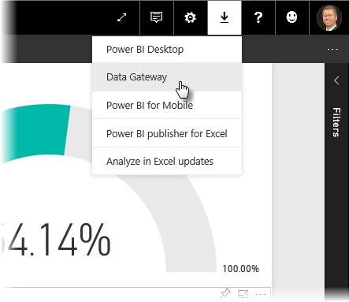
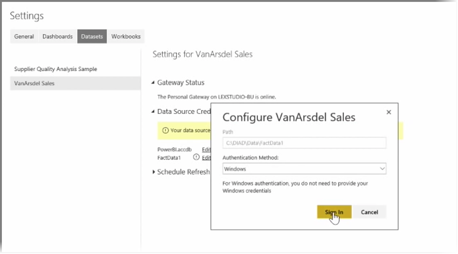

<properties
   pageTitle="安裝和設定個人閘道"
   description="自動更新的內部資料使用個人閘道"
   services="powerbi"
   documentationCenter=""
   authors="davidiseminger"
   manager="mblythe"
   backup=""
   editor=""
   tags=""
   qualityFocus="no"
   qualityDate=""
   featuredVideoId="UwSaTCke5MU"
   featuredVideoThumb=""
   courseDuration="11m"/>

<tags
   ms.service="powerbi"
   ms.devlang="NA"
   ms.topic="get-started-article"
   ms.tgt_pltfrm="NA"
   ms.workload="powerbi"
   ms.date="09/29/2016"
   ms.author="davidi"/>

# 安裝和設定個人閘道

在上一個主題中，我們已經討論過如何使用 Power BI 連接到資料來源，以及如何以手動方式重新整理您的資料集上的 Power BI 服務。 不過，您不會想要手動重新整理項目每次您變更資料，因此您可以使用 Power BI 設定 [排程重新整理，將連線到您的資料來源，會自動將它們發行至 Power BI 服務。 這也讓您與任何內部部署資料來源，包括 Excel 檔案、 存取資料庫、 SQL 資料庫連線服務的方式。

可讓您連接至 Power BI 服務的內部部署資料來源系統稱為 **資料閘道**。 它是一個小型應用程式會在您的電腦上執行，並連接到您的資料、 收集任何更新，並將其發送到 Power BI 服務使用存入的排程。  **個人閘道** 版本 **資料閘道** 可用而不需要任何系統管理員設定。

> 注意︰ 電腦是執行 Power BI 個人閘道 *必須* 上且連線到網際網路的 **個人閘道** 才能正常運作。

若要設定您 **個人閘道**, ，第一次登入 Power BI 服務。 選取 **下載** 中的畫面，然後選取右上角的圖示 **資料閘道** 從功能表。

從該處接下來到網頁上，您可以在其中選取 **Power BI 閘道個人**, ，如下所示。

一旦完成下載，請執行應用程式，並完成安裝精靈。

系統會提示您，啟動組態精靈來設定您的閘道。

將會要求您先登入到您的 Power BI 服務帳戶，然後登入電腦的 Windows 帳戶，因為閘道器服務是在您的帳戶下執行。

返回 Power BI 服務。 選取您想要重新整理，然後選取 [資料集旁邊的省略符號 （三個點） 功能表 **排程重新整理**。 這會開啟 **重新整理設定** 頁面。 Power BI 會偵測已安裝 **個人閘道**, ，並可讓您知道它的狀態。

選取 **編輯認證** 旁邊每個適用的資料來源和驗證設定。

最後，設定下的選項 **排程重新整理** 來啟動自動更新設定時，發生的頻率。

這樣就大功告成了。 在排程的時間，Power BI 會前往這些資料來源，使用的認證提供您和電腦的連接您 **個人閘道** 執行，並更新報表和資料集，根據您的排程。 下次您前往 Power BI 的儀表板、 報告和資料集將會反映最新排定的重新整理資料。

## 後續步驟

**恭喜！** 完成這項工作 **瀏覽資料** 區段 **引導式學習** Power BI 的課程。 Power BI 服務皆為有趣的方式瀏覽資料、 分享深入資訊，並與其互動視覺效果。 且所有可從瀏覽器中，從一項服務，您可以連接到隨時隨地存取。

Power BI 的一個功能強大且已知夥伴是 **Excel**。 Power BI 和 Excel 專為適合共同運作。您的活頁簿感覺就像是在家裡 Power BI 中，很容易讓它們有。

如何輕鬆嗎？ 下一節 **Power BI 與 Excel** 您了解完全。

下一節中見了 ！
