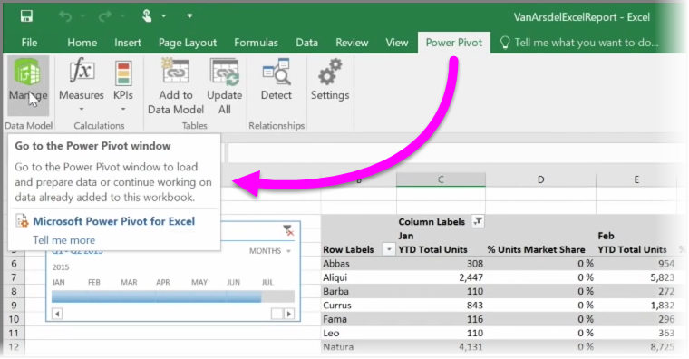

<properties
   pageTitle="匯入至 Power BI 的 Power View 及 Power Pivot"
   description="Power tool 的 Excel 活頁簿能順利使用 Power BI"
   services="powerbi"
   documentationCenter=""
   authors="davidiseminger"
   manager="mblythe"
   backup=""
   editor=""
   tags=""
   qualityFocus="no"
   qualityDate=""
   featuredVideoId="nVkpj0tB4Yk"
   featuredVideoThumb=""
   courseDuration="4m"/>

<tags
   ms.service="powerbi"
   ms.devlang="NA"
   ms.topic="get-started-article"
   ms.tgt_pltfrm="NA"
   ms.workload="powerbi"
   ms.date="09/29/2016"
   ms.author="davidi"/>

# 匯入資料模型和 Power View 工作表的 Excel 的檔案

如果您使用 Excel 的進階 BI 功能，例如 **Power Query** (稱為 **取得與轉換** Excel 2016 中)，以查詢和載入資料， **Power Pivot** 建立功能強大的資料模型和 **Power View** 若要建立動態報告，您可以匯入成 Power BI 太。

如果您使用 **Power Pivot** 來建立進階的資料模型，類似使用多個相關的資料表、 量值、 導出資料行和階層，Power BI 會匯入，以及所有。

如果您的活頁簿有 **Power View 工作表**, ，沒問題。 Power BI 會重新建立這些新 **報表** Power BI 中。 您可以開始立即釘選到儀表板的視覺效果。

以下是其中一個 Power BI 最棒的功能︰ 如果您使用 Power Query 或 Power Pivot 連接、 查詢和外部資料來源載入資料，您將活頁簿匯入 Power BI 之後，您可以設定 **排定的重新整理**。 藉由使用排定的重新整理，Power BI 會使用您的活頁簿中的連接資訊直接連接至資料來源和查詢，並載入任何資料已變更。 在報表中的任何視覺效果會自動更新，太。
