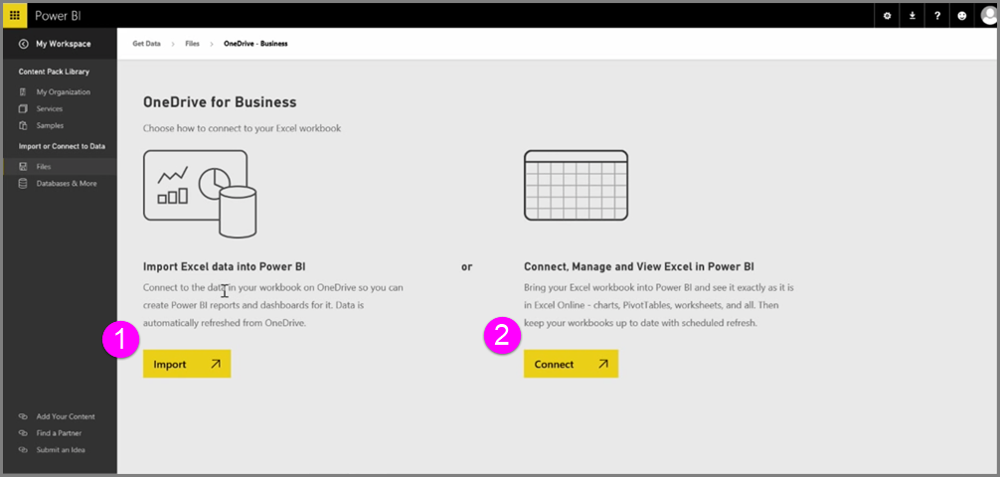

<properties
   pageTitle="連接至 Power BI 企業 OneDrive"
   description="商務和 Excel 檔案的 OneDrive 是在雲端中進行比對"
   services="powerbi"
   documentationCenter=""
   authors="davidiseminger"
   manager="mblythe"
   backup=""
   editor=""
   tags=""
   qualityFocus="no"
   qualityDate=""
   featuredVideoId="WK7OZF-hVZA"
   featuredVideoThumb=""
   courseDuration="8m"/>

<tags
   ms.service="powerbi"
   ms.devlang="NA"
   ms.topic="get-started-article"
   ms.tgt_pltfrm="NA"
   ms.workload="powerbi"
   ms.date="09/29/2016"
   ms.author="davidi"/>

# 連接至 Power BI 企業 OneDrive

當您將 Excel 活頁簿儲存到 OneDrive，請取得 Power BI 與 Excel 之間的緊密整合。

因為 OneDrive 定域機組，如同 Power BI 中將會對即時連接 Power BI 和 OneDrive。 如果您對您的活頁簿放在 OneDrive 上的變更，這些變更會 *自動同步處理* Power bi。 視覺效果報表和儀表板中的會保持最新狀態。 如果您的活頁簿連接到外部資料來源，例如資料庫或 OData 摘要時，您可以使用 Power BI **排程重新整理** 檢查更新的功能。 需要詢問您的活頁簿中的資料有關的問題？ 沒問題。 您可以使用 Power BI **問與答** 這麼做的功能。

有兩種方式可連接到您的 Excel 檔案放在 OneDrive 上企業︰

1.   Excel 資料匯入至 Power BI
2.   連接、 管理及 Power BI 中檢視 Excel

### Excel 資料匯入至 Power BI
當您選擇將 Excel 資料匯入 Power BI 時，便會從您的活頁簿的資料表資料載入至 Power BI 中的新資料集。 如果您有任何 **Power View** 活頁簿中的工作表，這些會匯入新的報表會自動建立和 Power BI 中太。

Power BI 將會保留它與您的 OneDrive 上的活頁簿檔案企業之間的連線。 如果您的活頁簿儲存時進行任何變更，這些變更將會 *自動同步處理** 透過 Power BI，通常會在一小時內。 如果您的活頁簿連接至外部資料來源，您可以設定排定的重新整理，因此 Power BI 中的資料集保持最新狀態。 在報表中的視覺效果和在 Power BI 儀表板會使用資料集中，當您瀏覽，因為您的查詢會快速閃電。

### 連接、 管理及 Power BI 中檢視 Excel
當您選擇連接到 Excel 活頁簿時，您會收到使用 Excel 和 Power BI 的活頁簿的感覺。 當您連接如此一來時，活頁簿的報表有小型的 Excel 圖示旁邊。

在報表中，您看到 Power BI 的 Excel 活頁簿中一樣 **Excel Online**。 您可以瀏覽和編輯您的工作表在 Excel Online 中編輯從功能表中選取省略符號。 當您進行變更時，會自動更新任何已釘選到儀表板的視覺效果。

在 Power BI 會建立沒有資料集。 所有的資料會保留在 OneDrive 上的活頁簿。 這種方法很多優點之一是您可以設定 **排定的重新整理** 如果您的活頁簿連接至外部資料來源。 您可以選取項目，例如樞紐分析表和圖表和 **pin** 這些儀表板 Power BI 中以滑鼠右鍵。 如果您進行任何變更，它們是自動反映在 Power BI 中。 而且，您可以使用 Power BI 實在太酷了 **問與答** 詢問有關您的活頁簿中的資料問題的功能。  
