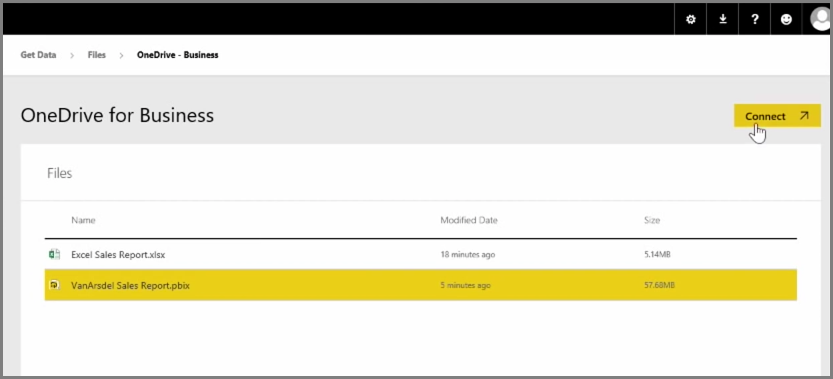

<properties
   pageTitle="將 OneDrive 整合了 Power BI"
   description="使用 OneDrive 商務和 Power BI 檔案輕易地共同作業"
   services="powerbi"
   documentationCenter=""
   authors="davidiseminger"
   manager="mblythe"
   backup=""
   editor=""
   tags=""
   qualityFocus="no"
   qualityDate=""
   featuredVideoId="mxjakuVGgnU"
   featuredVideoThumb=""
   courseDuration="3m"/>

<tags
   ms.service="powerbi"
   ms.devlang="NA"
   ms.topic="get-started-article"
   ms.tgt_pltfrm="NA"
   ms.workload="powerbi"
   ms.date="09/29/2016"
   ms.author="davidi"/>

# 將 OneDrive 整合了 Power BI

在之前的文章，我們會檢閱建立群組來協助組織管理及共同作業是在 Power BI 中的內容。 您也可以使用 Power BI Office365 群組共同作業及使用共用 / **商務用 OneDrive**。

OneDrive 使用 Power bi 做為來源的商務內容可讓您存取許多有用的工具，例如版本歷程記錄。 您也可以從一個 Office365 群組提供存取，讓許多人在相同的 Power BI 或 Excel 檔案上運作的商務用 OneDrive 中共用您的檔案。

若要連線到商務用 OneDrive 上 PBIX (Power BI Desktop) 檔案，登入 Power BI 服務，然後選取 **取得資料**。 選擇 **檔案** 下匯入或連接到資料，然後選取 **OneDrive-商務**。 反白顯示所需的檔案，然後選取 **連接**。

您的內容會出現在左側導覽列中。

現在，在對檔案進行任何變更 **商務用 OneDrive** 會自動反映在 Power BI 環境，並記錄在記錄中的版本。
