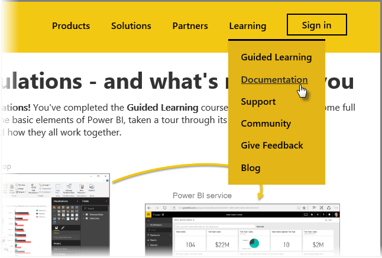

<properties
   pageTitle="Power BI 完成指引學習"
   description="最好的選擇-加上的摘要和許多有用的連結"
   services="powerbi"
   documentationCenter=""
   authors="davidiseminger"
   manager="mblythe"
   backup=""
   editor=""
   tags=""
   qualityFocus="no"
   qualityDate=""
   featuredVideoId=""
   featuredVideoThumb=""
   courseDuration="4m"/>

<tags
   ms.service="powerbi"
   ms.devlang="NA"
   ms.topic="get-started-article"
   ms.tgt_pltfrm="NA"
   ms.workload="powerbi"
   ms.date="09/29/2016"
   ms.author="davidi"/>

# 恭喜您-並為您的下一步

您可以辦到了 ！ **恭喜！** 您已經完成 **引導式學習** Power BI 的課程。 您已完整圓形來自學習 Power BI 的基本項目、 採取導覽其軟體功能和項目，以及了解它們如何共同運作。

這是最後一個區段 (和最後一個主題中，除非您想要了解 DAX) 在課程中，因此如果您已瀏覽所有的這些章節的順序，請花一點時間恭喜您上一步]。 很好 ！ 您要現在十分熟悉這些 **重要概念**:

-   什麼 [Power bi](powerbi-learning-0-0-what-is-power-bi.md)
-    [建置組塊](powerbi-learning-0b-building-blocks-power-bi.md) 的 Power BI
-   
            [取得](powerbi-learning-1-2-connect-to-data-sources-in-power-bi-desktop.md) 和 [模型](powerbi-learning-2-1-intro-modeling-data.md) 資料
-   [視覺效果](powerbi-learning-3-1-intro-visualizations.md)
-   
            [瀏覽資料](powerbi-learning-4-0-intro-power-bi-service.md) Power BI 服務中
-   使用 [Excel 和 Power BI](powerbi-learning-5-1-intro-excel-data.md) 在一起
-   和 [發佈和共用](powerbi-learning-6-0-intro-content-packs-groups.md) 您的工作

超大量的知識，以及現在擁有所有它在腦中，您已準備好開始移到 ！ 以下是一些 **下載的連結** 或取得您的瀏覽器 **連接到 Power BI 服務**:

-   您可以隨時 [取得最新的 Power BI Desktop](https://powerbi.microsoft.com/desktop)
-   前往 [Power BI 服務](https://powerbi.microsoft.com/) 很簡單
-   取得 [Power bi 行動應用程式](https://powerbi.microsoft.com/mobile/) 是兩下消失

還有其他 **說明及參考** 太內容可用。 只要前往此頁面頂端，並選取 **學習 > 文件** 查看我們組更周延的 Power BI 參考內容。

我們希望您喜歡這次您的帶領 **Power BI 引導式學習** 體驗。 幸運的而且可能最佳 Power BI 視覺效果時一律為沈浸式和吸引人。

## DAX 使用者的多個區段

還要更多？ 有興趣使用 **DAX (Data Analysis Expressions)** 來建立、 篩選，或在 Power BI 中使用自訂的資料行和資料表嗎？ 沒有一個人適用對象的多個區段比較傾向於某些程式碼中執行工作，Power BI，而且會呼叫 **DAX 簡介**。 如果您有興趣的引導式學習其他使用相同易記的方法，請看看。
