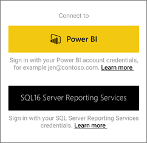
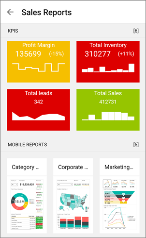

<properties 
   pageTitle="開始使用 Power BI for Android 的行動裝置應用程式"
   description="Microsoft Power BI 的 Android 行動應用程式會將 Power BI 帶入走，最新狀態、 觸控式行動存取商務資訊。"
   services="powerbi" 
   documentationCenter="" 
   authors="maggiesMSFT" 
   manager="mblythe" 
   backup=""
   editor=""
   tags=""
   qualityFocus="monitoring"
   qualityDate="05/18/2016"/>
 
<tags
   ms.service="powerbi"
   ms.devlang="NA"
   ms.topic="article"
   ms.tgt_pltfrm="NA"
   ms.workload="powerbi"
   ms.date="09/30/2016"
   ms.author="maggies"/>

# 開始使用 Power BI for Android 的行動裝置應用程式

Microsoft Power BI 的 Android 應用程式帶來口袋的商業資訊的最新狀態、 觸控式行動存取 Power BI。 檢視和公司儀表板從任何地方進行互動。

您 [Power BI 服務中建立儀表板和報表](powerbi-service-get-started.md) 您的資料。 

然後與您的儀表板和報表互動、 瀏覽資料，並分享，都可透過 Power BI 的 Android 應用程式。

## 首要之務

-   
            **取得應用程式**[Android 應用程式取得 Power BI](http://go.microsoft.com/fwlink/?LinkID=544867) 從 Google Play。  

    >
            **注意︰** Power BI 可在許多不同的 Android 電話上執行。 您的電話需要執行 Android 4.4 的作業系統，或更新版本。 若要檢查您的電話，請移至 **設定** > **裝置的相關** > **Android 版本**。 

-   
            **當您開啟應用程式時，啟動**    即使沒有註冊或登入，開啟應用程式，您可以快速瀏覽的快速概觀，您可以使用 Power BI 應用程式在 Android 電話執行的作業的登入頁面之後。 點選 **略過** 來檢視和瀏覽範例，以及取得應用程式的實際操作經驗。 您可以回到範例視需要從儀表板首頁。

-   了解 [Power Bi 行動應用程式中新](powerbi-mobile-whats-new-in-the-mobile-apps.md)。

## 註冊 Power BI 服務，在網站上

如果您還沒有註冊尚未，請移至 [Power BI 服務 (http://powerbi.com/)](http://powerbi.com/) 註冊您自己的帳戶建立和儲存儀表板和報表，以及將您的資料結合在一起。 然後登入 Power BI 在 Android 電話以查看您自己的儀表板，從任何地方。

1.  在 Power BI 服務，點選 [註冊](http://go.microsoft.com/fwlink/?LinkID=513879) 建立 Power BI 帳戶。

2.   啟動 [建立您自己的儀表板和報告](powerbi-service-get-started.md)。

## 開始使用您的電話上的 Power BI 應用程式

2.  在 Android 電話上，從 [開始] 畫面開啟 Power BI for Android 應用程式。

    

3.  若要檢視您的 Power BI 儀表板和報表，請點選 **Power BI**。  
   若要檢視您的行動的 Reporting Services 報表和 Kpi，請點選 **SQL Server Reporting Services**。

    

## 試用 Power BI 和 Reporting Services 範例  
即使未註冊，您可以試用 Power BI 和 Reporting Services 範例。 下載應用程式之後，您可以檢視範例，或開始使用。 回到範例視需要從儀表板首頁。

### Power BI 範例

您可以檢視並與其互動的 Power BI 儀表板範例中，但有幾件事，您不能處理它們。 您無法開啟儀表板背後的報告、 範例與其他人分享，或讓 [我的最愛]。

1.   點選全域瀏覽按鈕  左上角。
  
2.   點選 **Power BI 範例**, ，然後選擇角色，並瀏覽該角色的範例儀表板。  

    

    >
            **請注意**︰ 並非所有功能都都可以在這些範例。 例如，您無法檢視範例報表為基礎的儀表板。 

### Reporting Services 行動報表範例

1.   點選全域瀏覽按鈕  左上角。

2.  點選 **Reporting Services 範例**, ，然後開啟零售報告或銷售報表] 資料夾來瀏覽其 Kpi 和行動的報告。

    

## 接下來該怎麼辦？

了解其他您可以運用 Android 手機應用程式中 Power bi 儀表板和 Power BI 中的報表和 Reporting Services 行動報表和 Reporting Services web 入口網站中的 Kpi

### Power BI 儀表板

-   檢視您 [儀表板](powerbi-mobile-dashboards-in-the-android-app.md)。
-   瀏覽 [儀表板上的磚](powerbi-mobile-tiles-in-the-android-app.md)。
-   檢視 [報告頁面磚](powerbi-mobile-report-page-tiles-in-the-android-app.md)。
-   開啟 [Power BI 報告](powerbi-mobile-reports-in-the-android-app.md)。
-   檢視 [群組](powerbi-mobile-groups-in-the-android-app.md)。
-   
            [加上註解和共用並排](powerbi-mobile-annotate-and-share-a-tile-from-the-android-app.md)。
-   共用 [儀表板](powerbi-mobile-share-a-dashboard-from-the-android-app.md)。
-   
            [掃描 Power BI QR 代碼](powerbi-mobile-qr-code-for-tile.md) 從 Android 電話號碼，以開啟相關的儀表板。 
-   檢視 [通知更新您的 Power BI 帳戶](powerbi-mobile-notification-center.md), ，例如同事分享您的儀表板。

    

### Reporting Services 行動報表和 Kpi

- 
            [檢視行動的 Reporting Services 報表和 Kpi](powerbi-mobile-android-kpis-mobile-reports.md) Android 手機應用程式中的 Power BI。
- 建立 [Reporting Services web 入口網站上的 Kpi](https://msdn.microsoft.com/library/mt683632.aspx)。
- 
            [建立您自己行動的報告與 SQL Server Mobile 報表發行者](https://msdn.microsoft.com/library/mt652547.aspx), ，並將它們發行至 Reporting Services web 入口網站。

### 請參閱

-  
            [下載 Android 應用程式](http://go.microsoft.com/fwlink/?LinkID=544867) 從 Android 應用程式存放區。
-  [開始使用 Power BI](powerbi-service-get-started.md)
- 問題了嗎？ [請嘗試詢問 Power BI 社群](http://community.powerbi.com/)
