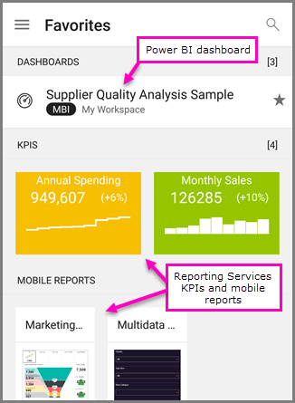

<properties 
   pageTitle="在 [Android 應用程式中檢視行動的 Reporting Services 報表和 Kpi"
   description="Power BI 的 Android 應用程式提供對您的內部重要商務資訊的即時、 觸控式行動存取。"
   services="powerbi" 
   documentationCenter="" 
   authors="maggiesMSFT" 
   manager="mblythe" 
   backup=""
   editor=""
   tags=""
   qualityFocus="no"
   qualityDate=""/>
 
<tags
   ms.service="powerbi"
   ms.devlang="NA"
   ms.topic="article"
   ms.tgt_pltfrm="NA"
   ms.workload="powerbi"
   ms.date="09/26/2016"
   ms.author="maggies"/>

# 在 Android 應用程式中檢視行動的 Reporting Services 報表和 Kpi，Power bi 
Power BI 的 Android 應用程式提供對您的內部重要商務資訊的即時、 觸控式行動存取。 

            [建立 Reporting Services 行動報表](https://msdn.microsoft.com/library/mt652547.aspx) 與 SQL Server Mobile 報表發行者 」 並將它們發行至 [Reporting Services web 入口網站](https://msdn.microsoft.com/library/mt637133.aspx)。 在入口網站中建立 Kpi 權限。 組織資料夾中，標示 [我的最愛]，讓您可以輕鬆地找到它們。 

然後在 Power BI Android 應用程式，檢視行動報表及 Kpi，在資料夾中組織或所收集的 [我的最愛]。 

## 瀏覽沒有 SSRS 伺服器範例

即使您沒有存取 Reporting Services web 入口網站，您仍然可以瀏覽行動的 Reporting Services 報表的功能。 

-  點選 [選項] 圖示  左上角向下捲動，然後點選 [SQL Server RS 範例。

瀏覽 Kpi 和行動的報告與互動的範例。

## 連接到伺服器，才能檢視行動的 Reporting Services 報表 

1.  在 Android 電話上，開啟 Power BI 應用程式。
  
3. 點選 [選項] 圖示  左上角和點選 **連接到 SSRS 伺服器**。

4. 填入伺服器位址以及使用者名稱和密碼，格式如下︰

    

    >
            **請注意**︰ 包含 **http** 或 **https** 前面的連接字串。 例如，http://*servername*.com/reports。

    點選 **進階選項** ，如果您想要授與伺服器名稱。

3. 點選右上角的核取記號。

5.  現在，您會看到在左側的導覽列中的伺服器。

    

>
            **秘訣**︰ 點選 [選項] 圖示  隨時為您的行動 Reporting Services 報表和儀表板中的 Power BI 服務之間移。 

## 檢視 Reporting Services Kpi 和行動 Power BI 應用程式中的報表

Reporting Services Kpi 和行動的報表會顯示在同一個資料夾它們在 Reporting Services web 入口網站上。 

- 點選以查看在聚焦模式 & #151; KPI然後提示您在橫向模式中看到的電話。

    

- 點選行動報表中，以開啟，並在 Power BI 應用程式互動。

    

## 您最愛的 Kpi 和報表檢視

您可以在 Reporting Services web 入口網站中將 Kpi 和行動報表標示為 [我的最愛]，然後檢視一個方便存取的資料夾中的這些在電話上，以及您的 Power BI 最愛的儀表板和報表。

-  點選 **我的最愛**。

    
   
    您從入口網站的最愛都在此頁面。

    

## 移除報表伺服器的連線

您只能連接到一部報表伺服器一次從 Android 應用程式。 如果您想要連接到另一部伺服器，您需要一個從目前中斷連線。

1. 在左側的導覽列下方，點選 **設定**。
2. 點選 [省略符號 (**...**) 您不想連接到伺服器名稱旁邊。
3. 點選 **移除連線**。

## 建立行動的 Reporting Services 報表和 Kpi

您不在 Power BI 行動應用程式中建立 Reporting Services Kpi 和行動的報告。 您在 SQL Server Mobile 報表簽發者和 SQL Server 2016 Reporting Services 入口網站中建立它們。

- 
            [建立您自己的行動 Reporting Services 報告](https://msdn.microsoft.com/library/mt652547.aspx) 並將它們發行至 Reporting Services web 入口網站。
- 建立 [Reporting Services web 入口網站上的 Kpi](https://msdn.microsoft.com/library/mt683632.aspx)

### 請參閱  
- [開始使用 Android 的應用程式的 Power BI](powerbi-mobile-android-app-get-started.md)  
- [開始使用 Power BI](powerbi-service-get-started.md)  
- 問題了嗎？ [請嘗試詢問 Power BI 社群](http://community.powerbi.com/)
