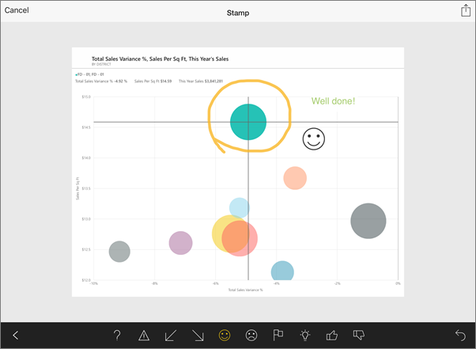

<properties 
   pageTitle="加上註解，並共用從 iPad 應用程式磚的快照集"
   description="了解共用從 ipad 的 iOS 的 Microsoft Power BI 應用程式區塊的快照集。 您可以在任何人，不只是同事傳送並排顯示快照集。"
   services="powerbi" 
   documentationCenter="" 
   authors="maggiesMSFT" 
   manager="erikre" 
   backup=""
   editor=""
   tags=""
   qualityFocus="no"
   qualityDate=""/>
 
<tags
   ms.service="powerbi"
   ms.devlang="NA"
   ms.topic="article"
   ms.tgt_pltfrm="NA"
   ms.workload="powerbi"
   ms.date="10/11/2016"
   ms.author="maggies"/>

# 加上註解，並共用從 iPad 應用程式 (適用於 iOS 的 Power BI) 磚的快照集  

當您共用從磚 [Microsoft Power BI 的 iPad 應用程式](http://go.microsoft.com/fwlink/?LinkId=522062) ios 平台，您正在共用並排的快照集。 收件者完全地傳送郵件時，請參閱 [] 磚。 無法開啟儀表板。 您可以將快照集的方塊傳送給任何人 — 不只是相同的電子郵件網域中的同事。

您可以將註解，行、 文字或戳記 — 至某個磚共用快照集之前。

1.  點選磚聚焦模式中開啟它。

    

2.  點選 [共用] 圖示  右上角的方塊。

3.  在 [編輯] 視窗中的並排顯示加上註解︰  
    

    -   若要繪製行不同的色彩和粗細，點選 [小畫家] 圖示，然後點選左下角的箭號。  

    -   若要輸入的註解，請點選 **A**, ，然後點選 [左邊中央的黑色列上的箭號。  

    -   要貼上 （例如表情符號） 的戳記，方塊上，點選笑臉，然後點選左下角的箭號。   
        

    -   註釋之後, 將它點選共用圖示  在右上角一次。

4.  點選 [郵件] 圖示、 輸入收件者的名稱和訊息，如果您想修改。  

    

5.  點選 **傳送**。

### 請參閱  

            [開始使用 iPad 應用程式](powerbi-mobile-iphone-app-get-started.md) (Power BI for iOS)  

            [從 iPad 應用程式共用儀表板](powerbi-mobile-share-dashboards-from-the-ipad-app.md)
