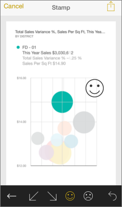

<properties 
   pageTitle="加上註解，並共用從 iPhone 應用程式磚"
   description="深入了解註解和共用磚 iPhone 上為 iOS Power BI 行動應用程式中的快照集。 收件者查看磚，但無法開啟儀表板。"
   services="powerbi" 
   documentationCenter="" 
   authors="maggiesMSFT" 
   manager="mblythe" 
   backup=""
   editor=""
   tags=""
   qualityFocus="no"
   qualityDate=""/>
 
<tags
   ms.service="powerbi"
   ms.devlang="NA"
   ms.topic="article"
   ms.tgt_pltfrm="NA"
   ms.workload="powerbi"
   ms.date="10/03/2016"
   ms.author="maggies"/>
# 加上註解，並共用從 iPhone 應用程式 (適用於 iOS 的 Power BI) 磚

IOS 的 Microsoft Power bi 共用從 iPhone 應用程式磚的快照集，您的收件者請參閱完全相同時送出郵件並排的快照集。 無法開啟儀表板。 您可以將快照集的方塊傳送給任何人 — 不只是相同的電子郵件網域中的同事。

您可以將註解，行、 文字或戳記 — 至某個磚共用快照集之前。

1.  在 [儀表板](powerbi-mobile-dashboards-in-the-iphone-app.md) iPhone 應用程式中，點選 [方塊，使其在聚焦模式中開啟它。

2.  點選 [共用] 圖示  右上角的方塊。

3.  加上註解區塊，點選下方列在 [編輯] 視窗中的圖示︰

    

    -   點選鉛筆圖示以繪製線條的不同的色彩和粗細。

    -   點選 [輸入註解文字球形文字說明。

    -   點選臉貼在並排顯示 （例如表情符號） 的戳記。

4.  之後註解，請點選 [共用資料夾] 圖示  右上角。

5.  在您選擇的郵件應用程式中輸入收件者的名稱，修改訊息，如果您想要然後傳送。

### 請參閱

- [共用 iPhone 應用程式的儀表板 \(Power BI for iOS\)](powerbi-mobile-share-a-dashboard-from-the-iphone-app.md)
- [開始使用 iPhone 應用程式的 Power BI](powerbi-mobile-iphone-app-get-started.md)
- 問題了嗎？ [請嘗試詢問 Power BI 社群](http://community.powerbi.com/)
