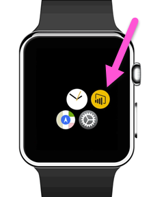
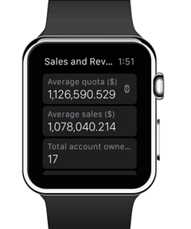
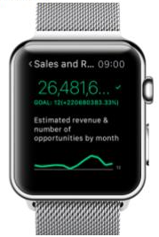
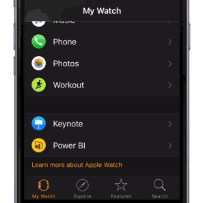

<properties 
   pageTitle="Power BI Apple Watch 應用程式"
   description="Power BI Apple Watch 應用程式"
   services="powerbi" 
   documentationCenter="" 
   authors="maggiesMSFT" 
   manager="erikre" 
   backup=""
   editor=""
   tags=""
   qualityFocus="no"
   qualityDate=""/>
 
<tags
   ms.service="powerbi"
   ms.devlang="NA"
   ms.topic="article"
   ms.tgt_pltfrm="NA"
   ms.workload="powerbi"
   ms.date="10/14/2016"
   ms.author="maggies"/>

# Power BI Apple Watch 應用程式

Power BI Apple Watch 應用程式中，您可以檢視 Kpi，並從 Power BI 儀表板，卡片磚，您監看式 」 權限。 Kpi 和卡片磚最適合小型螢幕上提供的活動訊號量值。 請檢查部落格文章。
 
## 安裝 Apple Watch 應用程式
Power BI Apple Watch 應用程式搭配 Power BI for iOS 應用程式，所以當您 [Power BI 應用程式下載到您的 iPhone](http://go.microsoft.com/fwlink/?LinkId=522062 "iPhone 應用程式下載") 從 Apple 應用程式存放區，就會自動同時下載 Power BI 監看式應用程式。 Apple 本指南說明如何 [Apple Watch 應用程式安裝](https://support.apple.com/en-us/HT204784)。

## 同步處理與 Apple Watch 上的 Power BI 儀表板
1. 在 iPhone 上的 Power BI，開啟您想要同步處理與 Apple Watch 儀表的板。 

2. 選取省略符號 （...） > **與監看式同步處理**。

Power BI 會顯示在儀表板已同步處理與監看式指標。

您可以只同步處理一個儀表板與監看式一次。

> 
            **秘訣**︰ 若要檢視您的監看式方塊從多個儀表板，在 Power BI 服務中，建立新的儀表板，並釘選到它的所有相關方塊。

## 在 Apple Watch 上使用 Power BI 應用程式
要取得 Power BI Apple Watch 應用程式從監看式的跳板，或 （若已設定），請按一下 [Power BI widget 直接從監看式表面。

Power BI Apple Watch 應用程式是由兩個部分所組成。

-    **索引螢幕** 可讓所有的 KPI 和卡片的快速概觀圖格同步處理的儀表板。

    

-    **單元的焦點磚**︰ 按一下某個特定方塊的詳盡檢視的索引螢幕上的磚。

    
 
## 設定自訂的 Power BI widget
您也可以直接在 Apple Watch 朝上顯示某個特定的 Power BI 方塊，所以根本是可見和可存取。

Power BI Apple Watch widget 更新時間接近您的資料更新，讓所需的資訊永遠最新。

### 新增 Power BI widget 監看式圖示

請參閱 [自訂 Apple Watch 朝](https://support.apple.com/en-us/HT205536) Apple 指南中。

### 變更小工具上的文字
提供 Apple Watch 朝上的小空間，Power BI Apple Watch 應用程式可讓您變更成小小的空間 widget 的標題。

-   您在 iPhone 上移至 Apple Watch 控制應用程式選取 Power BI、 瀏覽至小工具的 [名稱] 欄位中，輸入新名稱。

    

 
> [AZURE.NOTE]  如果您不要變更名稱，Power BI widget 會縮短符合監看式表面上的小空間中的字元數的名稱。 

### 請參閱

您的意見反應將協助我們決定要實作在未來，因此請別忘了您想要在 Power BI 行動應用程式中查看其他功能進行投票。 

-   下載 [Power BI iPhone 行動應用程式](http://go.microsoft.com/fwlink/?LinkId=522062)
-   請依照下列 [@MSPowerBI 的 Twitter](https://twitter.com/MSPowerBI)
-   加入在交談 [Power BI 社群](http://community.powerbi.com/)

            [開始使用 iPhone 應用程式的 Power BI](powerbi-mobile-iphone-app-get-started.md)

