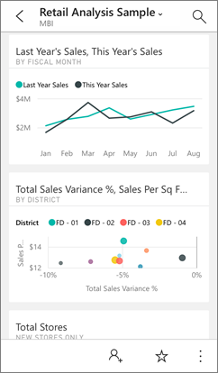
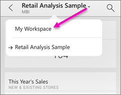

<properties 
   pageTitle="Power BI 行動應用程式中檢視儀表板"
   description="您建立或連接至 Power BI 服務中的儀表板。 然後您可以在 Power BI 行動應用程式中檢視它們。"
   services="powerbi" 
   documentationCenter="" 
   authors="maggiesMSFT" 
   manager="mblythe" 
   backup=""
   editor=""
   tags=""
   qualityFocus="complete"
   qualityDate="07/08/2016"/>
 
<tags
   ms.service="powerbi"
   ms.devlang="NA"
   ms.topic="article"
   ms.tgt_pltfrm="NA"
   ms.workload="powerbi"
   ms.date="10/03/2016"
   ms.author="maggies"/>
# Power BI 行動應用程式中檢視儀表板

儀表板是貴公司的生命週期和處理程序的入口網站。 儀表板是概觀，從單一位置監視業務的目前狀態。

## 在 Power BI 服務中建立儀表板
**行動應用程式中，請勿建立儀表板。** 

若要查看您的行動裝置上的多個儀表板，您需要建立或連接至這些電腦上。 

1. 移至 Power BI 服務 ([https://www.powerbi.com](https://www.powerbi.com)) 和 [登入帳戶](powerbi-service-self-service-signup-for-power-bi.md)。

2. 
            [建立 Power BI 儀表板](powerbi-service-create-a-dashboard.md), ，或連接到現有 [內容的各種服務的組件](powerbi-content-packs-services.md)。

以下是 Power BI 儀表板中的 Power BI 服務︰

## Power BI 行動應用程式中檢視儀表板

然後這些相同的儀表板也會自動出現在 Power BI 行動應用程式。 儀表板即時，會自動重新整理，因此不需要手動重新整理。

在行動電話所見，以下是相同的儀表板︰

從這裡開始，您可以︰

- 與同事共用儀表板 。
- 
            [讓您的最愛的其中一個儀表板](powerbi-mobile-favorites.md) 。
- 點選要回到我的工作區的儀表板名稱旁的箭號。

    

## 在 Power BI 服務建立電話檢視儀表板

如果您的儀表板擁有者 *在 Power BI 服務* 您可以建立專為手機的儀表板檢視直向模式。 

深入了解 [建立電話檢視儀表板](powerbi-service-create-dashboard-phone-view.md)。

### 進一步了解 Power BI 行動應用程式中的儀表板
- [在 Power BI 的 iPad 應用程式適用於 iOS 的儀表板](powerbi-mobile-dashboards-on-the-ipad-app.md)
- [在 iPhone iOS 的應用程式的 Power BI 儀表板](powerbi-mobile-dashboards-in-the-iphone-app.md)
- [在 Power BI 行動應用程式適用於 Windows 10 裝置的儀表板](powerbi-mobile-dashboards-in-the-win10phone-app.md)
- [儀表板中 Android 手機的 Power BI 應用程式](powerbi-mobile-dashboards-in-the-android-app.md)
- 問題了嗎？ [請嘗試詢問 Power BI 社群](http://community.powerbi.com/)