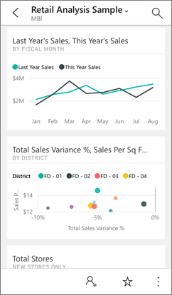
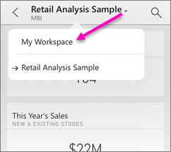

<properties 
   pageTitle="IPhone 應用程式中的儀表板"
   description="儀表板是您公司的生命週期的入口網站。 了解如何檢視、 探索和分享您的儀表板，在 Power BI for iPhone 上的 iOS 應用程式。" 
   services="powerbi" 
   documentationCenter="" 
   authors="maggiesMSFT" 
   manager="mblythe" 
   backup=""
   editor=""
   tags=""
   qualityFocus="monitoring"
   qualityDate="03/11/2016"/>
 
<tags
   ms.service="powerbi"
   ms.devlang="NA"
   ms.topic="article"
   ms.tgt_pltfrm="NA"
   ms.workload="powerbi"
   ms.date="09/30/2016"
   ms.author="maggies"/>

# 在 iPhone 應用程式 (適用於 iOS 的 Power BI) 儀表板  

儀表板是您公司的生命週期的入口網站。 了解如何檢視、 探索和分享您的儀表板，在 Power BI for iPhone 上的 iOS 應用程式。  

您不在 Power BI 應用程式中建立儀表板，您在 iPhone 上。 您 [建立儀表板](powerbi-service-dashboards.md) 或 [連接到服務的內建儀表板](powerbi-content-packs-services.md) 例如 Salesforce Power BI 服務中 ([https://www.powerbi.com](https://www.powerbi.com)) 電腦上。

然後在 iPhone iOS 的應用程式的 Microsoft Power BI，您可以探索這些相同的儀表板。 儀表板即時，會自動重新整理，因此您不需要手動重新整理。

## 您在 iPhone 上的 [檢視儀表板  
1.  開啟您在 iPhone 上的 Power BI 應用程式，然後登入。

    需要 [iPhone 應用程式下載](http://go.microsoft.com/fwlink/?LinkId=522062) Apple App Store 中？

3.  點選以開啟儀表板。  

     

    根據預設，Power BI 儀表板尋找您在 iPhone 上稍有不同。 所有的方塊會出現相同的大小，以及其排列方式逐一從上到下。

     

    >
            **秘訣**︰ 如果您的儀表板擁有者，在 Power BI 服務，您可以 [建立專為手機儀表板檢視](powerbi-service-create-dashboard-phone-view.md) 直向模式。 

     只需啟動您的電話側邊或者 [在橫向模式中檢視儀表板](#view-dashboards-in-landscape-mode) 在電話上。

     

4.  向上或向下撥動，以查看儀表板中的所有圖格。 您可以：

    -   
            [點選磚](powerbi-mobile-tiles-in-the-iphone-app.md) 焦點模式中開啟，並與其互動。

    -   
            [互動報表頁面磚](powerbi-mobile-report-page-tiles-in-the-iphone-app.md) iPhone 應用程式中。

    -   點選星形  至 [使其成為我的最愛](powerbi-mobile-favorites.md)。

    -  點選 **邀請**  至 [邀請同事](powerbi-mobile-share-a-dashboard-from-the-iphone-app.md) 檢視您的儀表板。

    -  點選以開啟 [儀表板] 功能表中的省略符號...

        

        然後點選以 [加入圖片磚](powerbi-mobile-picture-tiles-in-the-iphone-app.md) 儀表板。

        

    -  
            [同步處理與 Apple Watch 儀表板](powerbi-mobile-apple-watch.md)。

6.  若要回到儀表板的清單，請點選 [儀表板標題旁的箭號，然後點選 **我的工作區**。

    

## 檢視儀表板以橫向模式

若要檢視儀表板以橫向模式，只需啟動電話側邊。 儀表板版面配置變更由一系列並排顯示檢視的整個儀表板 & #151; 您會看到所有儀表板的磚就如同它們在 Power BI 服務。

若要放大和縮小您的儀表板的不同區域，來巡覽取景位置調整，您可以使用 「 縮小 」 筆勢。 您仍然可以和 [點選磚](powerbi-mobile-tiles-in-the-win10phone-app.md) 焦點模式開啟磚，並與您的資料互動。

### 請參閱  
- [開始使用 iPhone 應用程式的 Power BI](powerbi-mobile-iphone-app-get-started.md)  
- [開始使用 Power BI](powerbi-service-get-started.md) 
- [在 Power BI 建立儀表板電話檢視](powerbi-service-create-dashboard-phone-view.md) 
- 問題了嗎？ [請嘗試詢問 Power BI 社群](http://community.powerbi.com/)