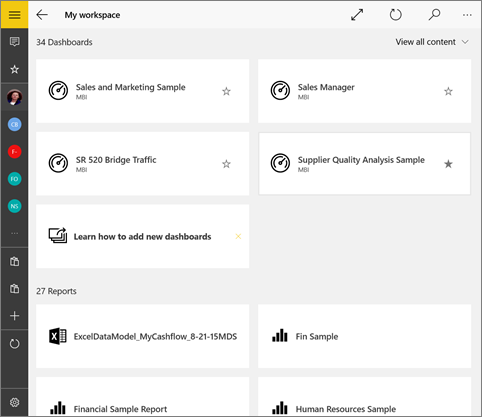

<properties 
   pageTitle="在 Windows 10 的 Power BI 行動應用程式中的儀表板"
   description="儀表板是您公司的生命週期的入口網站。 了解如何檢視、 瀏覽，以及共用儀表板 Power BI 行動應用程式中的 Windows 10"
   services="powerbi" 
   documentationCenter="" 
   authors="maggiesMSFT" 
   manager="mblythe" 
   backup=""
   editor=""
   tags=""
   qualityFocus="complete"
   qualityDate="09/28/2016"/>
 
<tags
   ms.service="powerbi"
   ms.devlang="NA"
   ms.topic="article"
   ms.tgt_pltfrm="NA"
   ms.workload="powerbi"
   ms.date="09/28/2016"
   ms.author="maggies"/>

# 檢視、 探索和共用的 Windows 10 的 Power BI 行動應用程式中的儀表板  

儀表板是貴公司的生命週期和處理程序的入口網站。 儀表板是概觀，從單一位置監視業務的目前狀態。 

Windows 10 行動裝置上，您不在 Power BI 建立儀表板。 您 [建立儀表板](powerbi-service-dashboards.md) 或 [連接到服務的內建儀表板](powerbi-content-packs-services.md) 例如 Salesforce Power BI 服務中 ([https://www.powerbi.com](https://www.powerbi.com)) 電腦上。

接著在 [Power BI for Windows 10 行動裝置應用程式](powerbi-mobile-win10phone-app-get-started.md), ，您可以瀏覽這些相同的儀表板。

## Windows 10 裝置上檢視儀表板  
1.  開啟 Windows 10 裝置上的 Power BI 應用程式，然後登入。

    需要 [下載應用程式](http://go.microsoft.com/fwlink/?LinkID=526478) 第一次？

2.  點選以開啟儀表板。   

    

    Power BI 儀表板尋找 Windows 10 手機上稍有不同。 所有圖格出現相同的寬度，而且其排列方式逐一從上到下。

    

     您也可以開啟您的電話側邊 [橫向模式中檢視儀表板](#view-dashboards-in-landscape-mode) 在電話上。

    >
            **秘訣**︰ 如果您的儀表板擁有者，在 Power BI 服務，您可以 [建立專為手機儀表板檢視](powerbi-service-create-dashboard-phone-view.md) 直向模式。 

5.  在 [儀表板，您可以︰

    -   
            [點選磚](powerbi-mobile-tiles-in-the-win10phone-app.md) 開啟，並與其互動。
    -   點選 **全螢幕** 圖示  呈現沒有框線或功能表 Power BI 儀表板，像是 **投影片放映** 在 PowerPoint 中的檢視。
    -   點選 **邀請** 圖示  至 [共用您的儀表板](powerbi-mobile-share-a-dashboard-from-the-win10phone-app.md) 與同事。
    -   點選星形  至 [使儀表板我的最愛](powerbi-mobile-favorites.md)。
    -   點選 **釘選到開始** 圖示 [釘選到您 Windows [開始] 畫面的儀表板](powerbi-mobile-pin-dashboard-from-win10phone-app.md)。 
    

6.  若要返回儀表板首頁上，點選 [儀表板名稱以開啟追蹤，然後點選 **我的工作區**:
   
     

## 檢視儀表板以橫向模式
您也可以在橫向模式中，檢視儀表板，只要開啟您的電話。 儀表板版面配置變更由一系列並排顯示檢視的整個儀表板 & #151;您會看到所有 Power BI 服務中配置的儀表板的磚。

若要放大和縮小您的儀表板的不同區域，來巡覽取景位置調整，您可以使用 「 縮小 」 筆勢。 您仍然可以和 [點選磚](powerbi-mobile-tiles-in-the-win10phone-app.md) 焦點模式開啟磚，並與您的資料互動。

### 請參閱  
- 
            [Power BI 行動應用程式下載 Windows 10](http://go.microsoft.com/fwlink/?LinkID=526478) 從 Windows 市集  
- [開始使用 Power BI 行動應用程式的 Windows 10](powerbi-mobile-win10phone-app-get-started.md)  
- [在 Power BI 建立儀表板電話檢視](powerbi-service-create-dashboard-phone-view.md)
- 問題了嗎？ [請嘗試詢問 Power BI 社群](http://community.powerbi.com/)