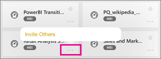

<properties 
   pageTitle="儀表板上 iPad 應用程式"
   description="儀表板是您公司的生命週期的入口網站。 了解如何檢視、 探索以及儀表板 iOS Power BI 應用程式中共用您的 iPad 上。"
   services="powerbi" 
   documentationCenter="" 
   authors="maggiesMSFT" 
   manager="erikre" 
   backup=""
   editor=""
   tags=""
   qualityFocus="monitoring"
   qualityDate="03/11/2016"/>
 
<tags
   ms.service="powerbi"
   ms.devlang="NA"
   ms.topic="article"
   ms.tgt_pltfrm="NA"
   ms.workload="powerbi"
   ms.date="10/11/2016"
   ms.author="maggies"/>
# 在 iPad 應用程式 (適用於 iOS 的 Power BI) 儀表板

儀表板是您公司的生命週期的入口網站。 了解如何檢視、 探索以及儀表板 iOS Power BI 應用程式中共用您的 iPad 上。

您不在您的 iPad 上建立儀表板。 在 Power BI 服務 ([https://www.powerbi.com](https://www.powerbi.com)) 電腦上，您 [建立儀表板](powerbi-service-dashboards.md) 或 [連接到服務的內建儀表板](powerbi-content-packs-services.md) 例如 Salesforce。

您看到 Microsoft Power bi 的 iPad 應用程式中的這些相同儀表板 ios 平台，以及您的同事分享您的儀表板。

## 在您的 iPad 上檢視儀表板

1.  開啟 Power BI 應用程式。

    需要 [iPad 應用程式下載](http://go.microsoft.com/fwlink/?LinkId=522062) 從 Apple 應用程式存放區第一次？

2.  點選 **儀表板** 頂端的 [應用程式。  

    

     -     黃色星形  顯示的儀表板的 [我的最愛]。 

     -     每個儀表板名稱之下的標記法  顯示分類中每個儀表板資料的方式。 深入了解 [Power BI 中的資料分類](powerbi-service-data-classification.md)。

3.  您可以從工作區中共用儀表板。 點選右下角的 [儀表板] 磚中，省略符號 （...），然後點選 **邀請其他人**。

    

4.  您也可以點選以開啟它，並查看該儀表板中的並排顯示的儀表板。 在儀表板，您可以與它互動的時間︰

    - 
            [點選磚互動](powerbi-mobile-tiles-in-the-ipad-app.md) 與方塊。

    - 
            [開啟報表](powerbi-mobile-reports-on-the-ipad-app.md) 背後並排顯示。

    - 
            [邀請其他人檢視儀表板](powerbi-mobile-share-dashboards-from-the-ipad-app.md)。

    - 
            [加上註解，並共用快照](powerbi-mobile-annotate-and-share-a-snapshot-from-the-ipad-app.md) 並排顯示。

4.  若要返回以我的工作區中，點選 [左上角的儀表板的名稱，然後點選 **我的工作區**。

    

### 請參閱

-   
            [開始使用 iPad 應用程式](powerbi-mobile-iphone-app-get-started.md) Power bi。
- 問題了嗎？ [請嘗試詢問 Power BI 社群](http://community.powerbi.com/)

