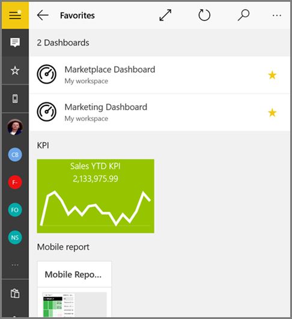
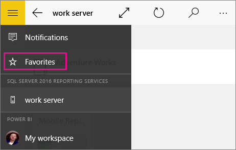
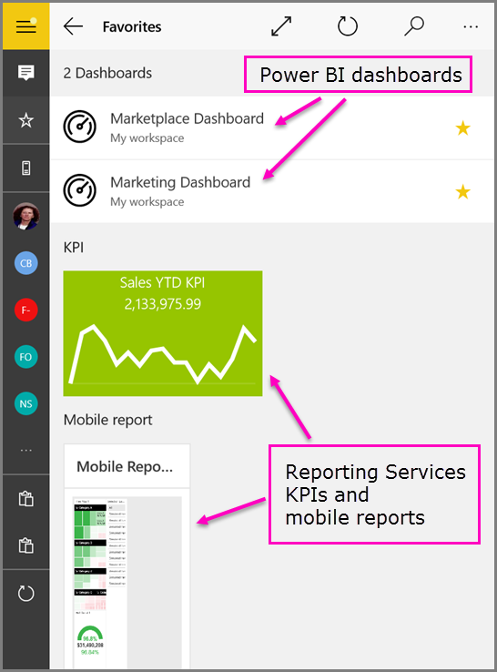
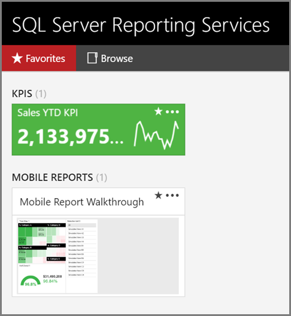

<properties 
   pageTitle="最喜愛的 Power BI 儀表板和 Power BI 應用程式中的 Reporting Services 行動報表"
   description="閱讀有關讓 Power BI 行動應用程式中檢視您最愛 Power BI 儀表板，以及 Reporting Services Kpi 和行動的報告。"
   services="powerbi" 
   documentationCenter="" 
   authors="maggiesMSFT" 
   manager="mblythe" 
   backup=""
   editor=""
   tags=""
   qualityFocus="no"
   qualityDate=""/>
 
<tags
   ms.service="powerbi"
   ms.devlang="NA"
   ms.topic="article"
   ms.tgt_pltfrm="NA"
   ms.workload="powerbi"
   ms.date="09/29/2016"
   ms.author="maggies"/>

# 最喜愛的 Power BI 儀表板，Reporting Services Kpi 和行動 Power BI 行動應用程式中的報表 

當您對儀表板 *最愛* 在 Power BI 行動應用程式，您可以從存取所有裝置，包括 Power BI 服務。 您可以檢視所有您最愛 Power BI 儀表板，以及 Reporting Services Kpi 和行動的報告，在行動應用程式中的 [我的最愛] 頁面上。

您也可以 [在 Power BI 服務中進行的 Power BI 儀表板我的最愛](powerbi-service-favorite-dashboards.md)。 然後您可以在看到行動應用程式中的 [我的最愛] 頁面。

> 
            **請注意**︰ 所有 Power BI 行動應用程式中，使用 [我的最愛] 頁面，您可以管理您在 Power BI 行動應用程式適用於 iOS 和 Windows 10 裝置的最愛。
 

## 在行動應用程式中進行的 Power BI 儀表板我的最愛
您可以在儀表板我的最愛清單中的 [儀表板或儀表板中，適用於 iOS 和 Windows 10 裝置的 Power BI 行動應用程式。

* 在儀表板中的行動應用程式清單中，點選 [儀表板名稱旁邊的空白星號， 。 星狀轉為黃色 。

    

* 在儀表板中，點選頂端功能區中的空白星號 。 星狀轉為黃色 。

    

## 檢視您最喜愛的 Power BI 儀表板，以及行動的 Reporting Services 報表和 Kpi

*   點選頂端導覽功能表 , ，然後點選 [ **我的最愛**。

    

    現在您會看到所有您最愛 Power BI 儀表板，再加上您最愛的 Reporting Services 行動報表和 Kpi，在一個地方。

    

## 建立行動的 Reporting Services 報表或 KPI 我的最愛

不在 Power BI 行動應用程式，讓行動的 Reporting Services 報表或 Kpi [我的最愛]，但您可以在行動應用程式中加以檢視。 

1. 開啟網頁瀏覽器。 

2. 在網頁瀏覽器網址列中輸入 web 入口網站 URL。
 
    根據預設，URL 會是 http://[ComputerName]/reports。

1. 瀏覽 KPI 或行動的報表，您想要讓最愛，選擇省略符號 (**...**) 在右上角中，選取 **加到我的最愛**。

    

2. 選取 **我的最愛** 以查看您喜愛入口網站的 [我的最愛] 頁面上以及在 web 入口網站功能區上。

    

    您現在可以看到它以及 Power BI 儀表板 [我的最愛]，在行動裝置應用程式。

### 請參閱

* [在 Power BI 服務的最愛儀表板](powerbi-service-favorite-dashboards.md) 

檢視行動的 Reporting Services 報表和 Kpi 中︰ 

* [IPad 應用程式 (適用於 iOS 的 Power BI)](powerbi-mobile-ipad-kpis-mobile-reports.md)
* [IPhone 應用程式 (適用於 iOS 的 Power BI)](powerbi-mobile-iphone-kpis-mobile-reports.md)
* [Android 的 Power BI 應用程式](powerbi-mobile-android-kpis-mobile-reports.md)
* [Power BI 行動應用程式的 Windows 10](powerbi-mobile-win10-kpis-mobile-reports.md)

### 問題了嗎？ 
[請嘗試詢問 Power BI 社群](http://community.powerbi.com/)
