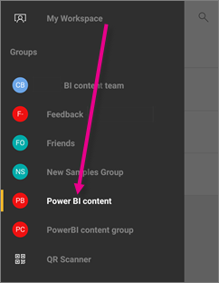

<properties 
   pageTitle="Android 應用程式中的群組"
   description="Power BI 群組都建置在 Office 365 群組。 閱讀有關檢視與 Power bi 互動 Android 的行動應用程式中的群組儀表板"
   services="powerbi" 
   documentationCenter="" 
   authors="maggiesMSFT" 
   manager="mblythe" 
   backup=""
   editor=""
   tags=""
   qualityFocus="no"
   qualityDate=""/>
 
<tags
   ms.service="powerbi"
   ms.devlang="NA"
   ms.topic="article"
   ms.tgt_pltfrm="NA"
   ms.workload="powerbi"
   ms.date="10/03/2016"
   ms.author="maggies"/>

# Power BI 的 Android 應用程式中的群組  

Power BI 群組提供 Office 365 群組上建置的強大共同作業體驗。 深入了解 [Office 365 中的群組](https://support.office.com/article/Create-a-group-in-Office-365-7124dc4c-1de9-40d4-b096-e8add19209e9)。 群組是使用 [Power BI Pro](powerbi-power-bi-pro-content-what-is-it.md) 體驗。

您 [在 Power BI 服務中建立群組](powerbi-service-create-a-group-in-power-bi.md), ，並那里為其新增儀表板。

則您看到並與其互動的 microsoft 群組儀表板 [Android 應用程式的 Power BI](powerbi-mobile-android-app-get-started.md)。  

## 群組的內容互動  
1.  開啟 Power bi 的 Android 應用程式。

    需要 [下載 Android 應用程式](http://go.microsoft.com/fwlink/?LinkID=544867) 第一次？

2.  在 [我的工作區，選取群組。  

    

3.  群組頁面會顯示儀表板和已經發佈到 [群組] 工作區的報表。  

    

4.  
            [選取儀表板](powerbi-mobile-dashboards-in-the-android-app.md) 開啟並檢視 [群組] 工作區中。  

### 請參閱  
-  
            [下載 Android 應用程式](http://go.microsoft.com/fwlink/?LinkID=544867) 從 Google play  
-  [開始使用 Android 的應用程式的 Power BI](powerbi-mobile-android-app-get-started.md)  
-  [開始使用 Power BI](powerbi-service-get-started.md)  
-  問題了嗎？ [請嘗試詢問 Power BI 社群](http://community.powerbi.com/)