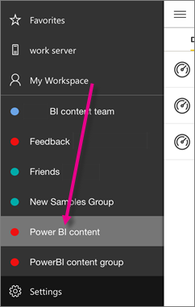

<properties 
   pageTitle="IPhone 應用程式中的群組"
   description="Power BI 群組都建置在 Office 365 群組。 閱讀有關檢視與互動在 Power BI iOS 行動應用程式的 iPhone 群組儀表板。"
   services="powerbi" 
   documentationCenter="" 
   authors="maggiesMSFT" 
   manager="mblythe" 
   backup=""
   editor=""
   tags=""
   qualityFocus="no"
   qualityDate=""/>
 
<tags
   ms.service="powerbi"
   ms.devlang="NA"
   ms.topic="article"
   ms.tgt_pltfrm="NA"
   ms.workload="powerbi"
   ms.date="10/03/2016"
   ms.author="maggies"/>

# IPhone 應用程式 (適用於 iOS 的 Power BI) 中的群組  

Power BI 群組提供 Office 365 群組上建置的強大共同作業體驗。 深入了解 [Office 365 中的群組](https://support.office.com/article/Create-a-group-in-Office-365-7124dc4c-1de9-40d4-b096-e8add19209e9)。 群組是提供付費的 Power BI 體驗。 

您 [Power BI 服務中建立群組](powerbi-service-create-a-group-in-power-bi.md)。 則您看到並與其互動的 microsoft 群組儀表板 [iPhone 的 Power BI iOS 應用程式](powerbi-mobile-ipad-app-get-started.md)。 

Power BI 傳送通知給 iPhone，每當有人給您所屬任何群組加入新的儀表板。 

## 與 Power BI 群組的互動  
1.  開啟 Power BI for iPhone iOS 應用程式。 

    需要 [下載並安裝 iOS 應用程式的 iPhone](http://go.microsoft.com/fwlink/?LinkId=522062) 第一次？

2.  在 [我的工作區，選取群組。 
 
    

3.  群組頁面會顯示已經發佈到 [群組] 工作區的儀表板。  

    

4.  
            [選取儀表板](powerbi-mobile-dashboards-in-the-iphone-app.md) ，開啟並檢視。

### 請參閱
- [開始使用 iPhone 應用程式的 Power BI](powerbi-mobile-iphone-app-get-started.md)
- [開始使用 Power BI](powerbi-service-get-started.md)
- 問題了嗎？ [請嘗試詢問 Power BI 社群](http://community.powerbi.com/)  