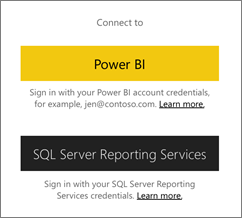
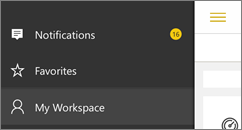

<properties 
   pageTitle="開始使用 iPad 應用程式"
   description="Microsoft Power BI for ipad 的 iOS 應用程式是 Power BI 和 Reporting Services 的行動 BI 體驗的關鍵部分。"
   services="powerbi" 
   documentationCenter="" 
   authors="maggiesMSFT" 
   manager="erikre" 
   backup=""
   editor=""
   tags=""
   qualityFocus="identified"
   qualityDate="08/08/2016"/>
 
<tags
   ms.service="powerbi"
   ms.devlang="NA"
   ms.topic="article"
   ms.tgt_pltfrm="NA"
   ms.workload="powerbi"
   ms.date="10/12/2016"
   ms.author="maggies"/>

# 開始使用 iPad 應用程式 (適用於 iOS 的 Power BI)  

IOS 的 Microsoft Power BI 的 iPad 應用程式是 Power BI 和 Reporting Services 的行動 BI 體驗的一部分。 即時、 觸控式行動存取您的重要商務資訊在內部部署和雲端中，您可以檢視並與其互動您公司的儀表板和報表輕易地從任何地方。 瀏覽儀表板中的資料，並分享您的同事的電子郵件或文字的訊息中。  

您 [Power BI 服務中建立儀表板和報表](powerbi-service-get-started.md) 您的資料。 

然後與您的儀表板和報表互動、 瀏覽資料，並分享，都可透過 Power BI 的 iPad 應用程式。

您也可以 [檢視 Reporting Services Kpi 和行動的報表，為您的內部部署資料](powerbi-mobile-ipad-kpis-mobile-reports.md) 中 Power BI 的 iPad 應用程式。 您 [使用 SQL Server Mobile 報表發行者建立這些 Kpi 和行動報表](https://msdn.microsoft.com/library/mt652547.aspx)。

了解 [Power Bi 行動應用程式中新](powerbi-mobile-whats-new-in-the-mobile-apps.md)。

## 下載適用於 iPad 的 iOS 應用程式  

            [下載 iPad 應用程式](http://go.microsoft.com/fwlink/?LinkId=522062) 從 Apple App Store。

> [AZURE.NOTE]  您的 iPad 必須至少執行 iOS 9.0。 

## 註冊 Power BI 服務

移至 [註冊 Power BI](http://go.microsoft.com/fwlink/?LinkID=513879) 服務時，如果您還沒有這麼做。 它是免費的。

## 開始使用 Power BI 應用程式 

1.  在 iPad，開啟 Power BI 應用程式。
  
2.  若要檢視您的 Power BI 儀表板和報表，請點選 **Power BI**。 使用與您在網站上的 Power BI 帳戶相同的認證登入。 

    若要檢視您的行動的 Reporting Services 報表和 Kpi，請點選 **SQL Server Reporting Services**。 使用 SQL Server Reporting Services 認證登入。

    

    >
            **秘訣**︰ 當您準備應用程式中時，點選全域瀏覽按鈕  左上角到兩個服務之間。 

## 試用 Power BI 和 Reporting Services 範例  
即使未註冊，您可以試用 Power BI 和 Reporting Services 範例。 下載應用程式之後，您可以檢視範例，或開始使用。 回到範例視需要從儀表板首頁。

### Power BI 範例

您可以檢視並與其互動的 Power BI 儀表板範例中，但有幾件事，您不能處理它們。 您無法開啟儀表板背後的報告、 範例與其他人分享，或讓 [我的最愛]。

1.   點選全域瀏覽按鈕  左上角。
  
2.   點選 **Power BI 範例**, ，然後選擇角色，並瀏覽該角色的範例儀表板。  

    

    >
            **請注意**︰ 並非所有功能都都可以在這些範例。 例如，您無法檢視範例報表為基礎的儀表板。 

### Reporting Services 行動報表範例

1.   點選全域瀏覽按鈕  左上角。

2.  點選 **Reporting Services 範例**, ，然後開啟零售報告或銷售報表] 資料夾來瀏覽其 Kpi 和行動的報告。

    

## 搜尋報表或儀表板

* 點選右上角中的放大鏡 , ，然後輸入要尋找的字詞。

    

    依預設它會搜尋所有儀表板和報表，但是您可以搜尋只是其中一個。

## 多個與 Power BI 儀表板和行動應用程式中的報表 
看看其他您可以在儀表板和 Power BI 中的報表和 Reporting Services 行動報表和 Reporting Services web 入口網站中的，Kpi iPad 應用程式。

-   檢視您 [Power BI 儀表板](powerbi-mobile-dashboards-on-the-ipad-app.md)。
-   互動 [Power BI 儀表板上的磚](powerbi-mobile-tiles-in-the-ipad-app.md)。
-   開啟 [Power BI 報告](powerbi-mobile-reports-on-the-ipad-app.md) 儀表板。
-   
            [共用 Power BI 儀表板](powerbi-mobile-share-dashboards-from-the-ipad-app.md)。
-   
            [加上註解，並共用快照](powerbi-mobile-annotate-and-share-a-snapshot-from-the-ipad-app.md) 並排顯示。
-   檢視您 [群組的 Power BI 儀表板和報表](powerbi-service-mobile-groups-in-the-ipad-app.md)。
-   
            [設定資料警示](powerbi-mobile-set-data-alerts-in-the-iphone-app.md) 到您的資料變更時收到通知。
-   檢視 [通知更新您的 Power BI 帳戶](powerbi-mobile-notification-center.md), ，例如同事分享您的儀表板。
   
    

## 以行動的 Reporting Services 報表和 Kpi

- 
            [檢視行動的 Reporting Services 報表和 Kpi](powerbi-mobile-ipad-kpis-mobile-reports.md) Reporting Services web 入口網站上。
- 建立 [Reporting Services web 入口網站上的 Kpi](https://msdn.microsoft.com/library/mt683632.aspx)。
- 
            [建立您自己行動的報告與 SQL Server Mobile 報表發行者](https://msdn.microsoft.com/library/mt652547.aspx), ，並將它們發行至 Reporting Services web 入口網站。

### 請參閱  
- 
            [開始使用 iPhone 應用程式的 Power BI](powerbi-mobile-ipad-app-get-started.md)  
- 
            [開始使用 Power BI](powerbi-service-get-started.md)  
- 問題了嗎？ 請嘗試詢問 [Power BI 社群](http://community.powerbi.com/)

