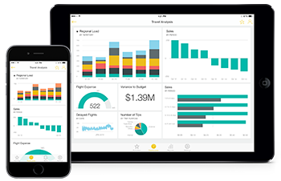

<properties 
   pageTitle="IOS 裝置的 power BI 行動應用程式"
   description="檢視並與其互動貴公司的 Power BI 儀表板和報表，以及行動的 Reporting Services 報表和 Kpi，來從任何地方。"
   services="powerbi" 
   documentationCenter="" 
   authors="maggiesMSFT" 
   manager="mblythe" 
   backup=""
   editor=""
   tags=""
   qualityFocus="no"
   qualityDate=""/>
 
<tags
   ms.service="powerbi"
   ms.devlang="NA"
   ms.topic="article"
   ms.tgt_pltfrm="NA"
   ms.workload="powerbi"
   ms.date="09/30/2016"
   ms.author="maggies"/>

# IOS 的 power BI 行動應用程式︰ 您的儀表板和報表在 iPad、 iPhone、 Apple Watch 和 iPod Touch

IOS 的 Microsoft Power BI 應用程式提供行動 BI 體驗 iPad、 iPhone、 Apple Watch 和 iPod Touch 上。 應用程式提供即時、 觸控式行動存取重要商務資訊，因此您可以檢視並與其互動貴公司的 Power BI 儀表板和報表，以及行動的 Reporting Services 報表和 Kpi，從任何地方。 瀏覽您的儀表板中的資料，並分享您的同事的電子郵件或文字的訊息中。

移至 [Power BI](http://go.microsoft.com/fwlink/?LinkID=513879) 註冊 Power BI 服務。

請參閱 [Power BI 行動應用程式中新](powerbi-mobile-whats-new-in-the-mobile-apps.md)。

## Power BI 的 iPad 應用程式

開始使用 [iPad iOS Power bi 應用程式](powerbi-mobile-ipad-app-get-started.md)。

-   下載 [iPad 應用程式](http://go.microsoft.com/fwlink/?LinkId=522062) (適用於 iOS 的 Power BI)。

### Power BI 儀表板和報表

-   檢視您 [Power BI 儀表板](powerbi-mobile-dashboards-on-the-ipad-app.md)。
-   互動 [Power BI 儀表板上的磚](powerbi-mobile-tiles-in-the-ipad-app.md)。
-   開啟 [Power BI 報告](powerbi-mobile-reports-on-the-ipad-app.md) 儀表板。
-   
            [共用 Power BI 儀表板](powerbi-mobile-share-dashboards-from-the-ipad-app.md)。
-   
            [加上註解，並共用快照](powerbi-mobile-annotate-and-share-a-snapshot-from-the-ipad-app.md) 並排顯示。
-   檢視您 [群組的 Power BI 儀表板和報表](powerbi-service-mobile-groups-in-the-ipad-app.md)。

### 行動報表及 Reporting Services web 入口網站中的 Kpi

- 
            [檢視 SQL Server 行動報表及 Kpi](powerbi-mobile-ipad-kpis-mobile-reports.md) Reporting Services web 入口網站上。
- 建立 [Reporting Services web 入口網站上的 Kpi](https://msdn.microsoft.com/library/mt683632.aspx)。
- 
            [建立您自己行動的報告與 SQL Server Mobile 報表發行者](https://msdn.microsoft.com/library/mt652547.aspx), ，並將它們發行至 Reporting Services web 入口網站。

## 適用於 iPhone、 Apple Watch 或 iPod Touch iOS power BI 應用程式

開始使用 [Power BI 應用程式適用於 iOS](powerbi-mobile-iphone-app-get-started.md) iPhone、 Apple Watch 或 iPod Touch 上。

-   下載 [Power BI 應用程式適用於 iOS](http://go.microsoft.com/fwlink/?LinkId=522062)。

### Power BI 儀表板和報表

-   檢視您 [Power BI 儀表板](powerbi-mobile-dashboards-in-the-iphone-app.md)。
-   互動 [磚](powerbi-mobile-tiles-in-the-iphone-app.md) 儀表板上。
-   設定 [資料警示](powerbi-mobile-set-data-alerts-in-the-iphone-app.md) 為您的資料。
-   共用 [Power BI 儀表板](powerbi-mobile-share-a-dashboard-from-the-iphone-app.md)。
-   加上註解和 [共用並排](powerbi-mobile-annotate-and-share-a-tile-from-the-iphone-app.md)。
-   
            [掃描 Power BI QR 代碼](powerbi-mobile-qr-code-for-tile.md) 從 iPhone
-   
            [建立圖片方塊](powerbi-mobile-picture-tiles-in-the-iphone-app.md) iPhone 應用程式

### 行動報表及 Reporting Services web 入口網站中的 Kpi

- 
            [檢視 SQL Server 行動報表及 Kpi](powerbi-mobile-iphone-kpis-mobile-reports.md) Reporting Services web 入口網站上。
- 建立 [Reporting Services web 入口網站上的 Kpi](https://msdn.microsoft.com/library/mt683632.aspx)。
- 
            [建立您自己行動的報告與 SQL Server Mobile 報表發行者](https://msdn.microsoft.com/library/mt652547.aspx), ，並將它們發行至 Reporting Services web 入口網站。

## 開始使用 Power BI

啟動 [將資料](powerbi-service-get-data.md) 從 Excel 試算表，SQL Server Analysis Services、 Salesforce，為各不相同，因為來源和 GitHub。

然後將您的資料結合在一起所建立 [儀表板](powerbi-service-dashboards.md) 和 [報表](powerbi-service-reports.md) Power BI 中。

現在遇到這些 iOS Power BI 應用程式中。

### 請參閱

- [開始使用 Power BI](powerbi-service-get-started.md)
- 問題了嗎？ [請嘗試詢問 Power BI 社群](http://community.powerbi.com/)
