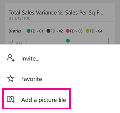
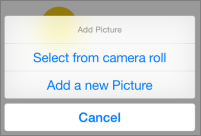

<properties 
   pageTitle="建立圖片方塊 iPhone 應用程式"
   description="您可以加入您在 iPhone 上的任何圖片，您擁有 Power BI 行動 iOS 應用程式中的儀表板。 了解如何。"
   services="powerbi" 
   documentationCenter="" 
   authors="maggiesMSFT" 
   manager="mblythe" 
   backup=""
   editor=""
   tags=""
   qualityFocus="no"
   qualityDate=""/>
 
<tags
   ms.service="powerbi"
   ms.devlang="NA"
   ms.topic="article"
   ms.tgt_pltfrm="NA"
   ms.workload="powerbi"
   ms.date="10/03/2016"
   ms.author="maggies"/>

# 建立圖片方塊與 iPhone 應用程式 (適用於 iOS 的 Power BI)

您可以加入您在 iPhone 上的任何圖片，您擁有 Power BI 行動 iOS 應用程式中的儀表板。 Power BI 將圖片新增為儀表板，您在 iPhone 上最後一個方塊，並將它加入至 Power BI 服務的儀表板的右下角。 每一位使用者可以看見您的儀表板可以在儀表板上看到圖片。 在 Power BI 服務中，您可以移動它任何您想要在儀表板。

## 建立圖片磚

1.  開啟 [iPhone 應用程式中的儀表板](powerbi-mobile-dashboards-in-the-iphone-app.md)。 您需要能夠編輯此儀表板的權限。

2.  點選以開啟 [儀表板] 功能表中的省略符號。

    

3.  點選 **加入圖片磚**。

    

4.  允許存取的相機或相機的 Power BI 向前復原。 

4.  從您的相簿中，選取一張圖片，或採用新的圖片。

    

5.  如果您想要的話，並點選 [輸入標題， **新增**。

6.  可能需要一些時間來上傳影像。 您可以繼續瀏覽其他儀表板和報表，Power BI 中的等待。

6.  您看到圖片已準備好的通知。 點選通知可移至儀表板。 向下的儀表板，以查看圖片結尾捲動。 

     

圖片方塊的作用與您在 iPhone 上的其他牌相同。 您可以：  

 - 焦點模式中加以開啟。
 - 
            [加上註解和分享](powerbi-mobile-annotate-and-share-a-tile-from-the-iphone-app.md) 電子郵件中。 

### 請參閱

- [開始使用 iPhone 應用程式的 Power BI](powerbi-mobile-iphone-app-get-started.md)
- [開始使用 Power BI](powerbi-service-get-started.md)
- 問題了嗎？ [請嘗試詢問 Power BI 社群](http://community.powerbi.com/)
