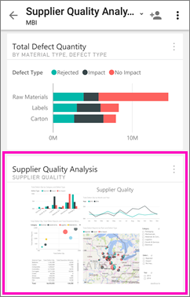
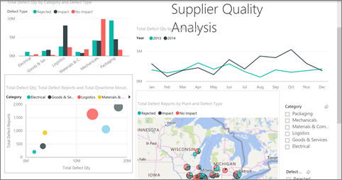

<properties 
   pageTitle="Android 的應用程式中檢視報表] 頁面磚"
   description="閱讀有關檢視與互動適用於 Android 的 Power BI 行動應用程式中的儀表板中並排顯示即時的報表。"
   services="powerbi" 
   documentationCenter="" 
   authors="maggiesMSFT" 
   manager="erikre" 
   backup=""
   editor=""
   tags=""
   qualityFocus="no"
   qualityDate=""/>
 
<tags
   ms.service="powerbi"
   ms.devlang="NA"
   ms.topic="article"
   ms.tgt_pltfrm="NA"
   ms.workload="powerbi"
   ms.date="10/14/2016"
   ms.author="maggies"/>

# 在 Power BI for Android 應用程式中檢視報表] 頁面磚

當您 [建立儀表板](powerbi-service-dashboards.md) 在 Power BI 服務中，您將新增個別視覺效果從 Power BI 報表為儀表板上的磚。 您也可以 [整個 Power BI 報表頁面，為動態磚釘選](powerbi-service-pin-a-live-tile-to-a-dashboard-from-a-report.md)。 您可以檢視這些報表磚中 Android 手機的 Power BI 應用程式。

1.  當您開啟 [Android 應用程式儀表板](powerbi-mobile-dashboards-in-the-android-app.md), ，您會看到報表的小型影像。

    

2. 點選的磚。 以橫向模式開啟已釘選的即時報表頁面。 

    

### 請參閱

- 
            [Android 應用程式中並排顯示](powerbi-mobile-tiles-in-the-android-app.md)
- 問題了嗎？ 
            [請嘗試詢問 Power BI 社群](http://community.powerbi.com/)

