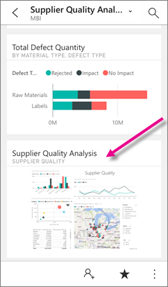
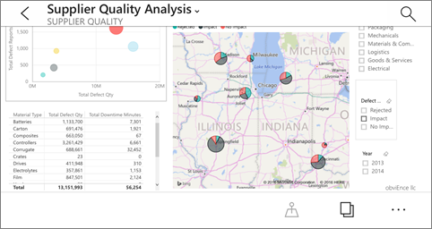

<properties 
   pageTitle="檢視報表] 頁面中並排顯示 iPhone 應用程式"
   description="閱讀有關檢視與您在 iPhone 上的 iOS Power BI 行動應用程式中的儀表板中並排顯示即時報表互動。"
   services="powerbi" 
   documentationCenter="" 
   authors="maggiesMSFT" 
   manager="mblythe" 
   backup=""
   editor=""
   tags=""
   qualityFocus="no"
   qualityDate=""/>
 
<tags
   ms.service="powerbi"
   ms.devlang="NA"
   ms.topic="article"
   ms.tgt_pltfrm="NA"
   ms.workload="powerbi"
   ms.date="10/03/2016"
   ms.author="maggies"/>

# 檢視報表] 頁面中並排顯示 iPhone 應用程式 (適用於 iOS 的 Power BI)

當您 [建立儀表板](powerbi-service-dashboards.md) 在 Power BI 服務中，您將新增個別視覺效果從 Power BI 報表為儀表板上的磚。 您也可以 [整個 Power BI 報表頁面，為動態磚釘選](powerbi-service-pin-a-live-tile-to-a-dashboard-from-a-report.md)。 您可以檢視這些報表磚中 iPhone 的 Power BI 應用程式。

1.  當您開啟 [iPhone 應用程式中的儀表板](powerbi-mobile-dashboards-in-the-iphone-app.md), ，您會看到報表的小型影像。

    

2. 點選的磚。 釘選的即時報表頁面以橫向模式開啟報表。 

    

6.  若要回到儀表板的清單，請點選報表頁面標題旁的箭號，然後點選 [ **我的工作區**。

    

### 請參閱

- [IPhone 應用程式中磚](powerbi-mobile-tiles-in-the-iphone-app.md)
- [開始使用 iPhone 應用程式的 Power BI](powerbi-mobile-iphone-app-get-started.md)
- [開始使用 Power BI](powerbi-service-get-started.md)
- 問題了嗎？ [請嘗試詢問 Power BI 社群](http://community.powerbi.com/)