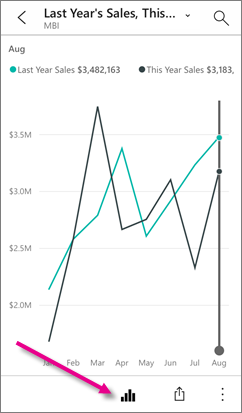
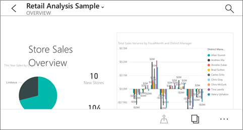

<properties 
   pageTitle="IPhone 應用程式中的報表"
   description="深入了解檢視與互動 iPhone iOS Power BI 行動應用程式中的報表。 報表會以視覺方式呈現您的資料。 "
   services="powerbi" 
   documentationCenter="" 
   authors="maggiesMSFT" 
   manager="mblythe" 
   backup=""
   editor=""
   tags=""
   qualityFocus="no"
   qualityDate=""/>
 
<tags
   ms.service="powerbi"
   ms.devlang="NA"
   ms.topic="article"
   ms.tgt_pltfrm="NA"
   ms.workload="powerbi"
   ms.date="10/03/2016"
   ms.author="maggies"/>

# 在 iPhone 應用程式 (適用於 iOS 的 Power BI) 報表

報表是您的資料，以代表不同的結果和深入觀點，從該資料的視覺效果的互動式檢視。 您 [建立和自訂報表](powerbi-service-create-a-new-report.md) 在 Power BI 服務 [(https://powerbi.com)](https://powerbi.com)。 

然後您檢視並與其互動中的這些報表 [iPhone 應用程式 (適用於 iOS 的 Power BI)](powerbi-mobile-iphone-app-get-started.md)。

## 開啟 Power BI 報表

-   您在 iPhone 上在 **我的工作區** 或在群組中，點選報表。

    

    您同時看到 Power BI 報表與 Excel 活頁簿。

-   或者︰ 在儀表板中，點選聚焦模式中開啟它的磚，然後點選 [開啟報表圖示 。

    

橫向模式中開啟報表。

>
            **請注意**︰ 並非所有的方塊可以在報表中開啟。 比方說，當您點一下您建立的問與答中提問的磚不開啟報表。 

## 請參閱其他 Power BI 報表中的頁面

-   撥動並排，或點選頁面圖示  > 點選頁面。 

## 交叉篩選和反白顯示 Power BI 報表頁面

-   點選圖表中的值。

    

    點選紅色的"030 把孩子"泡泡在泡泡圖中的反白顯示其他圖表中相關的值。 在右上方的直條圖會顯示百分比，因為有些反白顯示的值大於總計值，而有些則較小。 

## 使用交叉分析篩選器來篩選 [報表] 頁面

Power BI 服務中設計報表時 [(https://powerbi.com)](https://powerbi.com), ，您可以 [將交叉分析篩選器加入至報表頁面](powerbi-service-tutorial-slicers.md)。 然後當您或您的同事在您的行動裝置上檢視報表時，您可以使用交叉分析篩選器來篩選頁面。

-   在 [報表] 頁面上的交叉分析篩選器中選取的值。

    

## 回到我的工作區

*   點選 [方塊名稱旁的箭號，點選 **我的工作區**。

    

### 請參閱

- [開始使用 iPhone 應用程式 (適用於 iOS 的 Power BI)](powerbi-mobile-iphone-app-get-started.md)
- 問題了嗎？ [請嘗試詢問 Power BI 社群](http://community.powerbi.com/)
