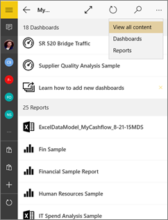
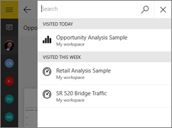
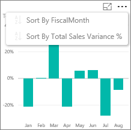
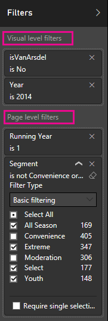
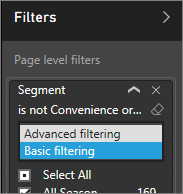

<properties 
   pageTitle="Windows 10 的 Power BI 行動應用程式中的報表"
   description="深入了解 Windows 10，Power BI 行動應用程式中檢視報表。 Power BI 服務，來建立報表，然後在行動應用程式互動。 "
   services="powerbi" 
   documentationCenter="" 
   authors="maggiesMSFT" 
   manager="erikre" 
   backup=""
   editor=""
   tags=""
   qualityFocus="no"
   qualityDate=""/>
 
<tags
   ms.service="powerbi"
   ms.devlang="NA"
   ms.topic="article"
   ms.tgt_pltfrm="NA"
   ms.workload="powerbi"
   ms.date="10/12/2016"
   ms.author="maggies"/>
# Windows 10 的 Power BI 行動應用程式中的報表

報表是您的資料，以代表不同的結果和深入觀點，從該資料的視覺效果的互動式檢視。 您 [建立和自訂報表](powerbi-service-create-a-new-report.md) 在 Power BI 服務 [(https://powerbi.com)](https://powerbi.com)。

然後您檢視並與其互動中的這些報表 [Power BI for Windows 10 行動裝置應用程式](powerbi-mobile-win10phone-app-get-started.md)。

## 開啟 Power BI 報表

您可以開啟報表 **我的工作區** 或以數種方式在 Windows 10 電話上的群組中︰ 

-   捲動到您的報表，或 
-   點選 **檢視所有內容** > **報表**。 
    
    

-   點選 [搜尋] 圖示或者  若要查看您最近造訪過的報表清單，或依名稱搜尋。

    

    > [AZURE.NOTE]  如果您 [整個 Excel 檔案匯入 Power BI](powerbi-bring-in-whole-excel-files.md), ，他們擁有的 Excel 圖示。 當您點選 [這些應用程式中時，開啟在 [Power BI 服務](https://powerbi.com) 瀏覽器視窗中。

-   或在儀表板中，點選 [垂直省略符號的磚，然後點選 **開啟報表** 圖示 。

    

    > [AZURE.NOTE]  並非所有的牌可以開啟報表。 比方說，當您點一下您建立的問與答中提問的磚不開啟報表。   

## 請參閱其他 Power BI 報表中的頁面

-   點選 [底部的頁面] 索引標籤。 

## 排序 Power BI 報表中的圖表

> [AZURE.NOTE]  排序上無法使用 Windows 10 手機。

1.  點選 [圖表]。 

2.  點選右上角中的省略符號 （...）、 點選 **排序** 箭號，然後點選欄位名稱。

    

3.  若要反轉排序次序，請點選 **排序** 箭號，然後點選一次名稱相同的欄位。 

## 交叉篩選和反白顯示 Power BI 報表頁面

-   點選圖表中的值。

    

    點選紅色的"030 把孩子"泡泡在泡泡圖中的反白顯示其他圖表中相關的值。 在右上方的直條圖會顯示百分比，因為有些反白顯示的值大於總計值，而有些則較小。 

## 使用交叉分析篩選器來篩選 [報表] 頁面

Power BI 服務中設計報表時 [(https://powerbi.com)](https://powerbi.com), ，您可以 [將交叉分析篩選器加入至報表頁面](powerbi-service-tutorial-slicers.md)。 然後當您或您的同事在您的行動裝置上檢視報表時，您可以使用交叉分析篩選器來篩選頁面。

-   在 [報表] 頁面上的交叉分析篩選器中選取的值。

    

## 若要篩選 Power BI 報表

您永遠可以使用本身的視覺效果中的欄位做為篩選，以篩選 Power BI 報表中的個別視覺效果。 您也可以篩選在報表中，整個頁面，如果您或報表建立者擁有 [篩選器新增至頁面](powerbi-service-add-a-filter-to-a-report.md) Power BI 服務中 ([https://powerbi.com](http://powerbi.com/))。 在 Power BI 服務中，您也可以加入其他欄位做為特定的視覺效果的篩選。 

> [AZURE.NOTE]  
> 
> - 如果您沒有編輯報表的權限，您可以變更篩選條件，但您無法儲存這些變更。 
> - 篩選報表上無法使用 Windows 10 手機。 不過，交叉分析篩選器可在電話上。 請參閱 [使用交叉分析篩選器來篩選報表頁面](powerbi-mobile-reports-in-the-windows-app.md#use-slicers-to-filter-the-report-page)。

1. 在報表中，展開 [篩選] 窗格。

    

    如果當您選取視覺效果時，報表建立者已設定頁面層級篩選，您會看到 *visual 層級篩選* 該視覺，和 *頁面層級篩選* 整個頁面。

    

2. 選取您想要的值的核取方塊。

3. 或者，您可以切換的篩選模式。 點選 **基本篩選** ，然後選取 **進階篩選** 選取改為使用運算式的值。

    

    數字欄位會提供這類運算式 **是小於**, ，**大於**, ，**不**, ，和 **是空白的**。

       

    文字欄位會提供這類運算式 **包含**, ，**開頭不**, ，和 **不**。

4.  若要將其他欄位加入至 [篩選] 窗格中，移至 Power BI 服務 ([https://powerbi.com](http://powerbi.com/))， [將篩選加入至頁面](powerbi-service-add-a-filter-to-a-report.md), ，並儲存報表。

## 向下切入圖表中的 [向下和向上

在使用向上和向下箭號的左上角的圖中，您可以向下鑽研來檢視圖表的一個部分所組成的值。 若要 [新增到視覺](powerbi-service-drill-down-in-a-visualization.md), ，編輯 Power BI 服務中的報表 ([https://powerbi.com](https://powerbi.com/))。

> [AZURE.NOTE]  向下和向上切入無法使用 Windows 10 行動電話上。

1.   點選以開啟向下鑽研右上角的箭號。
   
    

2.   點選列、 資料行或向下鑽研到該組件的詳細資料圖表的其他部分 — 在此情況下，哦資料行儲存在美國俄亥俄州。

3.   若要向下鑽研備份，點選 [按住滑鼠或以滑鼠右鍵按一下圖表，並點選右上角中的向上鍵。

    

## 回到我的工作區

-  點選 [上一頁] 箭頭，或點選報表名稱 > **我的工作區**。

    

### 請參閱

- 
            [開始使用 Power BI 應用程式適用於 Windows 10 裝置](powerbi-service-windows-app-get-started.md)
- 問題了嗎？ 
            [請嘗試詢問 Power BI 社群](http://community.powerbi.com/)

