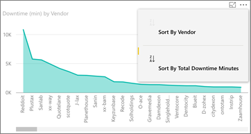
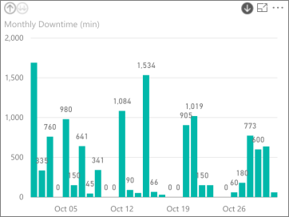
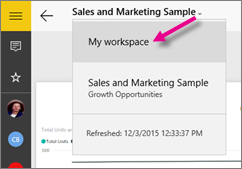

<properties 
   pageTitle="IPad 應用程式上的報表"
   description="深入了解適用於 ipad 的 iOS Power BI 行動應用程式中檢視報表。 Power BI 服務，來建立報表，然後在行動應用程式互動。"
   services="powerbi" 
   documentationCenter="" 
   authors="maggiesMSFT" 
   manager="erikre" 
   backup=""
   editor=""
   tags=""
   qualityFocus="no"
   qualityDate=""/>
 
<tags
   ms.service="powerbi"
   ms.devlang="NA"
   ms.topic="article"
   ms.tgt_pltfrm="NA"
   ms.workload="powerbi"
   ms.date="10/10/2016"
   ms.author="maggies"/>
# IPad 應用程式 (適用於 iOS 的 Power BI) 報表

報表是您的資料，以代表不同的結果和深入觀點，從該資料的視覺效果的互動式檢視。 您 [建立和自訂報表](powerbi-service-create-a-new-report.md) 在 Power BI 服務 [(https://powerbi.com)](https://powerbi.com)。

然後您檢視與報表互動上 [Microsoft Power BI 的 iPad 應用程式](http://go.microsoft.com/fwlink/?LinkId=522062) ios。

## 開啟 [報表]

-   點選 **報表** 頂端 **我的工作區**。

-   或點選儀表板上的磚，然後點選報表圖示 。

    > [AZURE.NOTE]  並非所有的牌可以開啟報表。 例如，透過問與答提出問題所建立的磚不開啟報表。

-   點選 [搜尋] 圖示或者  右上角，依名稱搜尋它，或參閱您最近造訪過的報表清單中。

    

## 請參閱報表中的其他頁面

-   點選 [] 索引標籤底部的 [應用程式。

    

## 交叉篩選報表頁面

-   點選列或資料行在圖表中。

    

    點選 **原料** 較低的圖表中的資料行反白顯示在上方圖表相關的值。

## 排序圖表

-  點選圖表中，點選 [省略符號 (**...**) 點選欄位名稱。

    

-   若要反轉排序次序，請點選 **排序** 箭號，然後點選一次名稱相同的欄位。

## 向下切入圖表中的 [向下和向上

有時候您可以向下切入圖表以查看圖表的一個部分所組成的值中。 您可以向上或向下切入 iPad 應用程式，但您無法將它新增至視覺效果。 您只能 [新增到視覺效果](powerbi-service-drill-down-in-a-visualization.md) Power BI 中的報表中。 

> [AZURE.NOTE]  目前，向下鑽研不適用於 iPad 中的對應。

-   點選 [視覺效果。 如果在右上角有向下箭號，然後您可以向下鑽研。 點選箭號，然後點選 [視覺效果 & #151; 中的值在此情況下， **年 10 月** 資料行。

    

-   若要備份的向下鑽研，點選左上角中的向上箭號。

    

## 若要篩選 Power BI 報表

您永遠可以使用本身的視覺效果中的欄位做為篩選，以篩選 Power BI 報表中的個別視覺效果。 您也可以篩選在報表中，整個頁面，如果您或報表建立者擁有 [篩選器新增至頁面](powerbi-service-add-a-filter-to-a-report.md) Power BI 服務中 ([https://powerbi.com](http://powerbi.com/))。 在 Power BI 服務中，您也可以加入其他欄位做為特定的視覺效果的篩選。 

> [AZURE.NOTE]  如果您沒有編輯報表的權限，您可以變更篩選條件，但您無法儲存這些變更。 

1. 在報表中，展開 [篩選] 窗格。

    

    如果當您選取視覺效果時，報表建立者已設定頁面層級篩選，您會看到 *visual 層級篩選* 該視覺，和 *頁面層級篩選* 整個頁面。

    

2. 選取您想要的值的核取方塊。

3. 或者，您可以切換的篩選模式。 點選 **基本篩選** ，然後選取 **進階篩選** 選取改為使用運算式的值。

    

     數字欄位會提供這類運算式 **是小於**, ，**大於**, ，**不**, ，和 **是空白的**。

     文字欄位會提供這類運算式 **包含**, ，**開頭不**, ，和 **不**。

       

4.  若要將其他欄位加入至 [篩選] 窗格中，移至 Power BI 服務 ([https://powerbi.com](http://powerbi.com/))， [將篩選加入至頁面](powerbi-service-add-a-filter-to-a-report.md), ，並儲存報表。

## 回到我的工作區

-  點選 [上一頁] 箭頭，或點選報表名稱 > **我的工作區**。

    

### 請參閱 

-  
            [開始使用 iPad 應用程式](powerbi-mobile-iphone-app-get-started.md) Power bi。
- 問題了嗎？ 
            [請嘗試詢問 Power BI 社群](http://community.powerbi.com/)

