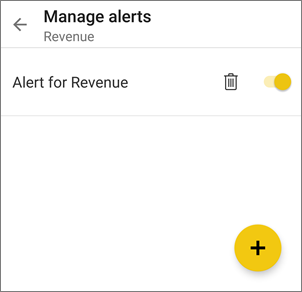

<properties
   pageTitle="Android 手機的 Power BI 應用程式中設定資料警示"
   description="了解如何設定警示通知您超出限制的儀表板中的資料變更時在 Power BI 應用程式中的 Android 手機和 Power BI 服務的設定。"
   services="powerbi"
   documentationCenter=""
   authors="maggiesMSFT"
   manager="mblythe"
   backup=""
   editor=""
   tags=""
   qualityFocus="no"
   qualityDate=""/>

<tags
   ms.service="powerbi"
   ms.devlang="NA"
   ms.topic="article"
   ms.tgt_pltfrm="NA"
   ms.workload="powerbi"
   ms.date="10/04/2016"
   ms.author="maggies"/>

# Android 手機的 Power BI 應用程式中設定資料警示

Power BI 服務，以通知您的儀表板中的資料變更時超出限制您設定和 Android 手機的 Power BI 行動應用程式中，您可以設定警示。 警示適用於包含單一數字，例如卡和量測計的磚。 您可以在 Power BI 行動應用程式中設定資料警示，並查看它們在 Power BI 服務，反之亦然。 只有您可以查看資料警示設定，即使您的儀表板或磚的快照集共用。

> [AZURE.WARNING] 資料驅動的警示通知提供您資料的相關資訊。 如果您的裝置被偷，仍建議您將 Power BI 服務關閉所有資料驅動的警示規則。 
> 
> 深入了解 [管理 Power BI 服務中的資料警示](powerbi-service-set-data-alerts.md)。

## 設定警示

1.  點選數字或量測計中開啟它的儀表板] 磚。  

2.  點選鈴鐺圖示  新增提醒。  

    

3.  請點選加號 （+） 圖示。

    

4.  選擇接收警示的上方或下方的值，並輸入值。

    

4.  點選 [完成]****。

5.  決定是否要接收每小時或每日警示，以及是否也會收到一封電子郵件時收到警示。

    

    >
            **請注意**︰ 除非在這段期間實際重新整理資料，沒有收到每隔一小時或每一天的警示。

6.  您可以變更警示的標題。

6.  點選 **儲存**。

## 接收警示

您在 Power BI 中接收警示 [通知中心](powerbi-mobile-notification-center.md) 在 Power BI 行動應用程式或 Power BI 服務，以及有關新儀表板通知別人已經與您共用。

雖然某些重新整理頻率，資料來源通常會設定為每天，重新整理。 儀表板中的資料重新整理時，如果正在追蹤的資料達到您所設定的臨界值的其中一個，將會發生幾件事。

1.  Power BI 會檢查以查看是否已超過一小時或 24 小時以上 （取決於您選取的選項） 自上一次警示已傳送。

    只要資料已超出臨界值，您會收到警示，每隔一小時或每隔 24 小時。

2.  如果您已經設定傳送電子郵件警示，您會發現類似下面的收件匣中。

    

3.  Power BI 新增訊息至您 [**通知中心**](powerbi-mobile-notification-center.md)。

4. 點選主功能表圖示  通知中心開啟，並請參閱警示詳細資料。

>
            **請注意**︰ 警示只能在資料重新整理。 當資料重新整理時，Power BI 會查看警示會為該資料。 如果資料已達到警示的閾值，則會觸發警示。

## 管理警示

您可以管理 Power BI 行動應用程式中的個別警示或 [管理 Power BI 服務中的所有警示](powerbi-service-set-data-alerts.md)。

### 在 Power BI 行動應用程式中管理警示

1.  在儀表板中，點選卡片或警示的並排顯示量測計。  

2.  點選實心鈴鐺圖示 。  

3. 點選 [變更值，或將它關閉的警示。

    

4. 請點選加號圖示 （+） 至相同的磚加入另一個警示。

4. 若要完全刪除警示，請點選記憶體回收可以圖示 。

## 秘訣與疑難排解
- 警示目前不支援 Bing 磚或卡片磚與日期/時間量值。
- 警示只適用於數值資料。
- 警示僅用於資料重新整理。 它們不適用於靜態資料。

### 請參閱  
- [管理您的 Power BI 服務警示](powerbi-service-set-data-alerts.md)
- [Power BI 行動通知中心](powerbi-mobile-notification-center.md)
- [開始使用 Power BI](powerbi-service-get-started.md)  
- 更多的問題嗎？ [試用 Power BI 社群](http://community.powerbi.com/)
