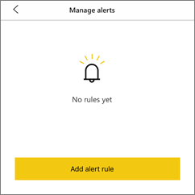

<properties
   pageTitle="Set data alerts in the Power BI app for iOS on the iPhone and iPad"
   description="Learn to set alerts to notify you when data in a dashboard changes beyond limits you set in the Power BI mobile app for iOS and in the Power BI service."
   services="powerbi"
   documentationCenter=""
   authors="maggiesMSFT"
   manager="mblythe"
   backup=""
   editor=""
   tags=""
   qualityFocus="no"
   qualityDate=""/>

<tags
   ms.service="powerbi"
   ms.devlang="NA"
   ms.topic="article"
   ms.tgt_pltfrm="NA"
   ms.workload="powerbi"
   ms.date="10/10/2016"
   ms.author="maggies"/>

# Set data alerts in the Power BI app for iOS on the iPhone and iPad

You can set alerts in the Power BI mobile app on the iPhone and iPad, and in the Power BI service, to notify you when data in a dashboard changes beyond limits you set. Alerts work for tiles featuring a single number, such as cards and gauges. You can set data alerts on your iPhone or iPad and see them in the Power BI service, and vice versa. Only you can see the data alerts you set, even if you share a dashboard or a snapshot of a tile.

> [AZURE.WARNING] Data-driven alert notifications provide information about your data. If your device gets stolen, we recommend going to the Power BI service to turn off all data-driven alert rules. 
> 
> Learn more about <bpt id="p1">[</bpt>managing data alerts in the Power BI service<ept id="p1">](powerbi-service-set-data-alerts.md)</ept>.

## Set an alert

1.  Tap a number or gauge tile in a dashboard to open it in focus mode.  

    

2.  Tap the bell icon <ph id="ph1"></ph> to add an alert.  

3.  Tap <bpt id="p1">**</bpt>Add alert rule<ept id="p1">**</ept>.

    

4.  Choose to receive alerts above or below a value, then set the value.

    

4.  Decide whether to receive hourly or daily alerts, and whether to also receive an email when you get the alert.

    ><bpt id="p1">**</bpt>Note<ept id="p1">**</ept>: You don't receive alerts every hour or every day unless the data has actually refreshed in that time.

6.  You can change the alert title, too.

6.  Tap <bpt id="p1">**</bpt>Save<ept id="p1">**</ept>.

7.  A single tile can have alerts for values both above and below thresholds. In <bpt id="p1">**</bpt>Manage alerts<ept id="p1">**</ept>, tap <bpt id="p2">**</bpt>Add alert rule<ept id="p2">**</ept>.

    

## Receiving alerts

You receive alerts in the Power BI <bpt id="p1">[</bpt>Notification Center<ept id="p1">](powerbi-mobile-notification-center.md)</ept> on your mobile device or in the Power BI service, along with notifications about new dashboards that someone has shared with you.

Data sources are often set to refresh daily, although some refresh more often. When the data in the dashboard is refreshed, if the data being tracked reaches one of the thresholds you've set, several things will happen.

1.  Power BI checks to see if it's been more than an hour or more than 24 hours (depending on the option you selected) since the last alert was sent.

    As long as the data is past the threshold, you'll get an alert every hour or every 24 hours.

2.  If you've set the alert to send you an email, you'll find something like this in your Inbox.

    

3.  Power BI adds a message to your <bpt id="p1">**</bpt>Notification center<ept id="p1">**</ept> and adds a new alert icon to the applicable tile <ph id="ph1"></ph>.

4. Tap the global navigation button <ph id="ph1"></ph> to <bpt id="p1">[</bpt>open your <bpt id="p2">**</bpt>Notification center<ept id="p2">**</ept><ept id="p1">](powerbi-mobile-notification-center.md)</ept> and see the alert details.

      

><bpt id="p1">**</bpt>Note<ept id="p1">**</ept>: Alerts only work on data that is refreshed. When data refreshes, Power BI looks to see if an alert is set for that data. If the data has reached an alert threshold, an alert is triggered.

## Manage alerts on your iPhone or iPad

You can manage individual alerts on your mobile device or <bpt id="p1">[</bpt>manage all your alerts in the Power BI service<ept id="p1">](powerbi-service-set-data-alerts.md)</ept>.

1.  In a dashboard, tap a number or gauge tile that has an alert.  

    

2.  Tap the bell icon <ph id="ph1"></ph>.  

3. Tap the name of the alert to edit it, tap the slider to turn off email alerts, or tap the garbage can to delete the alert.

    

## Tips and troubleshooting
- Alerts currently aren't supported for Bing tiles or card tiles with date/time measures.
- Alerts only work with numeric data.
- Alerts only work on data that is refreshed. They don't work on static data.

### 請參閱  
- [Manage your alerts in the Power BI service](powerbi-service-set-data-alerts.md)
- [Power BI Mobile Notification Center](powerbi-mobile-notification-center.md)
- [Get started with Power BI](powerbi-service-get-started.md)  
- Questions? [Try asking the Power BI Community](http://community.powerbi.com/)
