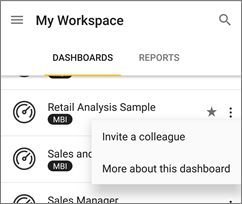

<properties 
   pageTitle="共用的儀表板，從 Android 應用程式"
   description="了解如何邀請同事共用 Power bi 從 Android 應用程式的連結，以檢視儀表板。"
   services="powerbi" 
   documentationCenter="" 
   authors="maggiesMSFT" 
   manager="mblythe" 
   backup=""
   editor=""
   tags=""
   qualityFocus="no"
   qualityDate=""/>
 
<tags
   ms.service="powerbi"
   ms.devlang="NA"
   ms.topic="article"
   ms.tgt_pltfrm="NA"
   ms.workload="powerbi"
   ms.date="10/14/2016"
   ms.author="maggies"/>
# Power bi 共用 Android 的行動電話應用程式的儀表板

邀請同事共用的連結來檢視您的儀表板 [Android 應用程式的 Microsoft Power BI](powerbi-mobile-android-app-get-started.md)。 

## 共用儀表板

1.  在儀表板首頁上，點選 [省略符號 （...），然後點選 **邀請同事**。

    

2.  或者，您也可以在儀表板右上角，點選 [邀請圖示 。

 
    如果您的儀表板擁有者，您會看到與您已共用此儀表板，這些資訊與同事的清單︰

    -   
            **可以檢視**︰ 已檢視儀表板，但不能共用它。

    -   
            **可以檢視與邀請**︰ 它們已檢視儀表板，並可以與其他同事共用。

2.  輸入電子郵件地址和要幫助您完成您的儀表板邀請的訊息。 否則 Power BI 傳送預設訊息。

3.  若要允許 resharing，保留 **允許收件者共用此儀表板** 選取。

    >
            **請注意**: Resharing 可讓您的同事轉寄電子郵件邀請給其他人在您的組織，透過瀏覽器或行動應用程式。

4.  點選飛機圖示  將郵件傳送右上角。

    您的同事取得電子郵件邀請的直接連結至儀表板。 邀請到期後一個月。 當他們開啟其瀏覽器或其中一種行動裝置應用程式時，它會加入至其 Power BI 帳戶。

    >
            **請注意**︰ 進一步了解 [與同事共用儀表板的相關注意事項](powerbi-service-share-unshare-dashboard.md#notes-about-sharing)。

## 取消共用儀表板

儀表板擁有者可以取消共用儀表板。

1.  在儀表板右上角，點選 [邀請圖示 。 

    您會看到與您已共用此儀表板的同事的清單。

2.   若要停止與同事共用儀表板，請點選 **X** 名稱旁邊 \> **移除**。

### 請參閱

- 
            [下載 Android 應用程式](http://go.microsoft.com/fwlink/?LinkID=544867) 從 Google play
- 
            [加上註解，並共用從 Android 應用程式磚](powerbi-mobile-annotate-and-share-a-tile-from-the-android-app.md)
- 問題了嗎？ 
            [請嘗試詢問 Power BI 社群](http://community.powerbi.com/)
