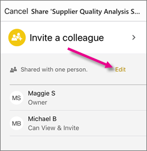

<properties 
   pageTitle="共用 iPhone 應用程式的儀表板"
   description="您可以邀請同事共用 iOS Power BI 行動應用程式中的連結，以檢視您的儀表板。 了解如何"
   services="powerbi" 
   documentationCenter="" 
   authors="maggiesMSFT" 
   manager="mblythe" 
   backup=""
   editor=""
   tags=""
   qualityFocus="no"
   qualityDate=""/>
 
<tags
   ms.service="powerbi"
   ms.devlang="NA"
   ms.topic="article"
   ms.tgt_pltfrm="NA"
   ms.workload="powerbi"
   ms.date="10/03/2016"
   ms.author="maggies"/>
# 共用的 iPhone 應用程式 (適用於 iOS 的 Power BI) 儀表板

邀請同事共用 Power bi 從 iPhone 應用程式的連結，以檢視您的儀表板。 您只能與相同的電子郵件網域，為您的同事共用儀表板。

## 共用儀表板

1.  在底部的 [儀表板動作列中，點選 [共用資料夾] 圖示 。

    

3.  點選 **邀請同事**。

2.  輸入名稱，並以逗號分隔，，而且隨著您的儀表板邀請的訊息。

3.  若要允許 resharing，保留 **允許收件者共用此儀表板** 選取。

    >
            **請注意**   Resharing 可讓您的同事轉寄電子郵件邀請給其他人在您的組織，透過 web 或行動應用程式。

4.  點選 **傳送** 右上角。

    您的同事取得電子郵件邀請的直接連結至儀表板。 邀請到期後一個月。 開啟時，瀏覽器或 iPhone 或 iPad 應用程式，它會加入至其 Power BI。

    >
            **請注意**︰ 進一步了解 [與同事共用儀表板的相關注意事項](powerbi-service-share-unshare-dashboard.md#notes-about-sharing)。

## 取消共用儀表板

如果您的儀表板擁有者，您只可以取消共用儀表板。

1.  在底部的 [儀表板動作列中，點選 [共用資料夾] 圖示 。

3.  點選 **邀請同事**。

    您會看到與您已共用此儀表板，這些片語與同事的清單︰

    -   
            **可以檢視**︰ 您可以檢視儀表板，但不是會共用它。

    -   
            **可以檢視與邀請**︰ 他們可以檢視儀表板及與其他同事共用。

2.  點選 **編輯**。

     

3.  若要取消共用，並點選名稱旁邊的紅色圓形，然後點選 **刪除**。

### 請參閱

- [加上註解，並共用從 iPhone 應用程式磚 Power bi](powerbi-mobile-annotate-and-share-a-tile-from-the-iphone-app.md)
- [開始使用 iPhone 應用程式的 Power BI](powerbi-mobile-iphone-app-get-started.md)
- [共用 Power BI 儀表板](powerbi-service-share-unshare-dashboard.md)
- 問題了嗎？ [請嘗試詢問 Power BI 社群](http://community.powerbi.com/)
