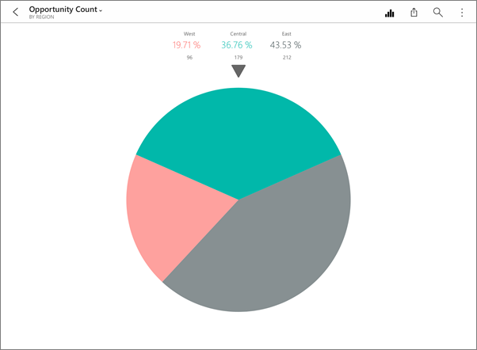

<properties 
   pageTitle="磚在 iPad 上的 Power BI 行動應用程式中進行互動"
   description="您可以建立並排在 Power BI 服務儀表板。 閱讀開啟磚和 ipad 的 iOS Power BI 行動應用程式中與其進行互動。"
   services="powerbi" 
   documentationCenter="" 
   authors="maggiesMSFT" 
   manager="erikre" 
   backup=""
   editor=""
   tags=""
   qualityFocus="no"
   qualityDate=""/>
 
<tags
   ms.service="powerbi"
   ms.devlang="NA"
   ms.topic="article"
   ms.tgt_pltfrm="NA"
   ms.workload="powerbi"
   ms.date="10/11/2016"
   ms.author="maggies"/>

# 與 Power BI 行動應用程式適用於 ipad 的 iOS 中並排顯示互動

方塊是即時的快照集的資料、 釘選到儀表板。 隨著資料變更，變更其值。 您 [Power BI 服務的儀表板上建立磚](powerbi-service-dashboard-tiles.md)。

接著在 [iPad 應用程式](http://go.microsoft.com/fwlink/?LinkId=522062), ，在您開啟磚聚焦模式並與其互動。 您可以使用所有類型的視覺效果，包括根據 Bing 和 r 的磚開啟磚

1.  開啟 [iPad 應用程式儀表板](powerbi-mobile-dashboards-on-the-ipad-app.md)。

2.  點選磚。 會開啟在焦點模式中，您可以互動的並排顯示資料︰

   -   在列、 列或直條圖中，拖曳資料列來檢視視覺效果的特定部分的值。  

         

        在 100%直條圖中，如年 3 月，垂直列交集圖表列出的值。

  -   在圓形圖中，點選 [配量的圓形圖，顯示在圓形圖的最上方的配量值。  
      

  -   
            [共用並排的快照集](powerbi-mobile-share-dashboards-from-the-ipad-app.md)  與其他人。

  -   
            [開啟報表](powerbi-mobile-reports-on-the-ipad-app.md)  方塊為基礎。

3. 若要將磚聚焦模式，點選並排顯示名稱，然後點選 [儀表板名稱或 **我的工作區**。

    

### 請參閱
-  
            [開始使用 iPad 應用程式](powerbi-mobile-iphone-app-get-started.md) Power bi。
- 問題了嗎？ [請嘗試詢問 Power BI 社群](http://community.powerbi.com/)
