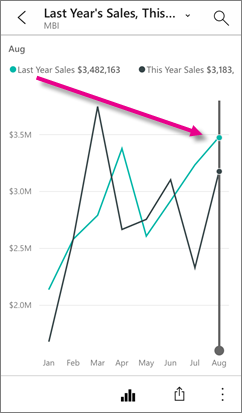
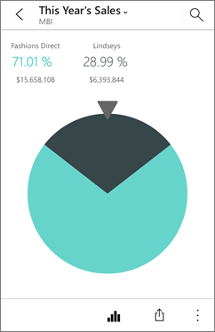
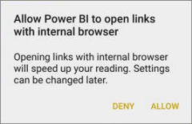

<properties 
   pageTitle="互動 iPhone 應用程式中磚"
   description="方塊是即時的快照集的資料、 釘選到儀表板。 深入了解磚 iPhone 上為 iOS Power BI 行動應用程式中進行互動。"
   services="powerbi" 
   documentationCenter="" 
   authors="maggiesMSFT" 
   manager="mblythe" 
   backup=""
   editor=""
   tags=""
   qualityFocus="no"
   qualityDate=""/>
 
<tags
   ms.service="powerbi"
   ms.devlang="NA"
   ms.topic="article"
   ms.tgt_pltfrm="NA"
   ms.workload="powerbi"
   ms.date="10/03/2016"
   ms.author="maggies"/>

# 互動 iPhone 應用程式 (適用於 iOS 的 Power BI) 中磚

方塊是即時的快照集的資料、 釘選到儀表板。 隨著資料變更，變更其值。 您 [Power BI 服務的儀表板上建立磚](powerbi-service-dashboard-tiles.md)。 

接著在 [iPhone 應用程式](http://go.microsoft.com/fwlink/?LinkId=522062), ，在您開啟磚聚焦模式並與其互動。 您可以使用所有類型的視覺效果，包括根據 Bing 和 r 的磚開啟磚

>
            **請注意**︰ 您也可以 [iPhone 應用程式中建立圖片方塊](powerbi-mobile-picture-tiles-in-the-iphone-app.md) 並將它們儲存到您的儀表板。

1.  開啟 [iPhone 應用程式中的儀表板](powerbi-mobile-dashboards-in-the-iphone-app.md)。

2.  點選磚。 它會開啟在焦點模式中，很容易檢視及瀏覽圖格資料。 在此模式中，您可以︰

   -   在列、 列或直條圖中，點選 [檢視視覺效果的特定部分的值。

        

        *比方說，在此折線圖中，選取的值是這個年度銷售額的 Last Year Sales 8 月。*  

  -   在圓形圖，微調將上方的圓形圖配量的值顯示圓形圖。

        

3.   點選 [共用] 圖示  至 [加上註解並分享磚](powerbi-mobile-annotate-and-share-a-tile-from-the-iphone-app.md) 與其他人。

4.   
            [互動報表頁面磚](powerbi-mobile-report-page-tiles-in-the-iphone-app.md) iPhone 應用程式中。

5.   
            [加入警示方塊](powerbi-mobile-set-data-alerts-in-the-iphone-app.md)。 如果值高於或低於目標，Power BI 會通知您。

6. 有時報表建立者加入連結至某個磚。 因此，它有連結圖示如果  是在聚焦模式︰

    

    連結可以前往其他 Power BI 儀表板或外部的 URL。 您可以 [點選連結](powerbi-service-edit-a-tile-in-a-dashboard.md#hyperlink) Power BI 應用程式內開啟它。 如果是外部網站，Power BI 會要求您允許它。
    
    

    在 Power BI 應用程式中開啟連結之後，您可以複製連結，並開啟瀏覽器視窗中。

## 回到我的工作區

*   點選 [方塊名稱旁的箭號，點選 **我的工作區**。

    

### 請參閱

- [開始使用 iPhone 應用程式的 Power BI](powerbi-mobile-iphone-app-get-started.md)
- [開始使用 Power BI](powerbi-service-get-started.md)
- 問題了嗎？ [請嘗試詢問 Power BI 社群](http://community.powerbi.com/)
