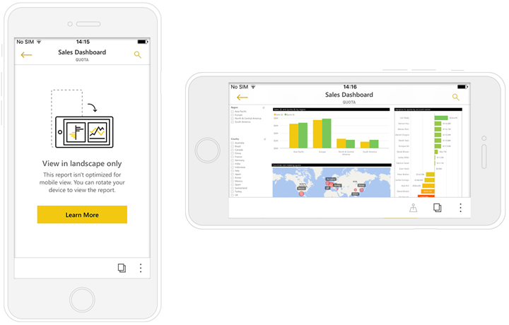

<properties 
   pageTitle="檢視並與其互動 Power BI 報表適合您的電話"
   description="了解 Power BI phone 應用程式中檢視最佳化的報表頁面進行互動。"
   services="powerbi" 
   documentationCenter="" 
   authors="maggiesMSFT" 
   manager="mblythe" 
   backup=""
   editor=""
   tags=""
   qualityFocus="no"
   qualityDate=""/>
 
<tags
   ms.service="powerbi"
   ms.devlang="NA"
   ms.topic="article"
   ms.tgt_pltfrm="NA"
   ms.workload="powerbi"
   ms.date="09/27/2016"
   ms.author="maggies"/>

# 檢視並與其互動 Power BI 報表適合您的電話 

當您在 Power BI Desktop 建立 Power BI 報表時，您也可以建立新版的 [最佳化成適合在 Power BI 應用程式在電話上檢視報表](powerbi-desktop-create-phone-report.md)。

然後，當您開啟在電話上的 Power BI 報表，Power BI 會自動偵測的電話，已經過最佳化報表。 如果電話最佳化的報表，Power BI 電話應用程式會自動開啟最佳化的報表。

如果不存在電話最佳化的報表，您仍可以變更電話的方向非最佳化 [橫向] 檢視中開啟報表。  

即使在電話最佳化報表中，如果您變更您的電話為橫向，報表會開啟非最佳化的檢視，與原始報表配置中。

如果只適合某些頁面，您會看到 [縱向] 檢視中的訊息，表示可用的報表集。

Power BI 報表的其他所有功能仍都在電話最佳化的報表。 深入了解您可以執行︰

*   
            [報告的 Iphone](powerbi-mobile-reports-in-the-iphone-app.md)。 
*   
            [Android 的行動電話上報告](powerbi-mobile-reports-in-the-android-app.md)。

## 檢視報表中的其他頁面

- 檢視報表中的其他頁面，方法是來自撥動或點選頁面圖示 。

## 跨反白顯示視覺效果
跨反白顯示的電話的視覺效果報表方式相同，但 Power BI 服務和 [橫向] 檢視中的行動電話上的報告中︰ 當您選取的資料在一個視覺化時，會反白顯示該頁面上的其他視覺效果中的相關的資料。

深入了解 [篩選和反白顯示在 Power BI 中](powerbi-service-about-filters-and-highlighting-in-reports.md)。

## 選取視覺效果
當您選取視覺效果、 電話報表會反白顯示該 visual 著重於，逐出畫布筆勢的電話報表。

與選取視覺效果，您可以像是視覺效果中的捲軸。 若要取消選取視覺效果，只要觸碰任何地方的可見區域外。

## 焦點模式中開啟視覺效果
電話報表會提供為焦點的模式，讓您可以專注於單一視覺效果，取得視覺效果的較大的檢視和瀏覽視覺效果和報表。

要在焦點模式承報表畫布，反之亦然，順暢地瀏覽經驗。 比方說，如果您反白顯示視覺效果中的值，然後返回 [整份報表，會篩選整個報表視覺效果中以反白顯示的值。

某些動作時，才可以在焦點模式中，因為螢幕的大小限制︰

- 
              **向下切入**, ，然後備份到顯示視覺效果，如果階層層級定義的資訊。
  深入了解 [向下和向上切入](powerbi-service-drill-down-in-a-visualization.md) Power BI 中。
- 
            **排序** 視覺效果中的值。
- 
            **還原**︰ 清除探勘步驟您已經在視覺上並還原為報表建立時設定的定義。

    還原在報表層級、 清除所有視覺效果，從所有的瀏覽或在視覺效果層級，清除所有探勘從選取的特定視覺效果。   

### 請參閱
- [建立報表的 Power BI 電話應用程式最佳化](powerbi-desktop-create-phone-report.md)
- [在 Power BI 建立儀表板電話檢視](powerbi-service-create-dashboard-phone-view.md)
- 更多的問題嗎？ [請嘗試詢問 Power BI 社群](http://community.powerbi.com/)
