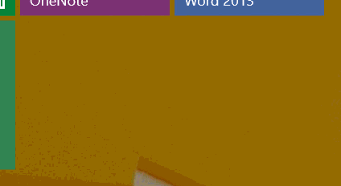
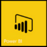
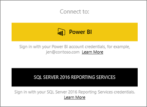
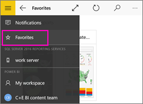

<properties 
   pageTitle="開始使用 Power BI 行動應用程式的 Windows 10"
   description="Windows 10 的 Power BI 行動應用程式會將最新狀態、 觸控式行動裝置存取帶到您的商業資訊在您的平板電腦或電話。"
   services="powerbi" 
   documentationCenter="" 
   authors="maggiesMSFT" 
   manager="mblythe" 
   backup=""
   editor=""
   tags=""
   qualityFocus="no"
   qualityDate=""/>
 
<tags
   ms.service="powerbi"
   ms.devlang="NA"
   ms.topic="article"
   ms.tgt_pltfrm="NA"
   ms.workload="powerbi"
   ms.date="09/28/2016"
   ms.author="maggies"/>

# 開始使用 Power BI 行動應用程式的 Windows 10

Power BI 行動應用程式的 Windows 10 將 Power BI 帶到您的平板電腦或電話號碼，最新狀態、 觸控式行動存取商務資訊。 檢視並與其互動公司儀表板從任何地方 & #151;以滑鼠右鍵您 [Windows [開始] 畫面](powerbi-mobile-pin-dashboard-from-win10phone-app.md)。

您 [Power BI 服務中建立儀表板和報表](powerbi-service-get-started.md) 您的資料。 

然後與您的儀表板和報表互動、 瀏覽資料，從與共用，所有 Windows 10 的 Power BI 行動應用程式。

## 首要之務

-   
            [
            **取得 Power BI 行動應用程式的 Windows 10**](http://go.microsoft.com/fwlink/?LinkID=526478) 從 Windows 市集。

    >
            **注意︰** 您的裝置必須執行 Windows 10。 應用程式最適合使用至少 2 GB RAM 和 8 GB 的內部儲存裝置。 它至少 1 gb RAM 的裝置上執行。

-   了解 [Power Bi 行動應用程式中新](powerbi-mobile-whats-new-in-the-mobile-apps.md)。

## 註冊 Power BI 服務，在網站上

如果您還沒有註冊尚未，請移至 [Power BI 服務](http://powerbi.com/) 註冊您自己的帳戶建立和儲存儀表板和報表，以及將您的資料結合在一起。 然後從登入 Power BI Windows 10 裝置若要查看您自己的儀表板，從任何地方。

1.  在 Power BI 服務，點選 [註冊](http://go.microsoft.com/fwlink/?LinkID=513879) 建立 Power BI 帳戶。

2.    啟動 [建立您自己的儀表板和報告](powerbi-service-get-started.md)。

## 開始使用 Power BI 應用程式 

1.  在 Windows 10 裝置的 [開始] 畫面開啟 Power BI 應用程式。

    
  
2.  若要檢視您的 Power BI 儀表板和報表，請點選 **Power BI**。 使用與您在網站上的 Power BI 帳戶相同的認證登入。 

    若要檢視您的行動的 Reporting Services 報表和 Kpi，請點選 **SQL Server 2016 Reporting Services**。 使用 SQL Server Reporting Services 認證登入。

    

4.  點選 **開始瀏覽**  若要檢視您自己的儀表板。

## 試用 Power BI 和 Reporting Services 範例  
即使未註冊，您可以試用 Power BI 和 Reporting Services 範例。 下載應用程式之後，您可以檢視範例，或開始使用。 回到範例視需要從儀表板首頁。

### Power BI 範例

您可以檢視並與其互動的 Power BI 儀表板範例中，但有幾件事，您不能處理它們。 您無法開啟儀表板背後的報告、 範例與其他人分享，或讓 [我的最愛]。

1.   點選全域瀏覽按鈕  左上角。
  
2.   點選 **Power BI 範例**, ，然後選擇角色，並瀏覽該角色的範例儀表板。  

    

    >
            **請注意**︰ 並非所有功能都都可以在這些範例。 例如，您無法檢視範例報表為基礎的儀表板。 

### Reporting Services 行動報表範例

1.   點選全域瀏覽按鈕  左上角。

2.  點選 **Reporting Services 範例**, ，然後開啟零售報告或銷售報表] 資料夾來瀏覽其 Kpi 和行動的報告。

    

## 儀表板、 報表和群組搜尋

永遠在應用程式頂端的 [搜尋] 方塊中輸入迅速地找到您的儀表板、 報表和群組。

1.  點選右上角的 [搜尋] 圖示。

    

    Power BI 會顯示您最新的儀表板、 報表和群組。

    

2.  當您開始輸入時，Power BI 會顯示所有相關的結果。

    

## 您最愛的儀表板、 Kpi 和報表檢視

您可以檢視所有您最愛 Power BI 儀表板，以及 Reporting Services Kpi 和行動的報告，在行動應用程式中的 [我的最愛] 頁面上。 當您對儀表板 *最愛* 在 Power BI 行動應用程式，您可以從存取所有裝置，包括 Power BI 服務。 

-  點選 **我的最愛**。

    
   
    您從入口網站的最愛都在此頁面。

    

深入了解 [Power BI 行動應用程式中的最愛](powerbi-mobile-favorites.md)。

## 何種多？

了解更多您在 Power BI 應用程式適用於 Windows 10 裝置儀表板和 Power BI 中的報表和 Reporting Services 行動報表和 Reporting Services web 入口網站中的 Kpi

### Power BI 儀表板

-   檢視您 [儀表板](powerbi-mobile-dashboards-in-the-win10phone-app.md)。
-   
            [釘選 Power BI 磚和儀表板](powerbi-mobile-pin-dashboard-from-win10phone-app.md) 到即時顯示為您的裝置 [開始] 畫面。
-   瀏覽 [儀表板上的磚](powerbi-mobile-tiles-in-the-win10phone-app.md)。
-   瀏覽您 [報表](powerbi-mobile-reports-in-the-windows-app.md)。
-   
            [共用並排](powerbi-mobile-share-a-tile-from-the-win10phone-app.md)。
-   共用 [儀表板](powerbi-mobile-share-a-dashboard-from-the-win10phone-app.md)。
-   檢視您 [群組的儀表板和報表](powerbi-mobile-groups-in-the-win10phone-app.md)。
-   檢視 [通知更新您的 Power BI 帳戶](powerbi-mobile-notification-center.md), ，例如同事分享您的儀表板。

     

### Reporting Services 行動報表和 Kpi

- 
            [檢視行動的 Reporting Services 報表和 Kpi](powerbi-mobile-win10-kpis-mobile-reports.md) 在 Power BI 應用程式適用於 Windows 10 裝置。
- 建立 [Reporting Services web 入口網站上的 Kpi](https://msdn.microsoft.com/library/mt683632.aspx)。
- 
            [建立您自己行動的報告與 SQL Server Mobile 報表發行者](https://msdn.microsoft.com/library/mt652547.aspx), ，並將它們發行至 Reporting Services web 入口網站。

### 請參閱

- 
            [下載 Power BI 應用程式](http://go.microsoft.com/fwlink/?LinkID=526478) 從 Windows 市集  
- [開始使用 Power BI](powerbi-service-get-started.md)
- 問題了嗎？ [請嘗試詢問 Power BI 社群](http://community.powerbi.com/)

