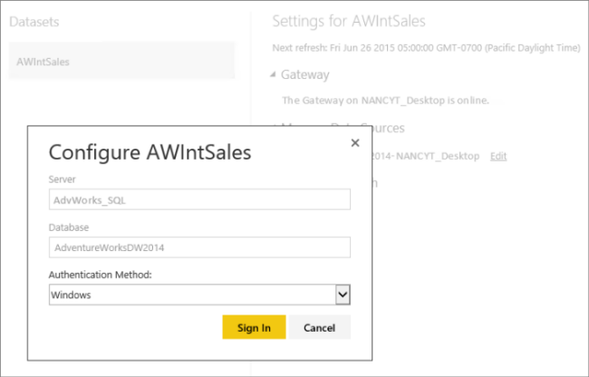
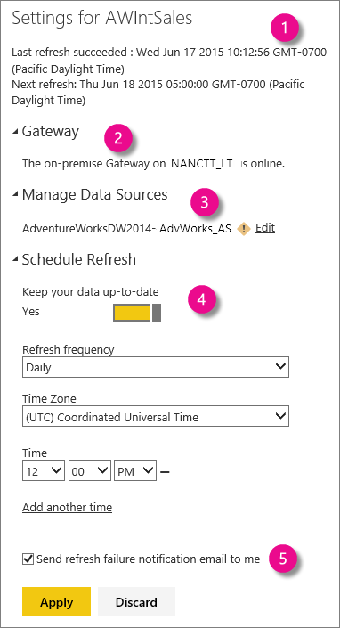
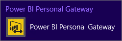
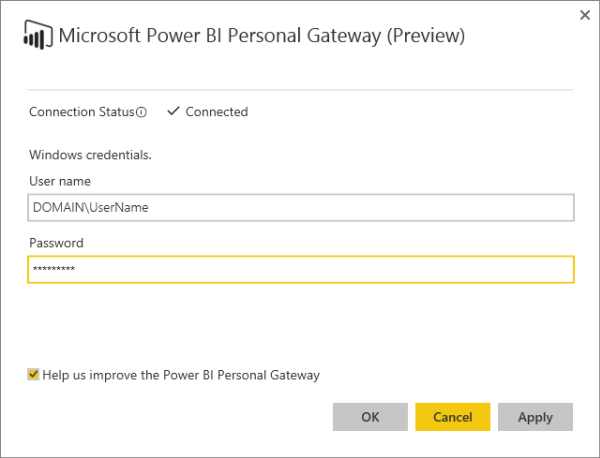

<properties 
   pageTitle="Power BI 閘道個人"
   description="Power BI 閘道個人"
   services="powerbi"
   documentationCenter=""
   authors="guyinacube"
   manager="mblythe"
   backup=""
   editor=""
   tags=""
   qualityFocus="no"
   qualityDate=""/>

<tags
   ms.service="powerbi"
   ms.devlang="NA"
   ms.topic="article"
   ms.tgt_pltfrm="NA"
   ms.workload="powerbi"
   ms.date="08/15/2016"
   ms.author="asaxton"/>

# Power BI 閘道個人

Power BI 閘道-個人扮演著橋接器，提供快速且安全的資料傳輸，Power BI 服務和內部部署資料來源之間支援 [重新整理](powerbi-refresh-data.md)。 本文旨在提供您的閘道器的運作方式，以及閘道需要深入了解。 我們也匯集了這 [很有幫助視訊](https://www.youtube.com/watch?v=de58vROLqZI) 有關個人閘道。 

僅適用於個人閘道 [Power BI Pro](powerbi-power-bi-pro-content-what-is-it.md)。 它會安裝，並在您的電腦上以服務方式執行。 做為服務，它會執行使用您在組態期間指定的 Windows 帳戶。 在某些情況下，閘道會執行應用程式。 我們將討論更詳盡的資訊更新版本。

當 Power BI 重新整理資料從內部部署資料來源時，可確保閘道，Power BI 帳戶已經正確連接及查詢資料來源的權限。

Power BI 和閘道間的資料傳輸透過安全 [Azure 服務匯流排](http://azure.microsoft.com/documentation/services/service-bus/)。 服務匯流排建立 Power BI 服務與電腦之間的安全通道。 因為閘道會提供這個安全連線，通常會有不需要在防火牆中開啟一個連接埠。

我們將詳細說明有關閘道之前，讓我們看看 Power BI 中使用的部份術語︰

A *資料集* 資料上傳到 Power BI 服務，從線上或內部資料來源。 當您連接到並將資料上傳使用取得資料時，您可以建立資料集。 資料集出現在 Power BI] 工作區，在瀏覽器中的 [我的工作區] 窗格中。 當您建立報表和 pin 磚儀表板時，您看到的資料從您的資料集。

A *資料來源* 是您上傳至資料集的資料確實來自何處。 它可以是幾乎任何項目。資料庫、 Excel 工作表、 Web 服務等。使用 Excel 活頁簿，您可以使用的資料列，建立簡單的工作表，可視為資料來源。 您也可以連接到並查詢線上同時從資料和內部部署資料來源，全都放在相同的活頁簿在 Excel 中使用 Power Query 或 Power Pivot。 Power BI Desktop，您可以使用取得的資料連接及查詢同時從資料線上和內部部署資料來源。

透過內部部署資料 Gateay 安裝個人閘道。 您可以下載上 [Power BI 閘道頁面](https://powerbi.microsoft.com/gateway/)。

## 我需要閘道嗎？

在安裝閘道之前，務必知道真的需要。 它其實取決於您的資料來源︰

### 內部資料來源

個人閘道 *需要* 才能重新整理資料來源的支援內部部署組織中取得資料的資料集。

使用閘道，現在重新整理排程重新整理支援和從上傳的資料集︰

-   Microsoft Excel 2013 （或更新版本） 的活頁簿其中 Power Query 或 Power Pivot 會用來連接和查詢支援內部部署資料來源的資料。 所有內部部署資料來源取得外部資料] 中除了 Hadoop 檔案 (HDFS) 和 Microsoft Exchange 的 Power Query 或 Power Pivot 支援重新整理所示。

-   Microsoft Power BI Desktop 檔案取得資料用於連接到並查詢資料從內部支援的資料來源。 所有內部部署上的資料來源取得資料支援重新整理，除了 Hadoop 檔案 (HDFS) 和 Microsoft Exchange 所示。

### 線上資料來源

個人閘道 *就不需要* 才能重新整理只能從線上資料來源取得資料的資料集。

閘道已上傳的資料集不支援重新整理現在和排程重新整理︰

-   從線上資料來源的組件的內容 (內容組件\\服務)。 根據預設，資料集內容的組件會自動更新後一天之內，但您也可以手動重新整理或重新整理排程。

-   Microsoft Excel 2013 （或更新版本） 的活頁簿其中 Power Query 或 Power Pivot 會用來連接及查詢從線上資料來源的資料。

-   Microsoft Power BI Desktop 檔案取得資料用於連接到並查詢資料從線上資料來源。

            **問題︰** 要是我的 Excel 活頁簿或 Power BI Desktop 檔案取得資料同時從線上，並在內部部署資料來源？

            **答案是︰** 閘道 *是* 必要。 您必須安裝並設定閘道，才能重新整理內部部署資料來源的資料。

            **問題︰** 要是我的 Excel 活頁簿只包含輸入的資料列？ * *

            **答案是︰** 閘道 *不* 必要。 您只需要安裝和設定閘道，如果您的活頁簿使用 Power Query 或 Power Pivot 來查詢，並將資料載入支援內部部署資料來源的資料模型

## 第一次設定閘道

第一次設定閘道為三個步驟的程序︰

1.  下載並安裝閘道

2.  設定閘道

3.  登入 Power BI 中的資料來源

讓我們仔細看看每個步驟。

### 下載並安裝閘道

將提示您安裝閘道，當您按一下 [立即重新整理或重新整理排程上支援的資料集的第一次。 若要下載的閘道，請選取 **資料閘道** 下載項目] 功能表底下。 下載 [內部資料閘道](http://go.microsoft.com/fwlink/?LinkID=820925)。

您會想要選擇 **個人閘道** 而不是 **內部資料閘道** 能夠為您自己的閘道。

其實不太多安裝閘道。 您將選取要安裝，並閱讀並接受授權合約，就像任何其他應用程式的位置。 有一些重要的不過應該知道的事項。 特別的是，電腦的類型您安裝上的閘道和登入到 Windows 與該電腦的帳戶類型。

> [AZURE.NOTE] 閘道必須能夠存取資料來源。 如果您的個人電腦無法連線到資料來源，您可能要考慮安裝 [內部資料閘道](powerbi-gateway-onprem.md) 沒有存取資料來源的電腦上。 這個範例是裝載於 Azure 的虛擬機器 (VM) 上安裝 SQL Server。 您個人電腦可能沒有存取的 vm。 您無法在 VM 上安裝內部部署資料閘道，並設定 Power BI 服務中的資料來源。

### 電腦類型

電腦安裝閘道器的類型是很重要。

> [AZURE.NOTE] 只能在 64 位元 Windows 作業系統上支援個人閘道。

膝上型電腦，而排程的重新整理，才會發生的順序則閘道必須啟動且正在執行。 膝上型電腦通常打烊關機或進入睡眠狀態之外，它們正在執行。 如果您在膝上型電腦上安裝您的閘道，請務必設定的膝上型電腦執行的時您排定的重新整理的時間。 如果沒有，重新整理不會嘗試一次排定的下次重新整理時間之前。

在桌上型電腦上 – 不多的問題。 請確定電腦，且閘道正在執行在排定的重新整理的時間。 許多桌面的電腦進入睡眠狀態，無法進行排定的重新整理，它是否處於睡眠模式。

一旦您安裝閘道，您不必安裝另一個。 一個閘道器適用於任何支援的資料集的數目。 您也不需要您上傳您的活頁簿和 Power BI Desktop 檔案從同一部電腦上安裝閘道。 以下是範例︰ 假設您有連接到您的組織中的 SQL Server 資料來源的 Excel 活頁簿。 若要從您的筆記型電腦上傳活頁簿取得資料用於 Power BI 中。 您也可以在桌上型電腦您將執行時間，而且您已安裝並設定閘道，該電腦上。 在 Power BI，您已登入您的資料來源，您所安裝的資料集的重新整理排程。  排定的重新整理時間時，Power BI 可讓您桌面的電腦上安裝閘道的安全連線。 它接著安全地連接到資料來源以取得更新。 重新整理時，會有與原始的活頁簿，您已上傳您的膝上型電腦進行通訊。

> [AZURE.NOTE] 您可以在同一部電腦上安裝個人和企業閘道。

### Windows 帳戶

當您安裝閘道時，您將登入到您的電腦使用您的 Windows 帳戶。 您的 Windows 帳戶具有的權限的類型將會影響閘道的安裝方式，以及如何在 Windows 中執行它。

當您登入 Windows:

||以系統管理員權限|不具系統管理員權限|
|---|---|---|
|**Power BI 閘道-個人執行**|Service|應用程式|
|**排定的重新整理**|您的電腦與閘道服務正在執行，因為您沒有登入，在排定的重新整理的時間。|您必須登入到您的電腦在排定的重新整理的時間。|
|**變更 Windows 帳戶密碼**|您必須變更您的閘道服務的密碼。 如果閘道所使用的帳戶密碼不再有效，重新整理將會失敗。|閘道器一定會執行使用的帳戶和您目前登入的密碼。 如果您未登入 Windows，閘道器不在執行，並重新整理將會失敗。|

### 設定閘道

安裝精靈完成時，系統會提示您啟動設定精靈。 其實要設定閘道。 您必須登入 Power BI 的精靈。 這是必要的 Power BI 服務中建立與您的 Power BI 帳戶連線精靈。

如果您系統管理員權限的帳戶與 windows 登入，系統會要求您輸入您的 Windows 帳戶認證。 您可以指定不同的 Windows 帳戶，但請記住，權限會決定閘道的執行方式。 閘道服務將使用此帳戶來執行。

### 登入的資料來源

當組態精靈完成，而且您的閘道已啟動且正在執行時，您必須指定驗證類型，然後登入每個資料集的資料來源。 您將完成此步驟，在 Power BI 中。

您只需要指定驗證類型，並一次登入的資料來源。 從登入 **管理資料來源** 一節中的資料集設定] 畫面。 如果您有多個資料來源，您必須為每個登入。 閘道會決定預設的驗證類型視資料來源。 在大部分情況下，它是 Windows 驗證。不過，在某些情況下，您的資料來源可能需要不同的驗證類型。 如果您不確定，請洽詢您的資料來源管理員。

## 啟動並執行 ！

當您的閘道已啟動且正在執行時，您可以按一下 [排程重新整理資料集，您會看到您的資料集設定] 頁面上的位置。

此頁面會顯示︰

1. 重新整理狀態 – 顯示重新整理成功和下次排定的重新整理。

2. 
            **閘道** -顯示閘道是否已安裝且在線上。 如果閘道已安裝但不是在線上，則會停用管理資料來源和排程重新整理設定。

3. 
            **管理資料來源** -顯示資料來源連接到的資料集。 您可以登入或變更驗證類型。 您將只需要登入每個資料來源一次。

4. 
            **排程重新整理** – 您可以設定的重新整理排程設定值。 如果閘道不是線上，就會停用這些設定。

5. 重新整理失敗通知 – 此選項，依預設選取，會傳送電子郵件給您，如果排定的重新整理失敗。

## 更新您的 Windows 帳戶密碼

如果您已登入電腦的系統管理員權限的 Windows 帳戶，安裝您的閘道器時，它會以使用您在 「 組態精靈 」 中指定的 Windows 帳戶的服務執行。 大多數情況下，這會是相同的 Windows 帳戶登入您的電腦。 當您變更您的 Windows 帳戶密碼時，您也需要在閘道中進行變更，否則服務可能未執行並重新整理將會失敗。 若要變更您的 Windows 帳戶密碼，閘道，選取 [在 Windows 桌面工作列上，或在應用程式中的個人閘道圖示。

從這裡開始，您可以更新您的密碼，並檢查您的閘道連接狀態。

## 連接埠

閘道輸出連接埠進行通訊︰ TCP 443 （預設）、 5671，5672，9350 到 9354。  閘道不需要輸入連接埠。

|網域名稱|輸出連接埠|說明|
|---|---|---|
|*。 powerbi.com|443|HTTPS|
|*。 analysis.windows.net|443|HTTPS|
|*。 login.windows.net|443|HTTPS|
|*.servicebus.windows.net|5671-5672|進階的訊息佇列通訊協定 (AMQP)|
|*.servicebus.windows.net|443, 9350-9354|透過 TCP （需要存取控制權杖取得 443） 的服務匯流排轉送的接聽程式|
|*。 frontend.clouddatahub.net|443|HTTPS|
|*。 core.windows.net|443|HTTPS|
|login.microsoftonline.com|443|HTTPS|
|login.windows.net|443|HTTPS|

如果您需要而不是網域的白名單 IP 位址，您可以下載並使用 Microsoft Azure 資料中心 IP 範圍清單。 [下載](https://www.microsoft.com/download/details.aspx?id=41653)

## 疑難排解

如果您無法順利安裝及設定個人閘道時，務必參閱 [疑難排解 Power BI 閘道-個人](powerbi-admin-troubleshooting-power-bi-personal-gateway.md)。

## 請參閱

[疑難排解 Power BI 閘道-個人](powerbi-admin-troubleshooting-power-bi-personal-gateway.md)  
[Power BI 閘道設定 proxy 設定](powerbi-gateway-proxy.md)  
更多的問題嗎？ [試用 Power BI 社群](http://community.powerbi.com/)
