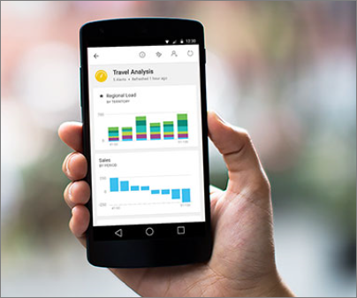

<properties
   pageTitle="行動裝置的 power BI 應用程式"
   description="Power BI 行動應用程式保持您連接到您的資料，任何一處，任何時候。 檢視您的行動裝置上的 Power BI 儀表板和報表。 "
   services="powerbi"
   documentationCenter=""
   authors="maggiesMSFT"
   manager="mblythe"
   backup=""
   editor=""
   tags=""
   qualityFocus="no"
   qualityDate=""/>

<tags
   ms.service="powerbi"
   ms.devlang="NA"
   ms.topic="get-started-article"
   ms.tgt_pltfrm="NA"
   ms.workload="powerbi"
   ms.date="09/26/2016"
   ms.author="maggies"/>

# 行動裝置的 power BI 應用程式  

保持連線到您的資料從任何地方，隨時使用 Power BI 行動應用程式。 請嘗試檢視並與 Power BI 儀表板上您的行動裝置 & #151; 互動是 （iPad、 iPhone、 iPod Touch 或 Apple Watch） iOS Android 手機或 Windows 10 裝置。

請參閱 [Power BI 行動應用程式中新](powerbi-mobile-whats-new-in-the-mobile-apps.md)。

## IPhone 和 iPod Touch 應用程式 (適用於 iOS 的 Power BI)

            [開始使用 iPhone 應用程式](powerbi-mobile-iphone-app-get-started.md) (適用於 iOS 的 Power BI)。

-   下載 [iphone](http://go.microsoft.com/fwlink/?LinkId=522062) (適用於 iOS 的 Power BI)。

### Power BI 儀表板

-   檢視您 [Power BI 儀表板](powerbi-mobile-dashboards-in-the-iphone-app.md)。
-   互動 [磚](powerbi-mobile-tiles-in-the-iphone-app.md) 儀表板上。
-   設定 [資料警示](powerbi-mobile-set-data-alerts-in-the-iphone-app.md) 為您的資料。
-   檢視上的 Power BI 您 [Apple Watch](powerbi-mobile-apple-watch.md)。
-   共用 [Power BI 儀表板](powerbi-mobile-share-a-dashboard-from-the-iphone-app.md)。
-   互動 [報告 iPhone](powerbi-mobile-reports-in-the-iphone-app.md)。
-   加上註解和 [共用並排](powerbi-mobile-annotate-and-share-a-tile-from-the-iphone-app.md)。
-   
            [掃描 Power BI QR 代碼](powerbi-mobile-qr-code-for-tile.md) 從 iPhone
-   
            [建立圖片方塊](powerbi-mobile-picture-tiles-in-the-iphone-app.md) iPhone 應用程式

### SQL Server 行動報表及 Kpi

- 
            [檢視 SQL Server 行動報表及 Kpi](powerbi-mobile-iphone-kpis-mobile-reports.md) Reporting Services web 入口網站上。
- 
            [Reporting Services web 入口網站上建立 Kpi](https://msdn.microsoft.com/library/mt683632.aspx)。
- 
            [建立您自己行動的報告與 SQL Server Mobile 報表發行者](https://msdn.microsoft.com/library/mt652547.aspx), ，並將它們發行至 Reporting Services web 入口網站。

## IPad 應用程式 (適用於 iOS 的 Power BI)

            [開始使用 iPad 應用程式](powerbi-mobile-ipad-app-get-started.md) (適用於 iOS 的 Power BI)。

-   下載 [iPad 應用程式](http://go.microsoft.com/fwlink/?LinkId=522062) (適用於 iOS 的 Power BI)。

### Power BI 儀表板和報表

-   檢視您 [Power BI 儀表板](powerbi-mobile-dashboards-on-the-ipad-app.md)。
-   互動 [Power BI 儀表板上的磚](powerbi-mobile-tiles-in-the-ipad-app.md)。
-   開啟 [Power BI 報告](powerbi-mobile-reports-on-the-ipad-app.md) 儀表板。
-   
            [共用 Power BI 儀表板](powerbi-mobile-share-dashboards-from-the-ipad-app.md)。
-   
            [加上註解，並共用快照](powerbi-mobile-annotate-and-share-a-snapshot-from-the-ipad-app.md) 並排顯示。
-   檢視您 [群組的 Power BI 儀表板和報表](powerbi-service-mobile-groups-in-the-ipad-app.md)。

### 行動報表及 Reporting Services web 入口網站中的 Kpi

- 
            [檢視 SQL Server 行動報表及 Kpi](powerbi-mobile-ipad-kpis-mobile-reports.md) Reporting Services web 入口網站上。
- 
            [Reporting Services web 入口網站上建立 Kpi](https://msdn.microsoft.com/library/mt683632.aspx)。
- 
            [建立您自己行動的報告與 SQL Server Mobile 報表發行者](https://msdn.microsoft.com/library/mt652547.aspx), ，並將它們發行至 Reporting Services web 入口網站。

## Android 手機 Power BI 應用程式

            [開始使用 Power BI 應用程式的 Android 手機](powerbi-mobile-android-app-get-started.md)。

-   下載 [Android 手機的 Power BI 應用程式](http://go.microsoft.com/fwlink/?LinkID=544867)。

### Power BI 儀表板和報表

-   檢視您 [儀表板](powerbi-mobile-dashboards-in-the-android-app.md)。
-   檢視您 [Power BI 群組](powerbi-mobile-groups-in-the-android-app.md)。
-   瀏覽 [儀表板上的磚](powerbi-mobile-tiles-in-the-android-app.md)。
-   
            [加上註解和共用並排](powerbi-mobile-annotate-and-share-a-tile-from-the-android-app.md)。
-   共用 [儀表板](powerbi-mobile-share-a-dashboard-from-the-android-app.md)。
-   
            [掃描 Power BI QR 代碼](powerbi-mobile-qr-code-for-android.md) 從 Android 手機。

### SQL Server 行動報表及 Kpi

- 
            [檢視 SQL Server 行動報表及 Kpi](powerbi-mobile-android-kpis-mobile-reports.md) Reporting Services web 入口網站上。
- 
            [Reporting Services web 入口網站上建立 Kpi](https://msdn.microsoft.com/library/mt683632.aspx)。
- 
            [建立您自己行動的報告與 SQL Server Mobile 報表發行者](https://msdn.microsoft.com/library/mt652547.aspx), ，並將它們發行至 Reporting Services web 入口網站。

## Power BI 行動應用程式適用於 Windows 10 裝置

            [開始使用 Power BI 行動應用程式的 Windows 10](powerbi-mobile-win10phone-app-get-started.md)。

-   下載 [Power BI 應用程式適用於 Windows 10 裝置](http://go.microsoft.com/fwlink/?LinkId=526478)

### Power BI 儀表板和報表

-   檢視您 [儀表板](powerbi-mobile-dashboards-in-the-win10phone-app.md)。
-   
            [釘選 Power BI 磚和儀表板](powerbi-mobile-pin-dashboard-from-win10phone-app.md) 到即時顯示為您的裝置 [開始] 畫面。
-   瀏覽 [儀表板上的磚](powerbi-mobile-tiles-in-the-win10phone-app.md)。
-   
            [共用並排](powerbi-mobile-share-a-tile-from-the-win10phone-app.md)。
-   共用 [儀表板](powerbi-mobile-share-a-dashboard-from-the-win10phone-app.md)。
-   互動 [報表](powerbi-mobile-reports-in-the-windows-app.md)。
-   檢視您 [群組的儀表板和報表](powerbi-mobile-groups-in-the-win10phone-app.md)。

### SQL Server 行動報表及 Kpi

- 
            [檢視 SQL Server 行動報表及 Kpi](powerbi-mobile-win10-kpis-mobile-reports.md) Reporting Services web 入口網站上。
- 
            [Reporting Services web 入口網站上建立 Kpi](https://msdn.microsoft.com/library/mt683632.aspx)。
- 
            [建立您自己行動的報告與 SQL Server Mobile 報表發行者](https://msdn.microsoft.com/library/mt652547.aspx), ，並將它們發行至 Reporting Services web 入口網站。

## Power BI 行動應用程式的企業支援

-  企業可以 [設定適用於 iOS 和 Android 的 Power BI 行動應用程式使用 Microsoft Intune](powerbi-admin-mobile-intune.md) 來管理裝置和應用程式。

## 請參閱

- 問題了嗎？ [請嘗試詢問 Power BI 社群](http://community.powerbi.com/)

