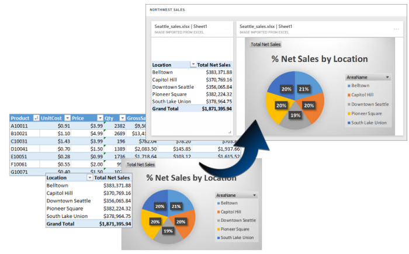
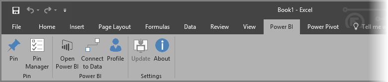
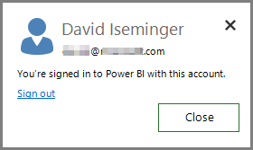
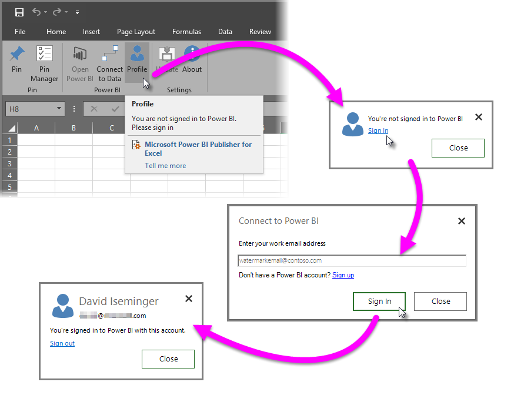
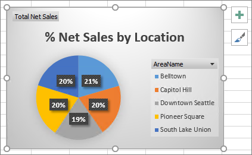
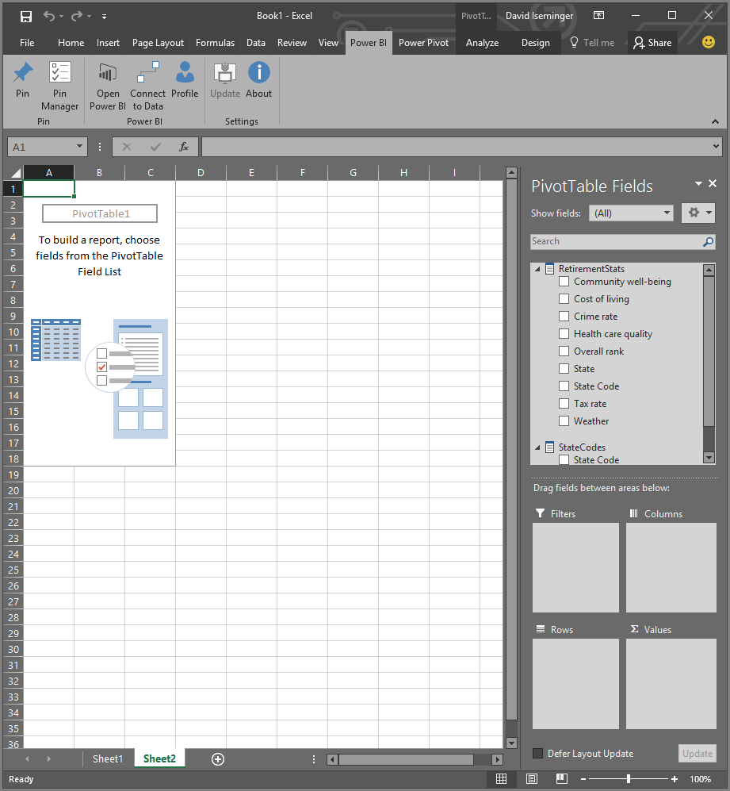

<properties
   pageTitle="適用於 Excel 的 power BI 發行者"
   description="了解如何使用適用於 Excel 的 Power BI 發行者"
   services="powerbi"
   documentationCenter=""
   authors="davidiseminger"
   manager="mblythe"
   backup=""
   editor=""
   tags=""
   qualityFocus="complete"
   qualityDate=""/>

<tags
   ms.service="powerbi"
   ms.devlang="NA"
   ms.topic="article"
   ms.tgt_pltfrm="NA"
   ms.workload="powerbi"
   ms.date="10/12/2016"
   ms.author="davidi"/>

# 適用於 Excel 的 power BI 發行者

與 Microsoft **適用於 Excel 的 Power BI 發行者**, ，就可以在最重要的深入剖析資訊的快照集在 Excel 中，例如樞紐分析表、 圖表和範圍，它們固定到 Power bi 儀表板。

您可以固定什麼？ 幾乎任何項目中的 Excel 工作表。 您可以選取資料格範圍從簡單的工作表或資料表時，樞紐分析表或樞紐分析圖、 圖例和影像、 文字。

您不能釘選︰ 您無法在 Power View 工作表中固定 3D 對應或視覺效果。 也有一些項目，您可以釘選，但它不太合理到，要的時間軸或交叉分析篩選器。

當您插入 Excel 中的項目時，新的磚會加入至 Power BI 中新的或現有儀表板。 新的磚是快照集，因此不是動態，但您仍然可以更新它。 例如，如果您變更樞紐分析表或您已釘選的圖表，Power BI 中的 [儀表板] 磚不自動更新，但您仍然可以更新您釘選的項目使用 **Pin Manager**。 您將深入了解 **Pin Manager** 下列各節中。

## 下載和安裝
適用於 Excel 的 power BI 發行者是增益集在您可以下載並安裝桌上型電腦版本的 Microsoft Excel 2007 和更新版本上。

[下載適用於 Excel 的 Power BI 發行者](http://go.microsoft.com/fwlink/?LinkId=715729)

安裝 「 發行者 」 之後，您會看到新 **Power BI** Power BI 的功能區在 Excel 中，您可以登入 （或登出）、 釘選到儀表板，項目和管理您已釘選的項目。

 **適用於 Excel 的 Power BI 發行者** 增益集預設為啟用，但如果基於某些原因看 Power BI 功能區索引標籤，在 Excel 中的，您必須啟用它。 按一下 [ **檔案** > **選項** > **增益集** > **COM 增益集**。 選取 **適用於 Excel 的 Microsoft Power BI 發行者**。

## 釘選到儀表板的範圍
您可以從工作表中，選取儲存格的任何範圍，並釘選在 Power BI 中的現有或新的儀表板範圍的快照集。 您可以太釘選到多個儀表板中，相同的快照集。

若要開始，您需要確定您已登入 Power BI。

1.  選取 **設定檔** 從 **Power BI** Excel 功能區] 索引標籤。 如果您已經登入 Power BI，您會看到一個對話方塊，顯示哪些帳戶您目前登入。 如果這是您想要使用時，很好的帳戶移至下一組步驟釘選您的範圍。 選取 *登出* 如果您想要使用不同的 Power BI 帳戶。 如果您未登入，請移至下一個步驟 (步驟 2)。

    

2.  如果您未登入，選取 **登入** 選取時會顯示的連結 **設定檔** 從 **Power BI** 在功能區] 索引標籤，在 Excel 中， **連接到 Power BI** 對話方塊輸入您想要使用，然後選取 [Power BI 帳戶電子郵件地址 **登入**。

    

您一次登入，請遵循下列步驟來釘選到儀表板的範圍︰

1.  在 Excel 中，選取 **Power BI** 功能區索引標籤，查看 **Pin** 功能區按鈕。
2.  從 Excel 活頁簿中選取的範圍。
3.  按一下 [ **Pin** 按鈕 **Power BI** 顯示功能區 **釘選到儀表板] 對話方塊**。 如果您尚未登入 Power BI，系統會提示您執行這項操作。 選取工作區從 **工作區** 下拉式清單中。 如果您想要釘選到您自己的儀表板，請確認 **我的工作區** 已選取。 如果您想要釘選到群組工作區中的儀表板，請從下拉式清單中選取的群組。
4.  選擇您要釘選到 *現有儀表板* 或建立 *新儀表板*。
5.  按一下 [ **好** 釘選您的選擇，儀表板。
6.  在 **釘選到儀表板**, ，工作區中選取現有的儀表板或建立一個新，然後按一下 **確定** ] 按鈕。

    

## 將圖表固定至 [儀表板
只要按一下圖表上，然後按一下 [Pin 。

## 管理已釘選的項目
使用 **Pin 管理員**, ，您可以更新 Power BI 中 （重新整理） pin 項目相關聯的並排顯示。 您也可以移除您已釘選到儀表板 Power BI 中的項目之間的 pin 碼。

若要更新您的儀表板的磚中 **Pin Manager** 選取一或多個項目，然後選取 **更新**。

若要移除在 Excel 中的已釘選的項目與相關聯的圖格之間的對應儀表板中，移除 **移除**。 當您選取 **移除**, ，你 *不* 從您的工作表在 Excel 中移除項目，或刪除相關聯的並排顯示的儀表板。 您要移除的 pin 碼或 *對應*, ，兩者之間。 已移除的項目不會再出現在 **Pin Manager**。 如果您再次釘選的項目，它會顯示為新的磚。

從儀表板中移除已釘選的項目 （方塊），您必須在 Power BI。 在您想要刪除的磚，選取 **開啟的功能表** 圖示  ，然後選取 **刪除磚**。   

## 連接至 Power BI 中的資料

開頭為 2016 年 7 月發行的 **適用於 Excel 的 Power BI 發行者** （包括目前的版本中，連結至以上），您可以直接連接到 Power BI 服務中的資料和分析該資料在 Excel 中使用樞紐分析表和樞紐分析圖。 此功能可讓您輕鬆使用 Power BI 資料 Excel 在一起，以分析最重要的資料。

改良包括下列各項︰

-   連接到 Power BI 中的資料所需的任何驅動程式會自動更新每個版本-不需要安裝或自行管理這些驅動程式。
-   您不再需要下載.odc 檔案來建立連線- **適用於 Excel 的 Power BI 發行者** 會自動建立連線，當您選取的報表或您想要使用的資料集。
-   現在您可以建立多個連線和樞紐分析表中相同的活頁簿
-   錯誤的改進與特定 **適用於 Excel 的 Power BI 發行者**, ，而不是使用預設 Excel 訊息

### 如何連接至 Power BI 資料在 Excel 中

若要連接到 Power BI 資料使用 **適用於 Excel 的 Power BI 發行者**, ，請遵循下列簡單的步驟︰

1.  請確定您已登入 Power BI。 本文稍早提供的步驟說明如何登入 （或使用不同的帳戶登入）。

2.    一旦您已登入 Power BI 與您想要使用，請選取帳戶 **連接至資料** 從 **Power BI** Excel 功能區] 索引標籤。

    

3.  Excel 連接到 Power BI 使用 HTTPS 連線，並顯示 **連接至 Power BI 中的資料** ] 對話方塊中，您可以在其中選取 *工作區* 從您要選取的資料 (1，在下圖中)，這 *的資料型別* 您想要連線，請 **報表** 或 **資料集** (2)，和下拉式清單 （3），可讓您選取 *可用的報表或資料集* 要進行連接。

    

4.  當您進行選擇，並選取 **連接** 從 **連接至 Power BI 中的資料** ] 對話方塊中，Excel 會準備樞紐分析表，然後顯示 **樞紐分析表欄位** ] 窗格中，您可以從連接的 Power BI 資料選取欄位並建立資料表，或圖表，幫助您分析資料。

    

如果您在 Power BI 中沒有任何資料，Excel 會偵測到並提供您建立範例資料，以連線至，然後再試。

有幾件事請考慮在此版本中 **適用於 Excel 的 Power BI 發行者**:

-   
            **共用資料** -已共用，但不會對您在 Power BI 中直接顯示的資料，並無法用於 **連接至資料**。
-   
            **SSAS 內部** -如果您選取的資料集是從內部部署 SQL Server Analysis Services (SSAS) 和 Power BI 中的資料集來存取資料，使用 DirectQuery **適用於 Excel 的 Power BI 發行者** 連接到內部網路連線，並透過該資料，然後執行 *不* 移到 Power BI 連接到該資料。 這麼一來，嘗試連線到這類的資料集的任何使用者都必須連接到內部網路中，與驗證來存取該資料使用儲存資料的 Analysis Services 執行個體所採用的驗證方法。
-   
            **所需的驅動程式** - **適用於 Excel 的 Power BI 發行者** 自動來工作，而且不會安裝所有必要驅動程式，這項功能。 之間的自動安裝的驅動程式是 Analysis Services; Excel OLE DB 驅動程式如果移除該驅動程式的使用者 （或任何其他原因），Power BI 資料連接無法運作。
-   
            **資料集必須有量值** -資料集必須有明確定義適用於 Excel 的順序視為值在樞紐分析表、 量值，以及正確地分析資料的量值。 深入了解 [量值](powerbi-desktop-measures.md)。
-   
            **支援群組** -與指定的群組之外的人員共用資料集不支援，並無法連接到連接。
-   
            **與 Pro 訂閱免費** -不適用於 Power BI 的免費使用者與群組相關聯的活動，並因此將不會看到任何資料集或共用與他們自己的工作區中的群組的報表。
-   
            **共用報表或資料集** -報表或已與您共用的資料集無法連線至。
-   
            **使用資料表，而不資料模型** -資料集和報表會從 Excel 匯入只能的資料表 （不含資料模型） 所建立的不支援在此階段中，無法連接到連接。

一旦您已建立吸引人的圖表或其他視覺效果，例如某個資料範圍，您可以輕鬆地釘選到 Power BI 儀表板本文稍早所述。

## 相關的文章

有許多方法可使用 Excel 和 Power BI 在一起，並取得的最佳輸出兩者。 看看下列的文件，如需詳細資訊。

-   [在 Excel 中分析](powerbi-service-analyze-in-excel.md)

-   [在疑難排解 Excel 中進行分析](powerbi-desktop-troubleshooting-analyze-in-excel.md)
