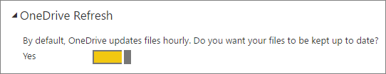

<properties
   pageTitle="在 Power BI 中的資料重新整理"
   description="在 Power BI 中的資料重新整理"
   services="powerbi"
   documentationCenter=""
   authors="guyinacube"
   manager="mblythe"
   backup=""
   editor=""
   tags=""
   qualityFocus="complete"
   qualityDate="03/31/2016"/>

<tags
   ms.service="powerbi"
   ms.devlang="NA"
   ms.topic="article"
   ms.tgt_pltfrm="NA"
   ms.workload="powerbi"
   ms.date="09/21/2016"
   ms.author="asaxton"/>

# 在 Power BI 中的資料重新整理  

確保您永遠都會取得最新的資料通常會在做出正確決策的關鍵。 您可能已經連接到並上傳一些資料，有些報表和儀表板建立 Power BI 中使用取得資料。 現在，您要確定您的資料其實是最新和最大。

在許多情況下，您不需要在執行任何動作。 某些資料，例如從 Salesforce 或 Marketo 內容套件會為您自動重新整理。 如果您的連接會使用即時連接或 DirectQuery，資料將會更新的日期。 但是，在其他情況下，像使用 Excel 活頁簿或 Power BI Desktop 檔案，以連接到外部線上或內部部署資料來源，您將需要手動重新整理或設定重新整理排程，讓 Power BI 可以讓您更新您的報表和儀表板中的資料。

這篇文章，以及一些其他的用意在於幫助您了解如何在 Power BI 中的資料重新整理實際運作方式、 要重新整理排程，以及哪些項目需要就地升級已成功重新整理您的資料。

## 依訂閱類型的資料重新整理 
 
我們繼續討論之前，務必了解資料重新整理如何運作視您的 Power BI 訂用帳戶類型而定。 有兩種不同的使用者訂用帳戶，Power BI （免費） 和 Power BI Pro。 Power BI Pro 提供額外的重新整理頻率和容量。

|**資料重新整理**|**Power BI （免費）**|**Power BI Pro**|
|---|---|---|
|若要重新整理排程的資料集|每日|每小時 *|
|您的儀表板和報表使用 Microsoft Power BI REST API 或 Microsoft 串流分析中的資料流。|10 萬列/小時|1m 資料列/小時|
|DirectQuery 即時內部資料來源提供完整的互動功能，透過內部部署資料閘道| | |
|即時雲端資料來源提供完整的互動功能 (HDInsight 上的 Azure SQL Database，Azure SQL 資料倉儲，Spark)| | |
|內部部署資料來源需要 Power BI 閘道-個人及/或內部部署資料閘道。| | |

\* 最多八個時間 （小時） 每日。

## 了解資料重新整理  
之前設定重新整理時，請務必了解它，您要重新整理，以及您要從何處取得資料。

A *資料來源* 是其中探索您在報表中的資料和儀表板其實就是從; 比方說，例如 Google 分析或 QuickBooks 的線上服務，雲端中的資料庫喜歡 Azure SQL Database，或資料庫或在本機電腦或您組織中的伺服器上的檔案。 這些是所有資料來源。 資料來源類型會決定從它的資料重新整理的方式。 我們會為每種類型的資料來源重新整理有點稍後 [什麼可以重新整理？](#what-can-be-refreshed) 一節。

A *資料集* 時自動建立 Power BI 中連接到的情況下，您在使用取得資料，並將資料上傳內容的組件、 檔案，或是您從連接到即時資料來源。 在 Power BI Desktop 和 Excel 2016 中，您也可以發行 Power BI 服務，這就像是使用以取得資料是您的檔案權限。

在每個案例中，資料集建立，並出現我的工作區或群組，在 Power BI 服務容器中。 當您選取 **省略號 （...）** 資料集，瀏覽報表中的資料、 編輯設定，並設定重新整理。
  

資料集可以從一個或多個資料來源取得資料。 例如，您可以使用 Power BI Desktop 從您的組織中的 SQL 資料庫取得資料，並從 OData 摘要線上取得其他資料。 然後，當您發行檔案至 Power BI，建立單一資料集，但它將有資料來源的 SQL 資料庫與 OData 摘要。

資料集包含相關資訊的資料來源、 資料來源認證，並在大部分情況下，資料的子集複製資料來源。 當您建立報表和儀表板中的視覺效果、 您正在查看資料集，或在 Azure SQL Database 之類的即時連接，資料集定義的資料會看見從資料來源的權限。 對即時連接至 Analysis Services，資料集定義是從 Analysis Services 直接。

> *當您重新整理資料時，您要更新資料集中儲存在資料來源的 Power BI。 這項重新整理是完整的重新整理與不增量。* 

每當您重新整理資料集是否使用立即重新整理或重新整理排程的設定，Power BI 連接到資料來源，為其定義查詢更新的資料，使用資料集中的資訊，然後將更新的資料載入資料集。 會自動更新您的報表或資料為基礎的儀表板中的任何視覺效果。

我們繼續討論之前，還有其他項目，一定要了解︰ 

> *頻率重新整理資料集，或查看即時資料的頻率，不論是在資料來源，您必須先最新的資料。*

大部分的組織在一天一次，通常在晚上處理他們的資料。 如果您排程重新整理資料集從 Power BI Desktop 檔案，以連接至內部部署資料庫，建立您的 IT 部門會處理該 SQL 資料庫上執行一次在晚上，則您只需要設定排定的重新整理一次一天執行。 例如，在資料庫上的處理都發生之後，但您進入工作之前。 當然，這不一定如此。 Power BI 提供許多方式來連接到經常更新或甚至是即時的資料來源。

## 重新整理的型別

有四種主要類型的重新整理 Power BI 內發生。 套件重新整理，模型/資料重新整理，並排顯示重新整理和視覺容器重新整理。

### 套件重新整理

這會同步處理您的 Power BI Desktop 或 Excel 檔案之間的 Power BI 服務和 OneDrive，或 SharePoint Online。 這不會從原始資料來源提取資料。 Power BI 中的資料集將只會更新與 OneDrive 或 SharePoint Online 中的檔案中。

### 模型/資料重新整理

這指重新整理資料集，在 Power BI 服務中，原始資料來源的資料。 這由使用排程重新整理，或立即重新整理。 這會需要內部部署資料來源的閘道。

### 並排顯示重新整理

並排顯示重新整理更新磚視覺效果，在儀表板，一次資料變更的快取。 這是關於每隔 15 分鐘。 您也可以選取 [強制] 磚重新整理 **省略號 （...）** 左上角的 [儀表板和選取 **重新整理儀表板磚**。

如需常見的並排顯示重新整理錯誤的詳細資訊，請參閱 [疑難排解磚錯誤](powerbi-refresh-troubleshooting-tile-errors.md)。

### 視覺容器重新整理

重新整理的視覺容器更新快取的報表視覺效果，在報表中，一次的資料變更。

## 可重新整理什麼？

在 Power BI 中，您將從本機磁碟機、 OneDrive 或 SharePoint Online 上的檔案匯入資料、 發行報表從 Power BI Desktop，或直接連接至資料庫的定域機組中您組織中通常使用取得資料。 可重新整理 Power BI 中的任何資料，但您需要取決於您的資料集的建立方式以及它會連接至資料來源。 讓我們看看每一種重新整理資料的方式。

我們繼續執行其他步驟之前，以下是一些重要的定義，以了解︰

            **自動重新整理**  -這表示沒有使用者設定定期重新整理是必要的資料集。 Power BI 會為您設定資料重新整理設定。 對於線上服務提供者，重新整理通常會發生一次一天。 自動重新整理載入從 OneDrive 的檔案，不是來自外部資料來源的資料每小時發生。 雖然您可以設定不同的排程重新整理設定，且手動重新整理，您可能不需要。

            **設定使用者手冊或排定的重新整理** – 這表示您可以手動重新整理資料集使用立即重新整理或使用排程重新整理資料集的設定中設定的重新整理排程。 Power BI Desktop 檔案和線上外部和內部部署資料來源連接的 Excel 活頁簿需要這種類型的重新整理。

> [AZURE.NOTE] 當您設定排定的重新整理的時間時，可能會達一小時開始之前的延遲。

            **Live DirectQuery** – 這表示沒有 Power BI 和資料來源之間的即時連接。 對於內部部署資料來源，系統管理員必須擁有 enterprise 閘道器中設定資料來源，但可能不需要使用者互動。

## 本機檔案和 OneDrive 或 SharePoint Online 上的檔案

支援資料重新整理 Power BI Desktop 檔案和連接到線上的外部或內部部署資料來源的 Excel 活頁簿。 這只會重新整理 Power BI 服務中的資料集的資料。 它不會更新您的本機檔案。

保留 OneDrive 或 SharePoint Online 上的檔案，以及從 Power BI 連接到提供絕佳的大的彈性。 但是，與所有這樣的彈性，您也可以最具挑戰性瞭解其中一項。 排定的重新整理檔案儲存在 OneDrive 或 SharePoint Online 互異套件重新整理。 您可以深入了解 [類型的重新整理](#types-of-refresh) 一節。

### Power BI Desktop 檔案

|**資料來源**|**自動重新整理**|**設定使用者手冊或排定的重新整理**|**所需的閘道**|
|---|---|---|---|
|取得資料 （在功能區） 用來連接及查詢任何列出的線上資料來源的資料。|否|是|否|
|取得資料用來連接到並瀏覽線上的 Analysis Services 資料庫。|是|否|是|
|取得資料用來連接到並瀏覽內部支援的 DirectQuery 資料來源。|是|否|是|
|取得資料用來連接到並查詢 Azure SQL Database，Azure SQL 資料倉儲，Azure HDInsight Spark 中的資料。|是 （小時）|是|否|
|取得資料用來連接及查詢從 Hadoop 檔案 (HDFS) 和 Microsoft Exchange 任何列出的內部資料來源的資料。|否|是|是|

如需詳細資訊，請參閱 [重新整理資料集從 OneDrive 上的 Power BI Desktop 檔案建立](powerbi-refresh-desktop-file-onedrive.md)。

### Excel 活頁簿

|**資料來源**|**自動重新整理**|**設定使用者手冊或排定的重新整理**|**所需的閘道**|
|---|---|---|---|
|不會載入 Excel 資料模型的工作表中的資料表。|[是]，每小時 *(僅限 OneDrive/SharePoint Online)*|只有手動 *(OneDrive/SharePoint 僅線上)*|否|
|資料工作表中的資料表連結至 Excel 資料模型 （連結資料表） 中的資料表。|[是]，每小時 *(僅限 OneDrive/SharePoint Online)*|只有手動 *(OneDrive/SharePoint 僅線上)*|否|
|電源查詢 * 用來連接和查詢中任何列出的線上資料來源的資料，並將資料載入 Excel 資料模型。|否|是|否|
|電源查詢 * 用來連接及查詢從 Hadoop 檔案 (HDFS) 除外的任何內部列出的資料來源的資料和 Microsoft Exchange 和載入資料至 Excel 資料模型。|否|是|是|
|Power Pivot 用來連接和查詢中任何列出的線上資料來源的資料，並將資料載入 Excel 資料模型。|否|是|否|
|Power Pivot 用來連接及查詢資料，從任何內部列出的資料來源資料並載入到 Excel 資料模型。|否|是|是|

*\* Power Query 稱為 Get 和轉換資料在 Excel 2016 中。*

如需詳細資訊，請參閱 [重新整理資料集從 OneDrive 上的 Excel 活頁簿建立](powerbi-refresh-excel-file-onedrive.md)。

### OneDrive 或 SharePoint Online 上的逗號分隔值 (.csv) 檔案

|**資料來源**|**自動重新整理**|**設定使用者手冊或排定的重新整理**|**所需的閘道**|
|---|---|---|---|
|簡單的逗號分隔值|[是]，每小時|只有手冊|否|

如需詳細資訊，請參閱 [重新整理從逗號分隔的值 (.csv) 檔案放在 OneDrive 上建立的資料集](powerbi-refresh-csv-file-onedrive.md)。

## 內容組件  
有兩種類型的內容在 Power BI 中的組件︰

            **內容中的線上服務的組件**: Adobe 分析、 SalesForce 和 Dynamics CRM Online 等。 從線上服務建立資料集是會自動重新整理一天一次。 雖然不可能有必要，您可以手動重新整理或重新整理排程。 線上服務都位於定域機組，因為不需要閘道。

            **組織內容套件**︰ 建立和您自己的組織中的使用者共用。 內容套件取用者無法重新整理排程或手動重新整理。 只有內容套件建立者可以設定此內容套件中的資料集的重新整理。 重新整理與資料集，會繼承設定。

### 從線上服務的內容組件

|**資料來源**|**自動重新整理**|**設定使用者手冊或排定的重新整理**|**所需的閘道**|
|---|---|---|---|
|在 [取得資料的線上服務 &gt; 服務|是|是|否|

### 組織內容套件

重新整理資料集組織內容組件相依於資料集內包含的功能。 請參閱上面的資訊相對於 OneDrive 或 SharePoint Online 的本機檔案。

若要深入了解，請參閱 [組織內容套件簡介](powerbi-service-organizational-content-packs-introduction.md)。

## 即時連接與內部部署資料來源的 DirectQuery 
與內部部署資料閘道，您可以從 Power BI 發出查詢至您的內部部署資料來源。 當您與視覺效果互動時，查詢會從 Power BI 直接送到資料庫。 然後會傳回更新的資料，並且更新視覺效果。 有了 Power BI 與資料庫之間的直接連線，因為沒有必要排程重新整理。 

當您使用內部部署資料閘道設定資料來源時，您可以使用該資料來源做為排定的重新整理選項。 這會是而不要使用個人閘道。

> [AZURE.NOTE] 如果您的資料集設定為即時或 DirectQuery 連接，您不會使用排定的重新整理的選項。 排定的重新整理僅適用於匯入資料集。

|**資料來源**|**Live DirectQuery**|**設定使用者手冊或排定的重新整理**|**所需的閘道**|
|---|---|---|---|
|Analysis Services 表格式|是|是|是|
|Analysis Services 多維度|是|是|是|
|SQL Server|是|是|是|
|SAP HANA|是|是|是|
|Oracle|是|是|是|
|Teradata|是|是|是|

若要深入了解，請參閱 [內部資料閘道](powerbi-gateway-onprem.md)

## 在雲端中的資料庫  

DirectQuery，沒有 Power BI 和雲端中的資料庫之間的直接連線。 當您與視覺效果互動時，查詢會從 Power BI 直接送到資料庫。 然後會傳回更新的資料，並且更新視覺效果。 如果沒有在視覺效果不需要使用者互動，像儀表板中的資料會自動重新整理有關每隔十五分鐘。 有了 Power BI 與資料庫之間的直接連線，因為沒有需要手動重新整理或重新整理排程的資料集。 而且因為 Power BI 服務和資料來源位於定域機組，就不需要個人閘道。

|**資料來源**|**Live DirectQuery**|**設定使用者手冊或排定的重新整理**|**所需的閘道**|
|---|---|---|---|
|SQL Azure 資料倉儲|是|否|否|
|HDInsight 上的 Spark|是|否|否|

若要深入了解，請參閱 [Azure 與 Power BI](powerbi-azure-and-power-bi.md)。

## 即時儀表板  

即時儀表板會使用 Microsoft Power BI REST API 或 Microsoft 串流分析，以確保資料保持最新狀態。 即時儀表板，而不需要使用者設定重新整理，因為它們不屬於本文範圍。

|**資料來源**|**自動**|**設定使用者手冊或排定的重新整理**|**所需的閘道**|
|---|---|---|---|
|使用 Power BI Rest API 或 Microsoft 串流分析開發自訂應用程式|是，即時串流|否|否|

若要深入了解，請參閱 [Power BI 中建立即時儀表板](https://msdn.microsoft.com/library/mt267603.aspx)。

## 設定排定的重新整理

若要了解如何設定排定的重新整理，請參閱 [設定排定的重新整理](powerbi-refresh-scheduled-refresh.md)

## 常見的資料重新整理案例  

有時候，最好了解 Power BI 來看一下範例中的資料重新整理。 以下是一些較常見的資料重新整理案例︰

### Excel 活頁簿之資料的資料表  

您可以使用數個資料表的資料，Excel 活頁簿，但都不會載入到 Excel 資料模型。 用於取得資料上傳到 Power BI，本機磁碟機的活頁簿檔案，並建立儀表板。 但是，現在您做了些許變更幾個活頁簿的資料表上的本機磁碟機，而且您想要的新資料更新 Power BI 儀表板。

不幸的是，在此案例中不支援重新整理。 要重新整理儀表板資料集，您必須重新上傳活頁簿。 不過，還有很棒的解決方案︰ 將活頁簿檔案的 OneDrive 或 SharePoint Online ！

當您連線到 OneDrive，或 SharePoint Online 上的檔案時，您的報表和儀表板會顯示資料在檔案中。 在此情況下，您的 Excel 活頁簿。 Power BI 會自動檢查該檔案，每小時更新有關。 如果您變更活頁簿 （儲存在 OneDrive 或 SharePoint Online），這些變更會反映在您的儀表板和報表以一小時內。 您不需要完全設定重新整理。 不過，如果您需要立即看到您在 Power BI 中的更新，您可以手動重新整理資料集使用立即重新整理。

若要深入了解，請參閱 [Power BI 中的資料的 Excel](powerbi-service-excel-data.md),，[取代 Power BI 中的 Excel、 Power BI Desktop 或 CSV 檔案](powerbi-replace-an-excel-power-bi-desktop-or-csv-file.md), ，[重新整理資料集從 OneDrive 上的 Excel 活頁簿建立](powerbi-refresh-excel-file-onedrive.md)。

### Excel 活頁簿連接到您的公司中的 SQL 資料庫  

例如，假設您有本機電腦上名為 SalesReport.xlsx 的 Excel 活頁簿。 在 Excel 中的 power Query 來連接到您的公司和載入資料模型的銷售資料的查詢中的伺服器上的 SQL 資料庫。 每個早上，您開啟活頁簿，然後按一下重新整理，以更新您的樞紐分析表。

現在您想要瀏覽 Power BI 中的銷售資料，因此您可以使用取得資料連接到並從本機磁碟機上傳 SalesReport.xlsx 活頁簿。

在此情況下，您可以手動重新整理 SalesReport.xlsx 資料集中的資料，或重新整理排程。 因為資料其實就是從您的公司中的 SQL 資料庫，您將需要下載並安裝閘道。 一旦安裝並設定閘道，您將需要進入 SalesReport 資料集的設定，而登入的資料來源;但是，您僅需進行一次。 您可以接著安裝程式重新整理排程，讓 Power BI 自動連線到 SQL 資料庫，並取得更新的資料。 您的報表和儀表板也會自動更新。

> [AZURE.NOTE] 這只會更新 Power BI 服務中的資料集內的資料。 重新整理的一部分，不會更新您的本機檔案。

若要深入了解，請參閱  [Power BI 中的資料的 Excel](powerbi-service-excel-data.md), ，[Power BI 閘道個人](powerbi-personal-gateway.md), ，[內部資料閘道](powerbi-gateway-onprem.md), ，[重新整理資料集從本機磁碟機上的 Excel 活頁簿建立](powerbi-refresh-excel-file-local-drive.md)。

### Power BI Desktop 檔案從 OData 摘要的資料  
在此情況下，您取得資料用於 Power BI Desktop 來連接，並從 OData 摘要匯入人口普查資料。  Power BI Desktop 中建立多個報表，然後 WACensus 的檔案名稱和公司中將它儲存在共用上。 然後將檔案發行至 Power BI 服務。

在此情況下，您可以手動重新整理 WACensus 資料集中的資料，或重新整理排程。 資料來源中的資料來自於 OData 摘要上線，因為您不需要安裝一個閘道，但必須進入 WACensus 資料集的設定，而登入 OData 資料來源。 您可以接著安裝程式重新整理排程，讓 Power BI 自動連接到 OData 摘要，並取得更新的資料。 您的報表和儀表板也會自動更新。

若要深入了解，請參閱 [從 Power BI Desktop 發行](powerbi-desktop-upload-desktop-files.md), ，[重新整理資料集從本機磁碟機上的 Power BI Desktop 檔案建立](powerbi-refresh-desktop-file-local-drive.md), ，[重新整理資料集從 OneDrive 上的 Power BI Desktop 檔案建立](powerbi-refresh-desktop-file-onedrive.md)。

### 共用內容的組件無法在組織中的另一位使用者  

您已連線到組織的內容套件。 它包含一個儀表板、 數個報表，與資料集。

在此案例中，您無法設定重新整理資料集。 資料分析師內容套件的建立者會負責確保重新整理資料集時，根據所使用的資料來源。

如果不更新您的儀表板和報告的內容套件，您會想要與資料分析師建立內容組件。

若要深入了解，請參閱 [組織內容套件簡介](powerbi-service-organizational-content-packs-introduction.md), ，[使用組織內容套件](powerbi-service-organizational-content-packs-use-and-work-with.md)。

### 從線上服務提供者，例如 Salesforce 的內容組件  

在 Power BI 中，您可以使用取得資料連接到並匯入資料，例如 Salesforce 線上服務提供者。 其實沒有太多所做的動作。 您的 Salesforce 資料集自動排定重新整理一天一次。 

大部分的線上服務提供者，像是 Salesforce 更新資料一天一次，通常是在晚上。 您可以手動重新整理您的 Salesforce 資料集，或重新整理排程，但它不需要因為 Power BI 會自動重新整理資料集，而且您的報表和儀表板會更新過。

若要深入了解，請參閱 [Salesforce Power BI 內容套件](powerbi-content-pack-salesforce.md)。

## 疑難排解  

發生錯誤時，通常是因為 Power BI 無法登入資料來源或資料集連接到內部部署資料來源，閘道已離線。 請確定 Power BI 可登入的資料來源。 如果您用來登入的資料來源的密碼變更，或從資料來源取得登出 Power BI，請務必嘗試登入您的資料來源中資料來源認證一次。

如需有關疑難排解的詳細資訊，請參閱 [疑難排解的工具，重新整理問題](powerbi-refresh-tools-for-troubleshooting-issues.md) 和 [疑難排解重新整理案例](powerbi-refresh-troubleshooting-refresh-scenarios.md)。

## 請參閱

[重新整理問題的疑難排解工具](powerbi-refresh-tools-for-troubleshooting-issues.md)  
[重新整理的疑難排解案例](powerbi-refresh-troubleshooting-refresh-scenarios.md)  
[Power BI 閘道個人](powerbi-personal-gateway.md)  
[內部資料閘道](powerbi-gateway-onprem.md)  
更多的問題嗎？ [試用 Power BI 社群](http://community.powerbi.com/)