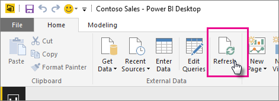

<properties
   pageTitle="重新整理從 Power BI Desktop 檔案-雲端建立的資料集"
   description="重新整理從 OneDrive 或 SharePoint Online 上的 Power BI Desktop 檔案建立資料集"
   services="powerbi"
   documentationCenter=""
   authors="guyinacube"
   manager="mblythe"
   backup=""
   editor=""
   tags=""
   qualityFocus="complete"
   qualityDate="04/01/2016"/>

<tags
   ms.service="powerbi"
   ms.devlang="NA"
   ms.topic="article"
   ms.tgt_pltfrm="NA"
   ms.workload="powerbi"
   ms.date="08/15/2016"
   ms.author="asaxton"/>

# 重新整理從 OneDrive 或 SharePoint Online 上的 Power BI Desktop 檔案建立資料集

## 優點有哪些？  
從 OneDrive 或 SharePoint Online，匯入檔案是以確定您所做的工作在 Power BI Desktop 保持同步的 Power BI 服務的好方法。 您已將檔案的模型載入任何資料匯入資料集和任何您已在檔案中建立的報表載入 Power BI 中的報表。 如果您變更檔案的 OneDrive 或 SharePoint Online，像是新增新的量值、 變更資料行名稱，或編輯視覺效果，一旦儲存之後，這些變更將會更新 Power BI 中，通常內大約一小時。

您可以執行一次，手動重新整理 Power BI Desktop 中選取 [首頁] 功能區上的 [重新整理的權限。 當您重新整理在這裡選取、 在資料 *檔案的* 的原始資料來源更新資料重新整理模型。 這類的重新整理，完全由 Power BI Desktop 內應用程式本身，不同於 Power BI 中的手動或排程重新整理且請務必了解其差異。

當您從 OneDrive 或資料，SharePoint Online，匯入 Power BI Desktop 檔案以及其他與模型相關的資訊會載入至 Power BI 中的資料集。 在 Power BI 服務中，沒有 Power BI Desktop，您會想要重新整理在資料集中的資料，因為那是您的報表，請在 Power BI 服務，為基礎。 因為外部資料來源，您可以使用手動重新整理資料集 **立即重新整理** 或您可以藉由設定重新整理排程 **排程重新整理**。

當您重新整理資料集時，Power BI 就不會連線至 OneDrive 或 SharePoint Online 上的檔案，即可查詢以取得更新的資料。 它會在資料集中使用資訊直接連接到資料來源以更新資料的查詢它，然後載入資料集。 此資料集重新整理的資料不同步回 OneDrive，或 SharePoint Online 上的檔案。

## 支援的項目？  
在 Power BI，立即重新整理和重新整理排程時，才支援建立從 Power BI Desktop 檔案匯入從何處取得資料/查詢編輯器用來連接到並從任何下列資料來源載入資料的本機磁碟機的資料集︰  

### Power BI 閘道個人
-   Power BI Desktop 的取得資料和查詢編輯器中顯示的所有線上資料來源。
-   除了 Hadoop 檔案 (HDFS) 和 Microsoft Exchange Power BI Desktop 的取得資料和查詢編輯器] 中顯示所有內部部署資料來源。

<!-- Refresh Data sources-->
[AZURE.INCLUDE [refresh-datasources](../includes/refresh-datasources.md)]

> [AZURE.NOTE] 閘道必須安裝和執行中，Power BI，以連接到內部部署資料來源重新整理資料集。

## OneDrive 或商務用 OneDrive。 有何不同？  
如果您有個人 OneDrive 和商務用 OneDrive，建議您保留任何您想要匯入 Power BI，商務用 OneDrive 中的檔案。 原因如下︰ 您可能使用兩個不同的帳戶來登入它們。

通常可以無縫連接到 Power BI 中的商務用 OneDrive，因為您用來登入 Power BI 與相同的帳戶通常是用來登入商務用 OneDrive 的相同帳戶。 但與使用不同的可能登入您的個人 OneDrive [Microsoft 帳戶](http://www.microsoft.com/account/default.aspx)。

當您登入您的 Microsoft 帳戶，務必選取 [讓我保持登。 Power BI 再同步處理您在 Power BI 中的資料集在 Power BI Desktop 檔案中進行任何更新  
    

如果您無法進行同步處理與資料集或報表，Power BI 中的 OneDrive 上的檔案可能變更您的 Microsoft 帳戶認證進行變更，您必須連接到並再次匯入檔案，從您的個人 OneDrive。

## 我要如何排程重新整理？  
當您安裝的重新整理排程時，Power BI 會直接連接到資料來源連接資訊和認證，使用更新的資料，資料集查詢，然後將更新的資料載入資料集。 也會更新報表和 Power BI 服務中的資料集為基礎的儀表板中的任何視覺效果。

如需有關如何安裝排程重新整理的詳細資訊，請參閱 [設定排程重新整理](powerbi-refresh-scheduled-refresh.md)。

## 不測風雲時  
發生錯誤時，通常是因為 Power BI 無法登入的資料來源，或如果資料集連接到內部部署資料來源，閘道已離線。 請確定 Power BI 可登入的資料來源。 如果您用來登入的資料來源的密碼變更，或從資料來源取得登出 Power BI，請務必嘗試登入您的資料來源中資料來源認證一次。

如果您正在變更的 Power BI Desktop 檔案放在 OneDrive 上並儲存，而且這些變更未反映在 Power BI 內一小時左右，它可能是因為 Power BI 無法連接到您的 OneDrive。 嘗試重新連線到 OneDrive 上的檔案。 如果系統提示您登入，請確定您選取 [讓我保持登中。 因為 Power BI 無法連接到您的 OneDrive 的檔案同步處理，您將需要再次匯入您的檔案。

請務必保留 **傳送重新整理失敗通知電子郵件給我** 檢查。 您會想要立刻知道如果排定的重新整理失敗。

## 疑難排解

有時候重新整理資料可能不會如預期般。 通常這會是與閘道連線的問題。 看看閘道疑難排解文件的工具和已知的問題。

[疑難排解內部部署資料閘道](powerbi-gateway-onprem-tshoot.md)

[疑難排解 Power BI 閘道-個人](powerbi-admin-troubleshooting-power-bi-personal-gateway.md)

更多的問題嗎？ [試用 Power BI 社群](http://community.powerbi.com/)