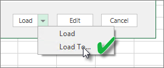

<properties
   pageTitle="重新整理從 Excel 活頁簿-本機建立的資料集"
   description="重新整理從本機磁碟機上的 Excel 活頁簿中建立的資料集"
   services="powerbi"
   documentationCenter=""
   authors="guyinacube"
   manager="mblythe"
   backup=""
   editor=""
   tags=""
   qualityFocus="complete"
   qualityDate="04/01/2016"/>

<tags
   ms.service="powerbi"
   ms.devlang="NA"
   ms.topic="article"
   ms.tgt_pltfrm="NA"
   ms.workload="powerbi"
   ms.date="08/15/2016"
   ms.author="asaxton"/>

# 重新整理從本機磁碟機上的 Excel 活頁簿中建立的資料集

## 支援的項目？  
在 Power BI，立即重新整理和重新整理排程時，才可支援從 Excel 活頁簿匯入從本機磁碟機，其中 Power Query （Get 和轉換資料，Excel 2016 中） 或 Power Pivot 會用來連線至任何下列資料來源和資料載入 Excel 資料模型建立的資料集︰  

### Power BI 閘道個人

-   顯示在 Power Query 中的所有線上資料來源。
-   除了 Hadoop 檔案 (HDFS) 和 Microsoft Exchange Power Query 中顯示所有內部部署資料來源。
-   顯示在 Power Pivot 中的所有線上資料來源。\*
-   除了 Hadoop 檔案 (HDFS) 和 Microsoft Exchange Power Pivot 中顯示所有內部部署資料來源。

<!-- Refresh Data sources-->
[AZURE.INCLUDE [refresh-datasources](../includes/refresh-datasources.md)]

>**注意：**  
>- 閘道必須安裝和執行中，Power BI，以連接到內部部署資料來源重新整理資料集。
>
>- 當使用 Excel 2013 中，請確定您已更新為最新版本的 Power Query。
>
>- 從本機磁碟機只能在工作表或連結的資料表中有資料匯入 Excel 活頁簿不支援重新整理。 如果會儲存並匯入從 OneDrive 重新整理，支援工作表資料。 若要深入了解，請參閱 [重新整理資料集從 OneDrive 或 SharePoint Online 上的 Excel 活頁簿建立](powerbi-refresh-excel-file-onedrive.md)。
>
>- 當您更新從本機磁碟機匯入 Excel 活頁簿中建立的資料集時，會重新整理查詢資料來源的資料。 如果您變更 Excel 或 Power Pivot; 中的資料模型的結構例如，建立新的量值或變更資料行的名稱，這些變更將不會複製至資料集。 如果您進行這類變更，您必須重新上傳或重新發行活頁簿。 如果您希望對您的活頁簿結構的一般變更，而且您想那些才會反映在 Power BI 中的資料集，而不必重新上傳，請考慮將您的活頁簿放在 OneDrive 上。 Power BI 會自動重新整理活頁簿儲存和匯入從 OneDrive 結構和工作表資料。

## 如何確定資料載入到 Excel 資料模型？  
當您使用 Power Query （Get 和轉換資料，Excel 2016） 來連接到資料來源時，您有幾個選項，將資料載入的位置。 若要確定您將資料載入資料模型，您必須選取 **將此資料加入至資料模型** 選項 **載入至** 對話方塊。

> [AZURE.NOTE] 以下影像顯示 Excel 2016。

在 **導覽**, ，按一下 [ **載入至...**  
    

或者，如果您按一下 **編輯** 導覽] 中，您會開啟 [查詢編輯器] 中。 您可以按一下 [那里 **關閉及載入至...**  
    

接著在 **載入至**, ，請確定您選取 **將此資料加入至資料模型**。  
    

### 如果使用 Power Pivot 中取得外部資料？  
沒問題。 每當您連線到使用 Power Pivot 時，從內部部署或線上資料來源的查詢資料，資料就會自動載入至資料模型。

## 我要如何排程重新整理？  
當您安裝的重新整理排程時，Power BI 會直接連接到資料來源連接資訊和認證，使用更新的資料，資料集查詢，然後將更新的資料載入資料集。 也會更新報表和 Power BI 服務中的資料集為基礎的儀表板中的任何視覺效果。

如需有關如何安裝排程重新整理的詳細資訊，請參閱 [設定排程重新整理](powerbi-refresh-scheduled-refresh.md)。

## 不測風雲時  
發生錯誤時，通常是因為 Power BI 無法登入的資料來源，或如果資料集連接到內部部署資料來源，閘道已離線。 請確定 Power BI 可登入的資料來源。 如果您用來登入的資料來源的密碼變更，或從資料來源取得登出 Power BI，請務必嘗試登入您的資料來源中資料來源認證一次。

請務必保留 **傳送重新整理失敗通知電子郵件給我檢查**。 您會想要立刻知道如果排定的重新整理失敗。

## 重要注意事項  
\* OData 摘要連接和從 Power Pivot 查詢不支援重新整理。 當使用 OData 摘要做為資料來源時，使用 Power Query。

## 疑難排解

有時候重新整理資料可能不會如預期般。 通常這會是與閘道連線的問題。 看看閘道疑難排解文件的工具和已知的問題。

[疑難排解內部部署資料閘道](powerbi-gateway-onprem-tshoot.md)

[疑難排解 Power BI 閘道-個人](powerbi-admin-troubleshooting-power-bi-personal-gateway.md)

更多的問題嗎？ [試用 Power BI 社群](http://community.powerbi.com/)
