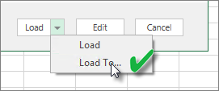

<properties
   pageTitle="重新整理 Excel 活頁簿-雲端中建立的資料集"
   description="重新整理從 OneDrive 或 SharePoint Online 上的 Excel 活頁簿中建立的資料集"
   services="powerbi"
   documentationCenter=""
   authors="guyinacube"
   manager="mblythe"
   backup=""
   editor=""
   tags=""
   qualityFocus="complete"
   qualityDate="04/01/2016"/>

<tags
   ms.service="powerbi"
   ms.devlang="NA"
   ms.topic="article"
   ms.tgt_pltfrm="NA"
   ms.workload="powerbi"
   ms.date="08/15/2016"
   ms.author="asaxton"/>

# 重新整理從 OneDrive 或 SharePoint Online 上的 Excel 活頁簿中建立的資料集

您可以匯入 Excel 活頁簿儲存在本機電腦，或在雲端儲存體，例如 OneDrive 商業或 SharePoint Online。 我們將為您的 excel 檔案使用雲端儲存體的優點。 如需有關如何將 Excel 檔案匯入 Power BI 的詳細資訊，請參閱 [從 Excel 活頁簿檔案取得資料](powerbi-service-excel-workbook-files.md)。

## 優點有哪些？  
從 OneDrive 或 SharePoint Online，匯入檔案時請確認您所做的工作中，Excel 會留在同步處理與 Power BI 服務的好方法。 您已將檔案的模型載入任何資料匯入資料集和任何您已在檔案中建立的報表載入 Power BI 中的報表。 如果您變更檔案的 OneDrive 或 SharePoint Online，像是新增新的量值、 變更資料行名稱，或編輯視覺效果，一旦儲存之後，這些變更將會更新 Power BI 中，通常內大約一小時。

當您從匯入 Excel 活頁簿您個人的 OneDrive 時，活頁簿時，就像在工作表及/或資料載入 Excel 資料模型和結構的資料模型中，資料表中的任何資料會匯入 Power BI 中的新資料集。 任何 Power View 視覺效果時都會重新建立在報表中。 Power BI 會自動連結上 OneDrive 或 SharePoint Online 的活頁簿，大約每個小時檢查更新。 如果活頁簿已變更，Power BI 會重新整理資料集和 Power BI 服務中的報表。

您可以重新整理 Power BI 服務中的資料集上。 當您手動重新整理，或排程重新整理資料集、 Power BI 直接連接到外部資料來源查詢更新的資料會再載入至資料集。 重新整理從 Power BI 中的資料集不會重新整理 OneDrive 或 SharePoint Online 上的活頁簿中的資料。 

## 支援的項目？  
在 Power BI，立即重新整理和重新整理排程時，才支援建立從 Power BI Desktop 檔案匯入從何處取得資料/查詢編輯器用來連接到並從任何下列資料來源載入資料的本機磁碟機的資料集︰  

### Power BI 閘道個人
-   Power BI Desktop 的取得資料和查詢編輯器中顯示的所有線上資料來源。
-   除了 Hadoop 檔案 (HDFS) 和 Microsoft Exchange Power BI Desktop 的取得資料和查詢編輯器] 中顯示所有內部部署資料來源。

<!-- Refresh Data sources-->
[AZURE.INCLUDE [refresh-datasources](../includes/refresh-datasources.md)]

> [AZURE.NOTE] 閘道必須安裝和執行中，Power BI，以連接到內部部署資料來源重新整理資料集。

## OneDrive 或商務用 OneDrive。 有何不同？  
如果您有個人 OneDrive 和商務用 OneDrive，建議您保留任何您想要匯入 Power BI，商務用 OneDrive 中的檔案。 原因如下︰ 您可能使用兩個不同的帳戶來登入它們。

通常可以無縫連接到 Power BI 中的商務用 OneDrive，因為您用來登入 Power BI 與相同的帳戶通常是用來登入商務用 OneDrive 的相同帳戶。 但與使用不同的可能登入您的個人 OneDrive [Microsoft 帳戶](http://www.microsoft.com/account/default.aspx)。

當您登入您的 Microsoft 帳戶，務必選取 [讓我保持登。 Power BI 再同步處理您在 Power BI 中的資料集在 Power BI Desktop 檔案中進行任何更新  
    

如果您無法進行同步處理與資料集或報表，Power BI 中的 OneDrive 上的檔案可能變更您的 Microsoft 帳戶認證進行變更，您必須連接到並再次匯入檔案，從您的個人 OneDrive。

## 連結到 Excel 檔案選項
當您連線到在 OneDrive 中的 Excel 活頁簿 for Business 或 SharePoint Online 時，您將有關於如何讓何謂到 Power BI 活頁簿中的兩個選項。

            [
            **Excel 資料匯入至 Power BI**](powerbi-service-excel-workbook-files.md#import-or-connect-to-an-excel-workbook-from-power-bi) – 當您匯入 Excel 活頁簿從您的 OneDrive Business 或 SharePoint Online 運作上面所述。

            [
            **連線管理，並在 Power BI 中檢視 Excel**](powerbi-service-excel-workbook-files.md#one-excel-workbook-two-ways-to-use-it) – 使用此選項時，您建立連接從 Power BI 由右至您的活頁簿放在 OneDrive 上的公司或 SharePoint Online。

當您連接到 Excel 活頁簿如此一來時，在 Power BI 中將不會建立資料集。 不過，活頁簿會出現在名稱旁的 Excel 圖示 [報表] 下的 Power BI 服務。 不同於 Excel Online，當您連接到您的活頁簿從 Power BI，如果您的活頁簿有連線到外部資料來源的資料載入 Excel 資料模型中，您可以使用設定的重新整理排程。

當您設定的重新整理排程，如此一來，唯一的差異會重新整理資料都會送到活頁簿的資料模型上 OneDrive，或 SharePoint Online，而不是 Power BI 中的資料集。

## 如何確定資料載入到 Excel 資料模型？  
當您使用 Power Query （Get 和轉換資料，Excel 2016） 來連接到資料來源時，您有幾個選項，將資料載入的位置。 若要確定您將資料載入資料模型，您必須選取 **將此資料加入至資料模型** 選項 **載入至** 對話方塊。

> [AZURE.NOTE] 以下影像顯示 Excel 2016。

在 **導覽**, ，按一下 [ **載入至...**  
    

或者，如果您按一下 **編輯** 導覽] 中，您會開啟 [查詢編輯器] 中。 您可以按一下 [那里 **關閉及載入至...**  
    

接著在 **載入至**, ，請確定您選取 **將此資料加入至資料模型**。  
    

### 如果使用 Power Pivot 中取得外部資料？  
沒問題。 每當您連線到使用 Power Pivot 時，從內部部署或線上資料來源的查詢資料，資料就會自動載入至資料模型。

## 我要如何排程重新整理？  
當您安裝的重新整理排程時，Power BI 會直接連接到資料來源連接資訊和認證，使用更新的資料，資料集查詢，然後將更新的資料載入資料集。 也會更新報表和 Power BI 服務中的資料集為基礎的儀表板中的任何視覺效果。

如需有關如何安裝排程重新整理的詳細資訊，請參閱 [設定排程重新整理](powerbi-refresh-scheduled-refresh.md)。

## 不測風雲時  
發生錯誤時，通常是因為 Power BI 無法登入的資料來源，或如果資料集連接到內部部署資料來源，閘道已離線。 請確定 Power BI 可登入的資料來源。 如果您用來登入的資料來源的密碼變更，或從資料來源取得登出 Power BI，請務必嘗試登入您的資料來源中資料來源認證一次。

請務必保留 **傳送重新整理失敗通知電子郵件給我檢查**。 您會想要立刻知道如果排定的重新整理失敗。

## 重要注意事項  
\* OData 摘要連接和從 Power Pivot 查詢不支援重新整理。 當使用 OData 摘要做為資料來源時，使用 Power Query。

## 疑難排解

有時候重新整理資料可能不會如預期般。 通常這會是與閘道連線的問題。 看看閘道疑難排解文件的工具和已知的問題。

[疑難排解內部部署資料閘道](powerbi-gateway-onprem-tshoot.md)

[疑難排解 Power BI 閘道-個人](powerbi-admin-troubleshooting-power-bi-personal-gateway.md)

更多的問題嗎？ [試用 Power BI 社群](http://community.powerbi.com/)