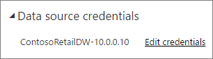

<properties
pageTitle="設定排定的重新整理"
description="這包含選取的閘道，並設定排定的重新整理的步驟。"
services="powerbi"
documentationCenter=""
authors="guyinacube"
manager="mblythe"
backup=""
editor=""
qualityFocus="complete"
qualityDate="04/01/2016"/>

<tags
ms.service="powerbi"
ms.devlang="NA"
ms.topic="article"
ms.tgt_pltfrm="na"
ms.workload="powerbi"
ms.date="08/15/2016"
ms.author="asaxton"/>
# 設定排定的重新整理

如果您的資料集使用立即重新整理和重新整理排程時，才支援排定的重新整理，有幾個需求和設定很重要的重新整理才會成功。 這些是 **閘道連線**, ，**資料來源認證**, ，和 **排程重新整理**。 讓我們仔細看看每個。

這將會描述兩個可用的選項 [Power BI 閘道 – 個人](powerbi-personal-gateway.md) 和 [內部資料閘道](powerbi-gateway-onprem.md)。

若要取得排程重新整理螢幕，您可以執行下列程式碼。

1. 選取 **省略號 （...）** 旁邊底下所列的資料集 **資料集**。

2. 選取 **排程重新整理**。

    

## 閘道的連線
您會看到不同的選項這裡根據您所擁有的個人或企業，閘道上線而且可以使用。

如果沒有閘道功能，您會看到 **閘道設定** 停用。 您也會看到一則訊息指出如何安裝個人閘道。

如果您有的個人閘道，將予以可供選取，如果它已上線。 如果無法使用時，它會顯示離線。

如果有可供您，您也可以選取 「 企業閘道 」。 您只會看到企業閘道 」 提供，如果您的帳戶列在資料來源指定的閘道設定的 [使用者] 索引標籤。

## 資料來源認證

### Power BI 閘道個人

如果您使用個人閘道以重新整理資料，您必須提供用來連接到後端資料來源的認證。 如果您的線上服務，從連線到內容的組件中，輸入連接的認證會繼續排程重新整理。

您只需要登入到資料來源您可以使用重新整理該資料集的第一次。 在輸入後，仍會保留這些認證與資料集。 

> [AZURE.NOTE] 某些驗證方法，如果您用來登入的資料來源的密碼過期或已變更，您將需要將它變更為資料來源中資料來源認證。

發生錯誤時，問題通常就需要運用閘道已離線，因為它無法登入 Windows，然後啟動服務，或 Power BI 無法登入的資料來源以更新的資料查詢。 如果重新整理失敗，請檢查資料集的設定。 如果閘道服務處於離線狀態，閘道器狀態會是您會看到錯誤的位置。 如果 Power BI 無法登入的資料來源，您會看到 [資料來源認證時發生錯誤。

### Power BI 閘道企業

如果您使用 「 企業閘道 」 來重新整理資料，您不需要閘道管理員所定義的資料來源提供認證。

## 排程重新整理

[排定的重新整理] 區段是您用來定義資料集重新整理頻率和時間的插槽。 某些資料來源不需要有閘道才能可用來設定。 其他人將會需要閘道。
 
您將需要變更 **保持最新資料** 為 [是] 以設定的設定。

## 支援的項目？  
對於不同的閘道器進行排程重新整理，則支援特定資料集。 以下是了解可用的參考。

### Power BI 閘道個人

**Power BI Desktop**

-   Power BI Desktop 的取得資料和查詢編輯器中顯示的所有線上資料來源。
-   除了 Hadoop 檔案 (HDFS) 和 Microsoft Exchange Power BI Desktop 的取得資料和查詢編輯器] 中顯示所有內部部署資料來源。

**Excel**

> [AZURE.NOTE] 在 Excel 2016 及更新版本，Power Query 現在會列在功能區中，Get 和轉換資料的資料區段。

-   顯示在 Power Query 中的所有線上資料來源。
-   除了 Hadoop 檔案 (HDFS) 和 Microsoft Exchange Power Query 中顯示所有內部部署資料來源。
-   顯示在 Power Pivot 中的所有線上資料來源。\*
-   除了 Hadoop 檔案 (HDFS) 和 Microsoft Exchange Power Pivot 中顯示所有內部部署資料來源。

<!-- Refresh Data sources-->
[AZURE.INCLUDE [refresh-datasources](../includes/refresh-datasources.md)]

## 疑難排解

有時候重新整理資料可能不會如預期般。 通常這會是與閘道連線的問題。 看看閘道疑難排解文件的工具和已知的問題。

[疑難排解內部部署資料閘道](powerbi-gateway-onprem-tshoot.md)

[疑難排解 Power BI 閘道-個人](powerbi-admin-troubleshooting-power-bi-personal-gateway.md)

## 請參閱

[在 Power BI 中的資料重新整理](powerbi-refresh-data.md)  
[Power BI 閘道個人](powerbi-personal-gateway.md)  
[內部資料閘道](powerbi-gateway-onprem.md)  
[疑難排解內部部署資料閘道](powerbi-gateway-onprem-tshoot.md)  
[疑難排解 Power BI 閘道-個人](powerbi-admin-troubleshooting-power-bi-personal-gateway.md)  
更多的問題嗎？ [試用 Power BI 社群](http://community.powerbi.com/)