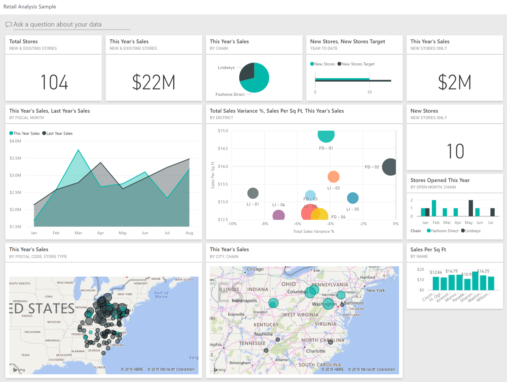
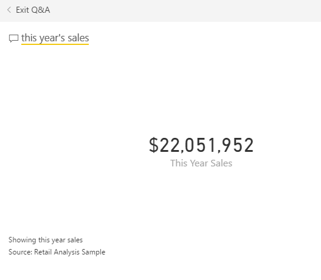
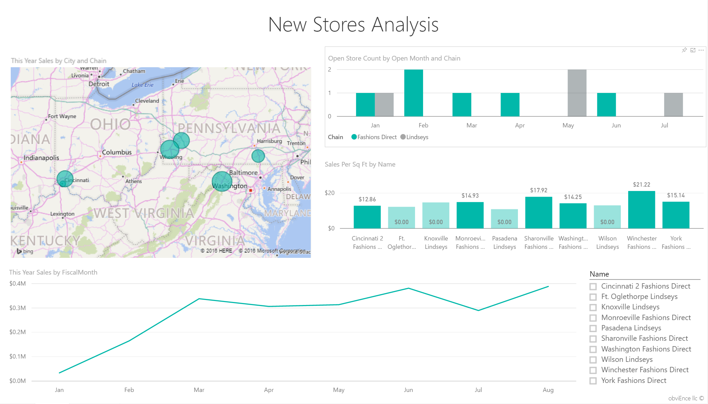

<properties
   pageTitle="Power BI 的零售分析範例︰ 導覽"
   description="Power BI 的零售分析範例︰ 導覽"
   services="powerbi"
   documentationCenter=""
   authors="amandacofsky"
   manager="mblythe"
   backup=""
   editor=""
   tags=""
   qualityFocus="no"
   qualityDate=""/>

<tags
   ms.service="powerbi"
   ms.devlang="NA"
   ms.topic="article"
   ms.tgt_pltfrm="NA"
   ms.workload="powerbi"
   ms.date="07/18/2016"
   ms.author="amac"/>

# Power BI 的零售分析範例︰ 導覽

##  有關零售分析範例

這個產業範例儀表板與基礎報表會分析跨多個儲存區和學區的銷售資料的項目售出商品的零售。 度量比較今年的最後一年在這些區域中︰ 銷售、 單位、 毛利、 和變異數，以及外加新商店的分析。 這些是來自 obviEnce 的真實資料 ([www.obvience.com](http://www.obvience.com)) 匿名的。

您也可以 [下載只是資料集 （Excel 活頁簿） 此範例](http://go.microsoft.com/fwlink/?LinkId=528592)。

##  啟動儀表板上，開啟報表

1.  在儀表板中，選取 「 總存放區 」 磚︰

      

    這會帶您報表中的 [市集銷售概觀] 頁面。 您會看到我們有新 104 總存放區，10 個。 我們有直接的方式和 Lindseys 的兩個鏈結。 平均的方式直接存放區是較大的。

2.  在圓形圖中，選取 **的方式直接**。

      

    請注意，泡泡圖中的結果︰

      

    FD 01 學區則具有每平方英呎平均銷售量最高、 FD 02 具有最低的變異數相較於最後一年的銷售額、 FD 03 和 FD 04 都是最差藝術家整體。

3.  選取個別的泡泡或其他圖表以查看跨反白顯示，提供您選項的影響。

4.  若要返回 [儀表板的上方導覽列中選取 Power BI。

    

5.  在儀表板中，選取 [磚 」 本年度銷售量 」。

    

    這就相當於 [問題] 方塊中輸入 「 本年度銷售量 」。

    您會看到這個畫面︰

    

##  檢閱使用 Power BI 問答集建立的磚

讓我們取得更明確。

1.  新增 「 本年度銷售量 **所學區**」 到問題。 觀察結果︰ 會自動將答案放在橫條圖，並建議其他片語︰

    

2.  現在已變更，問題就 「 本年度銷售量 **zip 和鏈結**」。

    請注意如何它回答這個問題在您輸入具有適當的圖表。

3.  玩一玩更多的問題，請參閱取得何種結果。

4.  當您準備好時，返回儀表板的左上角中選取 [Power BI。

##  深入探索到的資料

現在讓我們來探索詳細層級，看看學區的效能。

1.  在儀表板中，選取的磚比較今年的最後一年銷售量。

    

    1 月、 4 月，與正在特別是不正確的幾個月的月會注意到去年，變異數 %大的變化性。

    

    我們來看看我們可以縮小可能的問題。

2.  選取泡泡圖中，然後選擇 [ **020 Mens**。

      

    觀察 men's 類別不是做為整體，商務嚴重影響在 4 月，但 1 月和年 7 月仍然問題的幾個月。

3.  現在，選取 **010 Womens' 泡泡**。

    

    女裝類別執行大部分的通知不如跨所有月份，整體商務和更糟，幾乎每個月，相較於前一年。

4.  選取即可清除篩選條件的泡泡圖。

##  試用交叉分析篩選器

讓我們來看如何在特定學區。

1.  選取 [沒有 Guinot 左上方交叉分析篩選器中。

    

    請注意，沒有的學區的效能去年勝過於 3 月和年 6 月。

2.  現在，沒有仍然選取時，請選取 Women's 泡泡。

    

    請注意，Women's 類別，其地區從來都沒有符合去年的磁碟區。

3.  3.瀏覽其他學區管理員和類別-哪些深入資訊可以找到？

4.  當您準備好時 – 返回儀表板。

## 什麼我們的資料告訴我們本年度的銷售成長率？

我們想要探索的最後一個區域是我們的成長 – 新的存放區開啟今年。

1.  選取 ' 儲存開啟此 Year' 牌。

    

    做為從磚 – 明顯更多的方式直接儲存比開啟今年 Lindseys 存放區。

2.  觀察銷售每個 Sql 全文檢索依名稱的圖表︰

    

     還有一段每 SQF 平均銷售額的新的存放區之間的差異。

3.  按一下的方式直接上正確的圖表中的圖例項目。 請注意，即使是相同的鏈結，最佳的存放區 （Winchester 的方式直接） 的明顯勝過最差的存放區 （辛辛那提 2 的方式直接） $21.22 vs $12.86 分別。

    

4.  按一下交叉分析篩選器中的 [Winchester 直接的方式，並觀察折線圖。 第一次的銷售數字回報在二月，幾乎每個月提供根據磁碟區的前置字元存放區。

5.  按一下辛辛那提 2 的方式直接交叉分析篩選器，您會看到折線圖開啟在 6 月，它似乎是執行最差的存放區中。

6.  同樣地，線條和泡泡圖中的其他列上的 [瀏覽，並查看您可以探索哪些深入資訊。

這是安全的環境播放。 您永遠都可以選擇不儲存變更。 但是，如果您不要儲存它們，您可以一律移至取得資料的這個範例中的新複本。

## 後續步驟︰ 連接到您的資料

我們希望本教學課程示範了如何 Power BI 儀表板、 問答集，並報告可提供深入零售資料。 現在輪-連接到您自己的資料。 有了 Power BI，您可以連接到各種資料來源。 深入了解 [開始使用 Power BI](https://support.office.com/article/Get-Started-with-Power-BI-Preview-0f0237e2-f74f-49ab-82ea-1990c3c3deb8)。

## 請參閱

-   
            [下載零售分析範例內容的組件](powerbi-sample-tutorial-connect-to-the-samples.md)
-   
            [下載 Excel 活頁簿，此 Power BI 範例](http://go.microsoft.com/fwlink/?LinkId=528592)
-   
            [取得資料 （適用於 Power BI)](powerbi-service-get-data.md)
-   
            [Power BI-基本概念](powerbi-service-basic-concepts.md)
-  更多的問題嗎？ 
            [試用 Power BI 社群](http://community.powerbi.com/)
