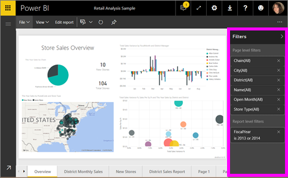
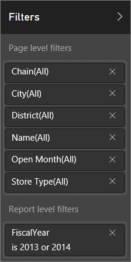
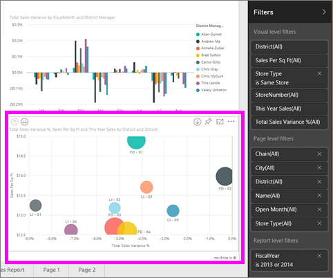
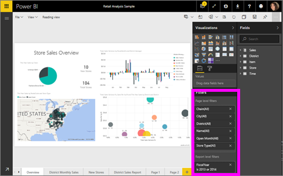

<properties
   pageTitle="關於篩選和反白顯示在 Power BI 報表"
   description="關於篩選和反白顯示在 Power BI 報表"
   services="powerbi"
   documentationCenter=""
   authors="mihart"
   manager="mblythe"
   backup=""
   editor=""
   tags=""
   qualityFocus="monitoring"
   qualityDate=""/>

<tags
   ms.service="powerbi"
   ms.devlang="NA"
   ms.topic="article"
   ms.tgt_pltfrm="NA"
   ms.workload="powerbi"
   ms.date="10/24/2016"
   ms.author="mihart"/>
# 關於篩選和反白顯示在 Power BI 報表

            ***篩選器*** 全部移除，但您想要專注於的資料。  
            ***反白顯示*** 是未篩選，而是它不會移除資料，因為會反白顯示的可見的資料子集; unhighlighted 的資料仍然可見但呈現暗灰色。

有許多種不同的方式，您可以篩選並反白顯示在 Power BI 中的報表。 將所有這些資訊放在一個發行項會收到令人困惑，因此我們已先將它向下細分，像這樣︰

-   篩選和反白顯示 （您要現在閱讀的文件） 簡介

-   您可以使用的方式 [建立及使用篩選器，並編輯檢視/您擁有之報表中反白顯示](powerbi-service-add-a-filter-to-a-report.md)。 當您編輯報表的權限，您可以建立、 修改和刪除篩選器和報表中反白顯示。

-   您可以使用的方式 [使用篩選器和報表，與您共用或報表讀取檢視中反白顯示](powerbi-service-interact-with-a-report-in-reading-view.md)。 您可以執行就會較小，但 Power BI 仍可讓您廣泛的篩選和反白顯示的選項。  

-   
            [篩選和反白顯示 [編輯] 檢視中的控制項的詳細的介紹](powerbi-service-how-to-use-a-report-filter.md) 包括深入了解類型的篩選器 （例如，日期和時間、 數字的文字） 和基本和進階選項之間的差異。

-   既然您已了解如何篩選器和反白顯示工作的預設值， [了解如何變更的方式上的視覺效果頁面篩選和反白顯示彼此](powerbi-service-visual-interactions.md)

>[AZURE.TIP] Power BI 可以怎麼知道與資料產生關聯？  它會使用不同的資料表和欄位在基礎之間的關聯性 [資料模型](https://support.office.com/article/Create-a-Data-Model-in-Excel-87e7a54c-87dc-488e-9410-5c75dbcb0f7b?ui=en-US&rs=en-US&ad=US) 報表] 頁面中的項目彼此互動。

##  篩選器和報表使用 [篩選] 窗格中反白顯示的簡介

篩選和反白顯示可使用套用 **篩選** 窗格或直接在報表本身上進行選取 (臨機操作查看頁面底部)。 [篩選] 窗格顯示的資料表和欄位，如果有的話，用於報表和已套用的篩選器。 篩選器會劃分成 **頁面層級篩選**, ，**報告層級篩選**, ，和 **Visual 層級篩選**。  如果您已選取的報表畫布上的視覺效果，則只會看到視覺化層級篩選。

>[AZURE.TIP]   如果篩選器有這個字 **所有** 旁邊，這表示整個欄位包含做為篩選條件。  例如， **Chain(All)** 以下螢幕擷取畫面中告訴我們此報表] 頁面包含所有存放區鏈結的相關資料。  相反地，報表層級篩選的 **FiscalYear 是 2013年或 2014年** 告訴我們報表，只包含 2013年和 2014年會計年度的資料。

##  在讀取檢視 verus 編輯檢視的篩選器

有兩種模式與報表互動︰ [讀取檢視](powerbi-service-interact-with-a-report-in-reading-view.md) 和 [編輯檢視](powerbi-service-interact-with-a-report-in-editing-view.md)。  可供您使用的篩選功能取決於您是在哪一個模式。

-   在 [編輯] 檢視中，您可以加入報表、 頁面和視覺化篩選。 當您儲存報表時，篩選器，都會一起儲存。 篩選器，您已新增，但不是儲存變更，看看在讀取檢視報表的人可以進行互動。

-   在讀取檢視中，您可以互動的任何頁面和視覺化篩選報表中已存在，但您將無法儲存您的篩選器變更。

### 在 [讀取] 檢視中的 [篩選] 窗格

如果您只有在讀取檢視報表存取權，[篩選] 窗格看起來像這樣︰

所以此報表的頁面都 6 頁面層級的篩選器和 1 的報告層級的篩選條件。

若要查看任何視覺化的層級篩選是否存在，選取 [視覺效果。 在下圖中，泡泡圖會有 6 套用的篩選器。

在讀取檢視中，瀏覽藉由修改現有的篩選條件的資料。 了解如何防範 [互動中讀取檢視篩選條件](powerbi-service-interact-with-a-report-in-reading-view.md)

### 在 [編輯] 檢視中的 [篩選] 窗格

在您報表的擁有者權限，並編輯檢視中開啟它，您會看到 **篩選** 只是其中幾個編輯窗格可用。

在讀取檢視 （如上所述） 我們現在看到這個報表的頁面已 6 頁面層級的篩選器和 1 的報告層級的篩選條件。 並選取泡泡圖中，我們會看到它有 6 visual 層級套用的篩選器。

但在 [編輯] 檢視中，還有很多，我們可以使用篩選器和反白顯示。 主要差異在於我們可以新增新的篩選條件。 了解如何執行此和文件中，甚至 [將篩選加入至報表](powerbi-service-add-a-filter-to-a-report.md)

##  臨機操作 filterting 和反白顯示
選取的欄位來篩選並反白顯示網頁的其餘報表畫布上。 選取的任何空白區域，在相同的視覺效果，將它移除。 這種類型的篩選和反白顯示並不會與報表一起儲存，但其實很有趣的方式來快速瀏覽資料的影響。 若要微調的交叉篩選和交叉反白顯示此類型的運作方式，請參閱 [Visual 互動](powerbi-service-visual-interactions.md)

### 請參閱

            [互動篩選和反白顯示 （在讀取檢視）](powerbi-service-interact-with-a-report-in-reading-view.md)

            [將篩選加入至報表 （在編輯檢視）](powerbi-service-add-a-filter-to-a-report.md)

            [導覽報表篩選](powerbi-service-how-to-use-a-report-filter.md)

            [變更報表的視覺效果交叉篩選及方式跨醒目提示的其他](powerbi-service-visual-interactions.md)

深入了解 [Power BI 中的報表](powerbi-service-reports.md)

更多的問題嗎？ 
            [試用 Power BI 社群](http://community.powerbi.com/)
