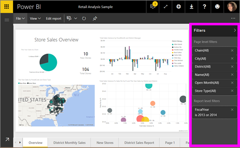
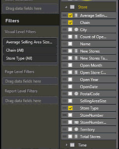

<properties
   pageTitle="將篩選加入至 Power BI 的報表"
   description="將篩選加入至 Power BI 的報表"
   services="powerbi"
   documentationCenter=""
   authors="mihart"
   manager="mblythe"
   backup=""
   editor=""
   tags=""
   qualityFocus="monitoring"
   qualityDate=""/>

<tags
   ms.service="powerbi"
   ms.devlang="NA"
   ms.topic="article"
   ms.tgt_pltfrm="NA"
   ms.workload="powerbi"
   ms.date="08/21/2016"
   ms.author="mihart"/>

# 將篩選加入至 Power BI 報表 （在 [編輯] 檢視中）

>
            **秘訣**︰ 我們建議您第一次讀取 [需篩選和反白顯示在 Power BI 報表](powerbi-service-about-filters-and-highlighting-in-reports.md)。

##  在讀取檢視與編輯] 檢視的報表篩選條件之間的差異為何

有兩種模式與報表互動︰ [讀取檢視](powerbi-service-interact-with-a-report-in-reading-view.md) 和 [編輯檢視](powerbi-service-interact-with-a-report-in-editing-view.md)。  可供您使用的篩選功能取決於您是在哪一個模式。

-   在 [編輯] 檢視中，您可以加入報表、 頁面和視覺化篩選。 當您儲存報表時，篩選器，都會一起儲存。 篩選器，您已新增，但不是儲存變更，看看在讀取檢視報表的人可以進行互動。

-   在讀取檢視中，您可以互動的任何頁面和視覺化篩選報表中已存在，但您將無法儲存您的篩選器變更。

            **注意︰**  這篇文章說明如何在報表中建立篩選器 **編輯檢視**。  如需有關讀取檢視中的篩選器的詳細資訊，請參閱 [讀取檢視報表中的篩選器與互動](powerbi-service-interact-with-a-report-in-reading-view.md)。

##  視覺化篩選、 頁面篩選和報表篩選
A **頁面篩選** 套用至 [報表] 頁面上的所有視覺效果。 A **視覺化篩選** 套用至報表頁面上的單一視覺效果。 和 **報表篩選** 適用於報表中的所有頁面。

## 將篩選加入至特定的視覺效果 （也稱為 visual 篩選器）

### 篩選已在圖表中的欄位

1.  開啟您 [編輯檢視報表](powerbi-service-go-from-reading-view-to-editing-view.md)。

2.  開啟 [視覺效果和篩選] 窗格和 [欄位] 窗格 （如果尚不開啟）。

3.  選取視覺效果，讓它成為作用。 視覺效果正在使用的所有欄位都都會列在 **欄位** 窗格也會列在 **篩選** 窗格底下 **視覺化層級篩選** 標題。

4.  選取您想要新增為新的視覺化層級篩選，並將它拖曳至視覺化層級篩選區域。  設定 **基本** 或 **進階** 篩選控制項 (請參閱 [如何使用報表篩選](powerbi-service-how-to-use-a-report-filter.md))。

    

視覺變更，以反映新的篩選器。 如果您使用篩選器儲存報表，報表讀者可以互動在讀取檢視中，選取或清除值篩選器。

## 將篩選加入整個頁面 （也稱為頁面檢視篩選器）

1.  開啟您 [編輯檢視報表](powerbi-service-go-from-reading-view-to-editing-view.md)。

2.  開啟 [視覺效果和篩選] 窗格和 [欄位] 窗格 （如果尚不開啟）。

3.  在報表中的欄位清單中選取一個欄位，並將它拖曳下方 **頁面層級篩選**。

4.  選取您想要篩選和設定的值  **基本** 或 **進階** 篩選控制項 (請參閱 [如何使用報表篩選](powerbi-service-how-to-use-a-report-filter.md))。

    視覺效果會變更以反映新的篩選器。 

    

如果您使用篩選器儲存報表，報表讀者可以互動在讀取檢視中，選取或清除值篩選器。

## 將篩選加入至整份 （也就是報表的篩選器）

1. 開啟您 [編輯檢視報表](powerbi-service-go-from-reading-view-to-editing-view.md)。

2. 開啟 [視覺效果和篩選] 窗格和 [欄位] 窗格 （如果尚不開啟）。

3. 在欄位清單中選取一個欄位，並將它拖曳下方 **報表層級篩選**。

4. 選取您想要篩選的值 (請參閱 [如何使用報表篩選](powerbi-service-how-to-use-a-report-filter.md))。

視覺效果在使用中的頁面上，以及所有頁面在報表中，會變更以反映新的篩選器。 如果您使用篩選器儲存報表，報表讀者可以互動在讀取檢視中，選取或清除值篩選器。

##  疑難排解

### 為什麼您視覺化層級篩選器和頁面層級篩選可能會傳回不同的結果

當您新增 visual 的層級篩選，彙總結果上的 Power BI 篩選器。  預設彙總為 Sum，不過您也可以 [變更彙總類型](powerbi-service-aggregates.md)。  

當您新增了頁面層級篩選，而不需要彙總的 Power BI 篩選器。  它會因為頁面可以有許多的視覺效果，其中每個可以利用不同的彙總類型。  因此篩選條件會套用至每個資料列。

## 請參閱

 [如何使用報表篩選](powerbi-service-how-to-use-a-report-filter.md)

  [篩選和反白顯示在報表中](powerbi-service-about-filters-and-highlighting-in-reports.md)

[篩選器和讀取檢視報表中反白顯示互動](powerbi-service-interact-with-a-report-in-reading-view.md)

[變更報表的視覺效果交叉篩選及方式跨醒目提示的其他](powerbi-service-visual-interactions.md)

深入了解 [Power BI 中的報表](powerbi-service-reports.md)

[Power BI-基本概念](powerbi-service-basic-concepts.md)

更多的問題嗎？ [試用 Power BI 社群](http://community.powerbi.com/)
