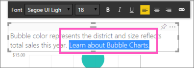
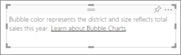
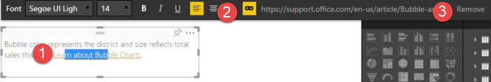

<properties
   pageTitle="加入 Power BI 報表中文字方塊的超連結"
   description="加入 Power BI 中的文字方塊中的超連結"
   services="powerbi"
   documentationCenter=""
   authors="mihart"
   manager="mblythe"
   backup=""
   editor=""
   tags=""
   featuredVideoId="_3q6VEBhGew"
   qualityFocus="no"
   qualityDate=""/>

<tags
   ms.service="powerbi"
   ms.devlang="NA"
   ms.topic="article"
   ms.tgt_pltfrm="NA"
   ms.workload="powerbi"
   ms.date="10/08/2016"
   ms.author="mihart"/>

# 加入報表中文字方塊的超連結

文字方塊可以加入至報表、 釘選到儀表板的報表，並直接加入至儀表板。 可以將超連結加入到文字方塊中，不論其所在的位置。 **本主題涵蓋在報表中的文字方塊。**

>
            **請注意**︰ 在 Power BI 資料表和矩陣中的超連結的資訊，請參閱 [資料表中的超連結](powerbi-service-hyperlinks-in-tables.md)。 如需新增文字方塊，以便您 **儀表板**, ，請參閱 [將磚加入直接從儀表板 ](powerbi-service-add-a-widget-to-a-dashboard.md)。 

<iframe width="560" height="315" src="https://www.youtube.com/embed/_3q6VEBhGew?list=PL1N57mwBHtN0JFoKSR0n-tBkUJHeMP2cP" frameborder="0" allowfullscreen></iframe>

## 若要加入報表中文字方塊的超連結

1.  
            [建立一個文字方塊，然後加入一些文字](powerbi-service-text-boxes-in-reports.md)。 

2.  反白顯示現有的文字，或加入新的文字，以做為超連結。

    

3.  選取超連結圖示   。

4.  輸入或貼上 URL 中的超連結欄位，然後選取 **完成**。

    

    

5.  測試連結。  

    -  在文字方塊中，選取要顯示的 URL 超連結

    -  選取要在新的瀏覽器視窗中開啟頁面的 URL。

## 若要移除的超連結，但保留文字

1.  至少有部分的反白顯示，超連結

2.  選取超連結圖示，然後

3.  選擇 **移除**。 

    

    或者，若要移除的超連結，但保留文字，請反白顯示整個超連結，然後選取 **刪除**。

## 請參閱

[Power BI 報表中的文字方塊](powerbi-service-text-boxes-in-reports.md)

[將文字方塊加入至儀表板 ](powerbi-service-add-a-widget-to-a-dashboard.md)

[在 Power BI 中的報表](powerbi-service-reports.md)

[Power BI 報表中的視覺效果](powerbi-service-visualizations-for-reports.md)

[Power BI-基本概念](powerbi-service-basic-concepts.md)

更多的問題嗎？ [試用 Power BI 社群](http://community.powerbi.com/)
