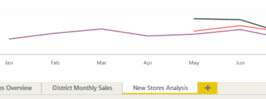

<properties
   pageTitle="新增 Power BI 報表頁面"
   description="新增 Power BI 報表頁面"
   services="powerbi"
   documentationCenter=""
   authors="mihart"
   manager="mblythe"
   backup=""
   editor=""
   tags=""
   qualityFocus="no"
   qualityDate=""/>

<tags
   ms.service="powerbi"
   ms.devlang="NA"
   ms.topic="article"
   ms.tgt_pltfrm="NA"
   ms.workload="powerbi"
   ms.date="10/08/2016"
   ms.author="mihart"/>

# 新增 Power BI 報表頁面  
## 加入新的空白頁面

沒有理由參觀報表頁面-只要加入新的空白頁面。

選擇黃色加號圖示，然後輸入 [頁面的新名稱。  

## 複製頁面
從上面的控制項列在 [編輯模式](powerbi-service-interact-with-a-report-in-editing-view.md), ，請選取 **複製此頁面** 圖示。

新頁面已建立，並成為使用中的頁面。 若要將它重新命名，連按兩下加以，反白顯示] 索引標籤上的名稱並輸入新名稱。  如需詳細資訊，請參閱 [重新命名報表和報表頁面]()

## 請參閱  
深入了解 [Power BI 中的報表](powerbi-service-reports.md)  
[Power BI-基本概念](powerbi-service-basic-concepts.md)

更多的問題嗎？ [試用 Power BI 社群](http://community.powerbi.com/)
