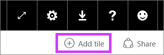
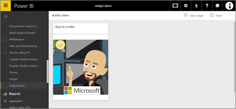
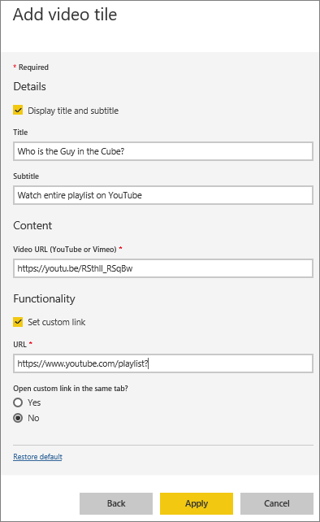
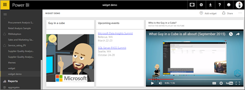
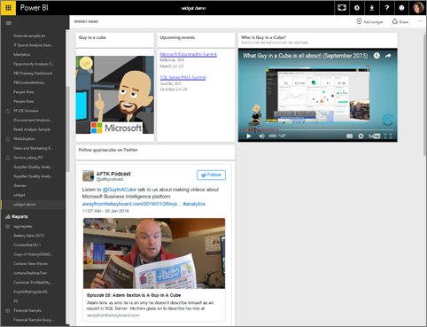
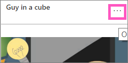

<properties
   pageTitle="將影像、 文字方塊、 影片或 web 程式碼加入至您的儀表板"
   description="如何將影像、 視訊、] 文字方塊中，web 程式碼的並排顯示的儀表板上的文件。"
   services="powerbi"
   documentationCenter=""
   authors="mihart"
   manager="mblythe"
   backup=""
   editor=""
   tags=""
   featuredVideoId="HivEJ5lN3l4"
   qualityFocus="identified"
   qualityDate=""/>

<tags
   ms.service="powerbi"
   ms.devlang="NA"
   ms.topic="article"
   ms.tgt_pltfrm="NA"
   ms.workload="powerbi"
   ms.date="10/07/2016"
   ms.author="mihart"/>

# 將磚加入直接從本身的儀表板

<iframe width="560" height="315" src="https://www.youtube.com/embed/HivEJ5lN3l4" frameborder="0" allowfullscreen></iframe>

>
            **請注意**: 「 新增小工具 」 功能已重新命名為 「 新增磚 」。

## 新增磚

 **新增磚** 控制項可讓您直接將加入的影像、 文字方塊、 視訊資料流處理資料，或 web 儀表板的程式碼。

1. 選取 **新增磚** 從功能表列。

    

2. 選取要加入哪些 widget: **映像**, ，**文字方塊**, ，**視訊**, ，**網頁內容**, ，或 **自訂資料流**。

    


## 加入影像
假設您想在您的儀表板或其他映像的貴公司的標誌。

1. 選取 **映像** > **下一步**。

2. 映像將資訊加入至 **並排顯示詳細資料** 窗格。

    

  - 若要顯示的影像上方的標題，請選取 *顯示標題和副標題* 輸入標題和/或子字幕。

  - 輸入影像的 URL

  - 若要並排顯示超連結，請選取 **組自訂連結** 並輸入 URL。  當同事按一下此映像或標題時，便會進入此 URL。

  - 選取 **套用**。  在儀表板，調整大小，並視需要移動影像。

        

##  新增文字] 方塊或儀表板標題

1. 選取 **文字方塊 > 下一步**。

    

    >
            **請注意**︰ 加入儀表板標題、 在文字方塊中輸入您的標題和增加字型。

2. 設定文字方塊的格式︰

  - 若要顯示在文字方塊上面的標題，請選取 **顯示標題和副標題** 輸入標題和/或子字幕。

  - 輸入並格式化文字方塊的內容。  

  - 選擇性地設定標題的自訂連結。  不過，在此範例中我們新增了超連結文字內方塊本身，因此請保持 **組自訂連結** 未核取。

3.  選取 **套用**。  在儀表板，調整大小，並視需要移動文字方塊。

    

## 新增視訊

YouTube 或 Vimeo 視訊磚加入儀表板時視訊播放您的儀表板 」 權限。

1. 選取 **影片 > 下一步**。

2. 將視訊資訊加入 **並排顯示詳細資料** 窗格。

    

  - 若要顯示頂端的 [視訊] 磚的標題和副標題，請選取 *顯示標題和副標題* 輸入標題和/或子字幕。 在此範例中，我們會加入子標題，然後將它轉換成超連結回到 YouTube 上的整個播放清單。

  - 輸入視訊的 URL

  - 加入標題和副標題的超連結。  之後您的同事觀看內嵌視訊您可能想它們 YouTube 上檢視整個播放清單--將連結加入到此播放清單。

  - 選取 **套用**。  在儀表板，調整大小，並視需要移動 [視訊] 磚。

      

3. 選取 [視訊] 磚以播放視訊。

4. 選取的子標題造訪 YouTube 上的播放清單。

## 將 web 內容

貼上或輸入任何 HTML 內容。  Power BI 加入，做為並排顯示，您的儀表板。 以手動方式輸入內嵌程式碼或複製/貼上從 Twitter、 YouTube、 embed.ly，等等的站台。

1. 選取 **網頁內容 > 下一步**。

2. 將資訊加入至 **新增 web 內容磚** 窗格。

    

  - 顯示方塊上方的標題，請選取 *顯示標題和副標題* 輸入標題和/或子字幕。

  - 輸入內嵌程式碼。 在此範例中，我們要複製並貼上 Twitter 摘要。

  - 選取 **套用**。  在儀表板，調整大小，並視需要將 web 內容方塊移。

      

### 內嵌網頁內容的秘訣###

- Iframe，使用安全的來源。 如果您輸入您 iframe 內嵌程式碼，並取得空白方塊，請檢查您正在使用 **http** iframe 來源。  如果是的話，將它變更為 **https**。

  ```
  <iframe src="https://xyz.com">
  ```

- 編輯寬度和高度的資訊。 此內嵌程式碼會內嵌視訊，並將視訊播放程式設定為 560 x 315 像素為單位。  調整並排顯示，不會變更此大小。

  ```
  <iframe width="560" height="315"
  src="https://www.youtube.com/embed/Cle_rKBpZ28" frameborder="0"
   allowfullscreen></iframe>
  ```

  如果您想要播放程式調整大小來容納並排顯示大小、 設定寬度和高度，以 100%。

  ```
  <iframe width="100%" height="100%"
  src="https://www.youtube.com/embed/Cle_rKBpZ28" frameborder="0"
   allowfullscreen></iframe>
  ```

- 此程式碼會內嵌到推文並保留在儀表板，個別連結的連結 **AFK** 播客 **@GuyInACube 的 Twitter 網頁**, ，**遵循**, ，**#analytics**, ，**回覆**, ，**轉推**, ，和 **像**。  選取並排顯示本身會帶您前往 Twitter 上播客。

  ```
  <blockquote class="twitter-tweet" data-partner="tweetdeck">
  <p lang="en" dir="ltr">Listen to
  <a href="https://twitter.com/GuyInACube">@GuyInACube</a> talk to
  us about making videos about Microsoft Business Intelligence
  platform
  <a href="https://t.co/TmRgalz7tv">https://t.co/TmRgalz7tv </a>
  <a href="https://twitter.com/hashtag/analytics?src=hash">
  #analytics</a></p>&mdash; AFTK Podcast (@aftkpodcast) <a
  href="https://twitter.com/aftkpodcast/status/693465456531771392">
  January 30, 2016</a></blockquote>
<script async src="//platform.twitter.com/widgets.js"
charset="utf-8"></script>
```

- 若要讓您更輕鬆地將磚移動您的儀表板上，加入標題和/或子字幕。

- 如果您想要內嵌來自網站，某些內容，但不會讓網站您內嵌程式碼複製並貼上、 簽出 embed.ly 產生內嵌程式碼的說明。

##  編輯磚

若要變更方塊...

1. 將滑鼠停留在右上角的方塊，然後選取省略符號。

    

2. 選取 [編輯] 圖示，即可重新開啟 **並排顯示詳細資料** 窗格並變更。

    

## 請參閱  


            [建立 Power BI 儀表板](powerbi-service-create-a-dashboard.md)
[儀表板磚](powerbi-service-dashboard-tiles.md)

更多的問題嗎？ 
            [試用 Power BI 社群](http://community.powerbi.com/)。
