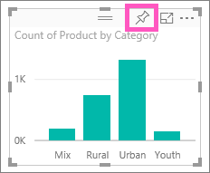

<properties
   pageTitle="教學課程︰ 第 1 部，將視覺效果加入 Power BI 報表"
   description="教學課程︰ 第 1 部，將視覺效果加入 Power BI 報表"
   services="powerbi"
   documentationCenter=""
   authors="mihart"
   manager="mblythe"
   backup=""
   editor=""
   tags=""
   featuredVideoId="rnMyiA6Nt6Y"
   qualityFocus="no"
   qualityDate=""/>

<tags
   ms.service="powerbi"
   ms.devlang="NA"
   ms.topic="article"
   ms.tgt_pltfrm="NA"
   ms.workload="powerbi"
   ms.date="10/09/2016"
   ms.author="mihart"/>

# 教學課程︰ 第 1 部，將視覺效果加入 Power BI 報表

這篇文章提供在報表中建立視覺效果的快速簡介。  對於更進階的內容，請 [請參閱第二部分](powerbi-service-add-visualizations-to-a-report-ii.md)。 以下影片中，將會顯示您幾個不同的方式來建立、 編輯和格式化報表上的視覺效果畫布中。

<iframe width="560" height="315" src="https://www.youtube.com/embed/rnMyiA6Nt6Y?list=PL1N57mwBHtN0JFoKSR0n-tBkUJHeMP2cP" frameborder="0" allowfullscreen></iframe>

現在使用 [銷售和行銷範例](powerbi-sample-datasets.md) 來建立您自己的報表。

1.  開啟 [編輯檢視報表](powerbi-service-go-from-reading-view-to-editing-view.md)。 本教學課程使用銷售和行銷範例。

2.  如果看不到 [欄位] 窗格中，選取箭頭圖示來開啟它。 

    

3.  
            [加入報表中的空白頁面](powerbi-service-add-a-page-to-a-report.md)。

4.  選取欄位，以便建立視覺效果 **欄位** 窗格。  

    
            **數值欄位的開頭︰ Power BI 的單一資料行建立直條圖**。

    

    
            **從類別目錄欄位開始**, ，例如名稱或縣 （市）︰ Power BI 會建立資料表，並將該欄位 **值** 良好。

    

5.  選取要加入至視覺效果的其他欄位。  選取 **計數** **產品** 將它加入至 **值** 良好。

    

6.  選取資料行圖表圖示，視覺效果變更為直條圖。

    

7.  當您在報表中建立視覺效果時，您可以 [它們固定到 [儀表板](powerbi-service-pin-a-tile-to-a-dashboard-from-a-report.md)。 若要釘選視覺效果，請選取 [釘選圖示 。

    

8.  現在您可以︰

    繼續 [第 2 部分︰ 將視覺效果加入 Power BI 報表](powerbi-service-add-visualizations-to-a-report-ii.md)

    
            [C](powerbi-service-change-the-type-of-visualization-in-a-report.md)[後面的 < 變更視覺效果類型](powerbi-service-change-the-type-of-visualization-in-a-report.md)[。](powerbi-service-change-the-type-of-visualization-in-a-report.md)

    
            [釘選視覺效果](powerbi-service-pin-a-tile-to-a-dashboard-from-a-report.md) 為並排顯示儀表板。

    
            [視覺效果與互動](powerbi-service-interact-with-a-report-in-reading-view.md) 在報表中。

    
            [執行更多的視覺效果與](powerbi-service-visualizations-for-reports.md)。

    
            [將報表儲存](powerbi-service-save-a-report.md)。

## 請參閱

進一步了解 [Power BI 報表中的視覺效果](powerbi-service-visualizations-for-reports.md)。

[在 Power BI 中的報表](powerbi-service-reports.md)

[Power BI-基本概念](powerbi-service-basic-concepts.md)

更多的問題嗎？ [試用 Power BI 社群](http://community.powerbi.com/)
