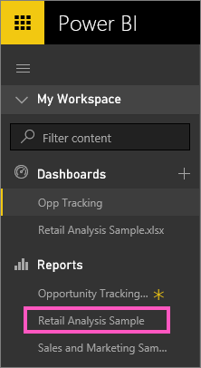
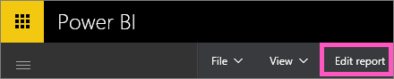
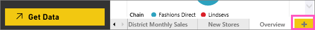
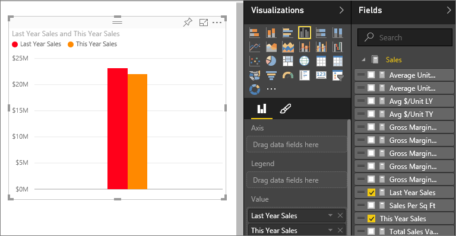
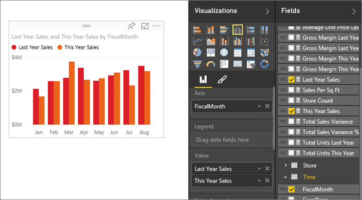
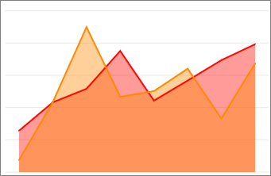
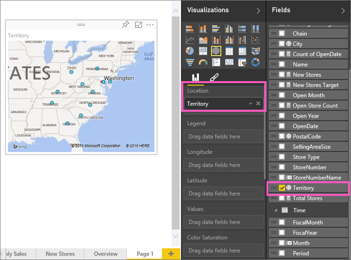

<properties
   pageTitle="教學課程︰ 組件 2，新增至 Power BI 報表的視覺效果"
   description="教學課程︰ 組件 2，新增至 Power BI 報表的視覺效果"
   services="powerbi"
   documentationCenter=""
   authors="mihart"
   manager="mblythe"
   backup=""
   editor=""
   tags=""
   qualityFocus="no"
   qualityDate=""/>

<tags
   ms.service="powerbi"
   ms.devlang="NA"
   ms.topic="article"
   ms.tgt_pltfrm="NA"
   ms.workload="powerbi"
   ms.date="10/08/2016"
   ms.author="mihart"/>

# 教學課程︰ 組件 2，新增至 Power BI 報表的視覺效果  

在 [第 1 部分](https://powerbi.uservoice.com/knowledgebase/articles/441777-part-i-add-visualizations-to-a-power-bi-report), ，您選取欄位名稱旁的核取方塊來建立基本的視覺效果。  在第 2 部分中，您將學習如何使用拖放和充分利用 **欄位** 和 **視覺效果** 窗格來建立和修改的視覺效果。

## 建立新的視覺效果  
在本教學課程中，我們將深入探討我們零售分析的資料集並建立幾個重要的視覺效果。

### 開啟報表並加入新的空白頁面。  
1.  如果尚未展開，請展開左的導覽窗格。

2.  在 **報表**, ，請選取 **零售分析範例** 讀取檢視中開啟報表。  
    

3.  選取 **編輯報表** 編輯檢視中開啟報表。  
    

4.  
                [加入新的頁面](powerbi-service-add-a-page-to-a-report.md) 選取黃色加號畫布底部的圖示。  

### 將會查看本年度銷售量與去年相較的視覺效果。  
1.  從 **銷售** 資料表中，選取 **本年度銷售額** > **值** 和 **Last Year Sales**。 Power BI 建立直條圖。  這是有點有趣，而且您想要更深入發掘。 銷售看起來像是依月份的作用為何？  

    

2.  從 [時間] 資料表中，拖曳 **月** 到 **軸** 區域。  
  

3.  
            [變更視覺效果](powerbi-service-change-the-type-of-visualization-in-a-report.md) 區域圖。  有許多視覺效果類型，可從中-請參閱 [各個的說明、 最佳作法和教學課程的秘訣](powerbi-service-visualization-types-for-reports-and-q-and-a.md) 協助以決定要使用哪種類型。 從 [視覺效果] 窗格中，選取區域圖圖示。

5.  
            [調整視覺效果](powerbi-service-move-and-resize-a-visualization.md) 選取視覺效果、 抓取一個外框圓形，然後拖曳。 讓寬度不足以消除捲軸和夠小，無法提供足夠的空間來加入另一個視覺效果。

    

6.  
            [將報表儲存](powerbi-service-save-a-report.md)。

### 新增位置的銷售額會查看地圖視覺效果  
1.  從 **存放區** 資料表中，按一下 **領域**。 Power BI 會將領域是一個位置，並建立地圖視覺效果。  
    

2.  拖放到 **總商店** 到大小區域。  
    

3.  加入圖例。  若要查看的資料存放區名稱，請將 **鏈結** 到圖例區域。  
    

## 請參閱  
-   如需 [欄位] 窗格的詳細資訊，請參閱 [報表編輯器...介紹](powerbi-service-the-report-editor-take-a-tour.md)。   
-   若要了解如何篩選並反白顯示視覺效果，請參閱 [篩選和反白顯示在 Power BI 報表](powerbi-service-about-filters-and-highlighting-in-reports.md)。  
-   若要深入了解使用以及變更彙總，請參閱 [報表中的彙總](powerbi-service-aggregates.md)。  
-   進一步了解 [Power BI 報表中的視覺效果](powerbi-service-visualizations-for-reports.md)。  
-   更多的問題嗎？ 
            [試用 Power BI 社群](http://community.powerbi.com/)。
