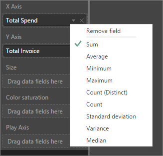
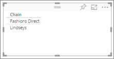

<properties
   pageTitle="中的彙總 （總和、 平均、 最大值等） Power BI"
   description="變更在 Power BI 的圖表 （總和、 平均、 最大值等） 的彙總"
   services="powerbi"
   documentationCenter=""
   authors="mihart"
   manager="mblythe"
   backup=""
   editor=""
   tags=""
   qualityFocus="no"
   qualityDate=""/>

<tags
   ms.service="powerbi"
   ms.devlang="NA"
   ms.topic="article"
   ms.tgt_pltfrm="NA"
   ms.workload="powerbi"
   ms.date="09/21/2016"
   ms.author="mihart"/>

# Power BI 中的彙總  

## 什麼是彙總？

數值欄位是值，這個值將會彙總 （加總或平均，例如）。  這些通常稱為 **量值**。 （您的報表為基礎的資料模型中定義） 的資料匯入 Power BI 中的量值。 在 [欄位] 清單中，量值會顯示與 ∑ 符號。 如需詳細資訊，請參閱 [報表編輯器...介紹](powerbi-service-the-report-editor-take-a-tour.md)。

## 變更數值欄位彙總的資料

假設您有一份圖表加總的銷售資料的不同區域，但您想讓平均值。 

1.  在報表的 [編輯] 檢視中，將量值加入至視覺效果。

2.  欄位的視覺效果，窗格中按一下滑鼠右鍵，選取您需要的彙總類型的尋找。

    

>[AZURE.NOTE] 下拉式清單中可用的選項取決於所選的欄位。

某些可用的彙總欄位的選項︰

-   
            **不摘要**。 選擇此選項，該欄位中的每個值是分開處理，並不摘述。 如果您有不應該加總的數值識別碼資料行通常使用這種。

-   
            **總和**。 這會將該欄位中的所有值相加。

-   
            **平均**。 會接受的算術平均值的值。

-   
            **最小值**。 顯示的最小值。

-   
            **最大**。 顯示的最大值。

-   
            **計數 （沒有空格）。** 這會計算該欄位中不是空白的值數目。

-   
            **計數 （相異）。** 這會計算該欄位中的不同值的數目。

- 
            **標準差。**

- 
            **變異數**。

- 
            **中間值**。  顯示的位數 （中間） 值。 這是具有相同數目的項目之上或之下的值。  如果有 2 個眾數，Power BI 取其平均值。

例如，這項資料︰

| 國家/地區   | 數量 |
|:----------|:-------|
| 美國       | 100    |
| 英國        | 150    |
| 加拿大    | 100    |
| 德國   | 125    |
| 法國    |        |
| 日本     | 125    |
| 澳洲 | 150    |

會提供下列結果︰

-   
            **執行摘要**︰ 則會個別顯示每個值

-   
            **總和**: 750

-   
            **平均**: 125

-   
            **最大**: 150

-   
            **最小值**: 100

-   
            **計數 （沒有空格）︰** 6

-   
            **計數 （相異）︰** 4

- 
            **標準差︰** 20.4124145...

- 
            **變異數︰** 416.666...

- 
            **中間值︰** 125

## 做為數值欄位中的非彙總的欄位

您也可以使用非彙總的欄位做為數值欄位。 比方說，如果您有產品名稱] 欄位中，您可以加入做為值並將該值設定為 **計數** 或 **相異計數**。 

1.  例如，如果您選取 **存放區 > 鏈結**。

    

2.  如果您變更預設彙總 **不摘要** 至 **計數 （相異）**, ，Power BI 計算不同鏈結的數目。 在此情況下，有 2︰ 直接的方式和 Lindseys。

    

3.  如果您變更的彙總 **計數**, ，Power BI 計算總數。 在此情況下，都有 104 **鏈結**。 藉由新增 **鏈結** 做為篩選條件，您可以看到有 37 資料列的方式直接和 67 Lindseys 資料列。  

    

## 請參閱  

            [Power BI 報表中的視覺效果](powerbi-service-visualizations-for-reports.md)  

            [Power BI-基本概念](powerbi-service-basic-concepts.md)  

更多的問題嗎？ 
            [試用 Power BI 社群](http://community.powerbi.com/)
